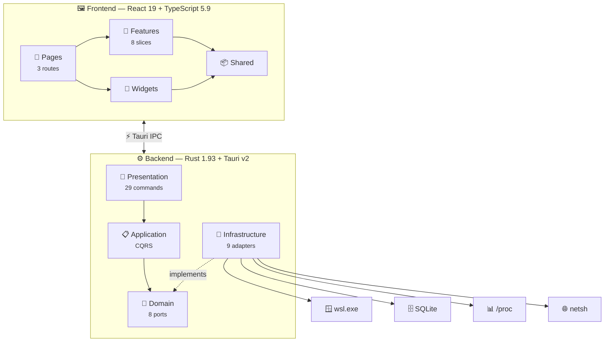
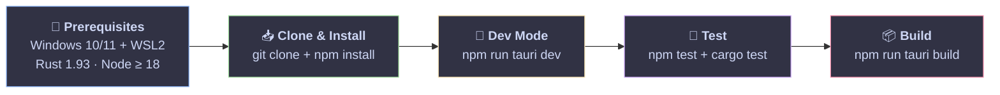

<div align="center">

# 🚀 WSL Nexus

**Your all-in-one desktop dashboard for WSL2 management**


</div>

---

## ✨ Features

🖥️ **Distributions** — Start, stop, restart WSL distros at a glance
📸 **Snapshots** — Backup & restore (tar / vhdx)
📊 **Monitoring** — Live CPU, RAM, disk, network charts + processes + alerts
💻 **Terminal** — Interactive WSL shell via xterm
🔀 **Port Forwarding** — WSL → Windows port mapping
⚙️ **Configuration** — `.wslconfig` editor + VHDX compaction
📋 **Audit Log** — Full action traceability
🐛 **Debug Console** — Real-time log viewer (`Ctrl+Shift+D`)
🌍 **i18n** — EN · ES · FR · ZH
🎨 **Theming** — Catppuccin Mocha 🌙 / Latte ☀️

---

## 🏗️ Architecture



---

## 🚦 Getting Started



```bash
git clone https://github.com/muchini/wsl-nexus.git && cd wsl-nexus
npm install           # 📦 Frontend deps (Cargo handles Rust)
npm run tauri dev     # 🚀 Launch with hot-reload
```

---

## 🧪 Tests

| | Layer | Command | Count |
|---|---|---|---|
| 🖼️ | Frontend | `npm run test` | **383** (40 files) |
| 🦀 | Backend | `cd src-tauri && cargo test` | **~140** |

> 🔄 **CI/CD** — GitHub Actions runs lint + format + clippy + tests on every push. Tags `v*` build a Windows installer (.msi / .exe).

---

## 📂 Structure

```
wsl-nexus/
├── 🦀 src-tauri/               # Rust backend (Hexagonal + CQRS)
│   ├── 💎 domain/              # Entities, value objects, ports
│   ├── 📋 application/         # CQRS handlers, DTOs
│   ├── 🔌 infrastructure/      # WSL CLI, SQLite, ProcFS, PTY, netsh
│   └── 🎯 presentation/        # Tauri commands, AppState
│
└── 🖼️ src/                     # React frontend (Feature-Sliced Design)
    ├── 🧩 features/            # 8 feature slices + 1 hook
    ├── 📄 pages/               # Distributions · Monitoring · Settings
    ├── 🔲 widgets/             # Header + Debug Console
    └── 📦 shared/              # API, hooks, stores, UI
```

---

## 📚 Docs

> Every directory has its own detailed README — dive in!

| | Layer | Link |
|---|---|---|
| 🦀 | **Backend overview** | [src-tauri/](src-tauri/README.md) |
| 💎 | Domain | [domain/](src-tauri/src/domain/README.md) |
| 📋 | Application | [application/](src-tauri/src/application/README.md) |
| 🔌 | Infrastructure | [infrastructure/](src-tauri/src/infrastructure/README.md) |
| 🎯 | Presentation | [presentation/](src-tauri/src/presentation/README.md) |
| 🖼️ | **Frontend overview** | [src/](src/README.md) |
| 🧩 | Features | [features/](src/features/README.md) |
| 📦 | Shared | [shared/](src/shared/README.md) |
| 📄 | Pages | [pages/](src/pages/README.md) |
| 🔲 | Widgets | [widgets/](src/widgets/README.md) |

---

## 📜 License

MIT
