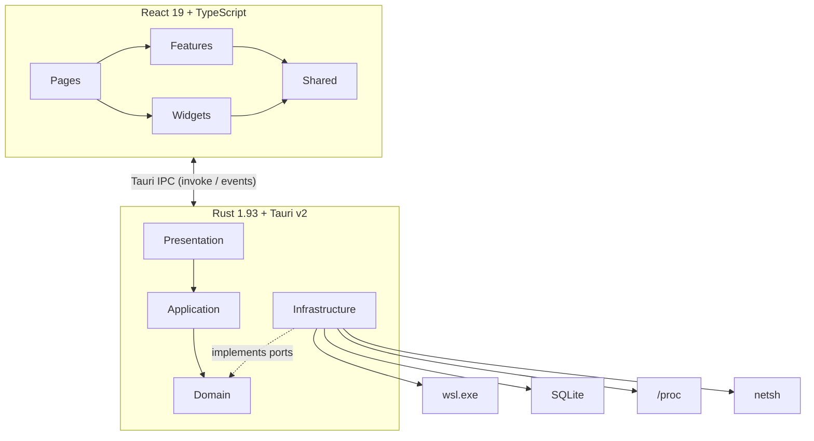
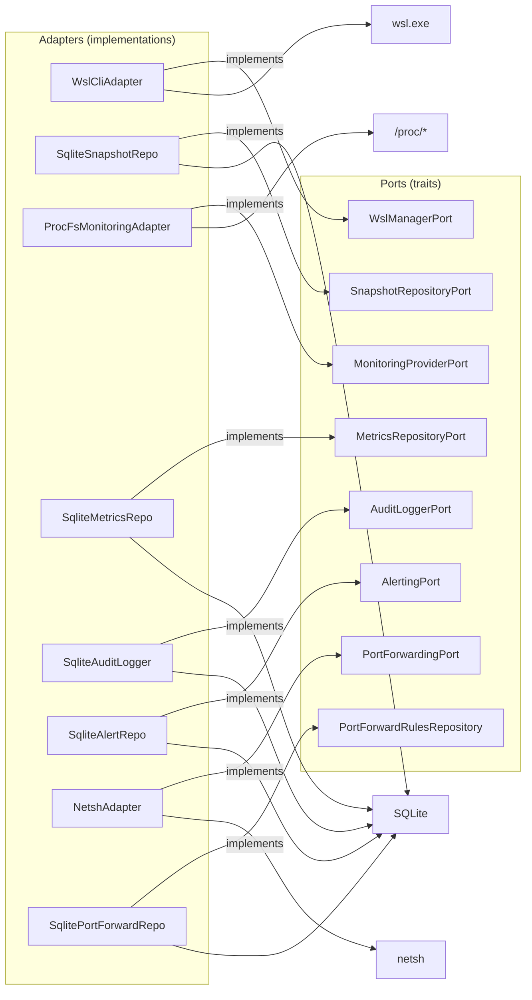
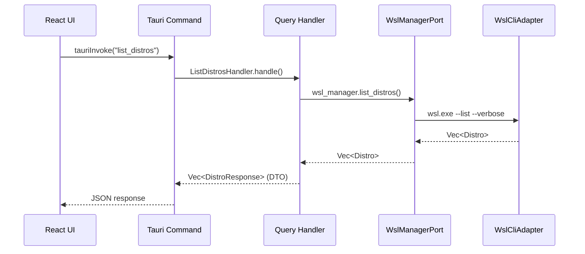
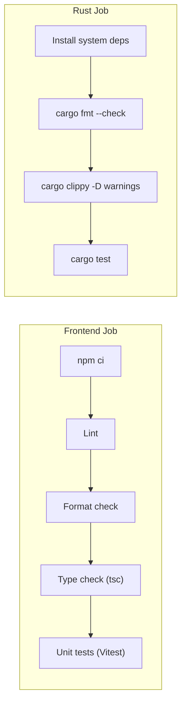

# WSL Nexus

> **Desktop application for comprehensive WSL2 distribution management** -- Monitoring, Snapshots, Terminal, Port Forwarding, Configuration, and Audit Logging.


---

## Features

| Feature | Description |
|---|---|
| **Distribution Management** | List, start, stop, restart your WSL distros |
| **Snapshots** | Create, restore and delete backups (tar, vhdx) |
| **Real-Time Monitoring** | CPU, memory, disk, network + process table + historical metrics + alerting |
| **Terminal** | Interactive WSL terminal sessions (xterm) |
| **Port Forwarding** | WSL-to-Windows port mapping via netsh |
| **WSL Configuration** | Edit `.wslconfig` + compact VHDX disks |
| **Audit Log** | Full traceability of all actions |
| **Debug Console** | In-app real-time log viewer with level filtering (Ctrl+Shift+D) |
| **Internationalization** | English, Spanish, French, Chinese |
| **App Preferences** | Language and theme preferences |

---

## Tech Stack

| Layer | Technologies |
|---|---|
| **Frontend** | React 19, TypeScript 5.9, Vite 7, Tailwind CSS 4 (Catppuccin), TanStack Query 5, TanStack Router 1, Zustand 5, Recharts 3, Lucide, Zod 4, i18next, xterm |
| **Backend** | Rust 1.93, Tauri v2, SQLx 0.8 (SQLite), Tokio, async-trait, thiserror, tracing, portable-pty |
| **Testing** | Vitest 4 + Testing Library (frontend), mockall + tokio-test + proptest (backend) |
| **Architecture** | Hexagonal Architecture + CQRS (backend), Feature-Sliced Design (frontend) |
| **CI/CD** | GitHub Actions (lint, format, clippy, tests), automated release on tag push |

---

## Architecture Overview

### High-Level View



### Hexagonal Architecture (Ports & Adapters)



### CQRS Flow (example: listing distributions)



---

## Prerequisites

| Tool | Version | Notes |
|---|---|---|
| **Windows** | 10/11 | WSL2 must be enabled |
| **WSL2** | -- | At least one distribution installed |
| **Rust** | 1.93+ | Install via `rustup default 1.93` |
| **Node.js** | >= 18 | With `npm` |
| **Tauri CLI** | v2 | Included in devDependencies |

---

## Getting Started

### 1. Clone the project

```bash
git clone https://github.com/your-user/wsl-nexus.git
cd wsl-nexus
```

### 2. Install dependencies

```bash
# Frontend dependencies
npm install

# Rust dependencies are handled automatically by Cargo
```

### 3. Run in development mode

```bash
# Launches Vite (frontend) + Tauri (backend) with hot-reload
npm run tauri dev
```

### 4. Production build

```bash
npm run tauri build
```

### 5. Run tests

```bash
# Frontend tests (Vitest)
npm run test

# Backend tests (Rust)
cd src-tauri && cargo test
```

---

## Available Scripts

| Script | Command | Description |
|---|---|---|
| `npm run dev` | `vite` | Frontend dev server (port 1420) |
| `npm run build` | `tsc -b && vite build` | TypeScript + Vite build |
| `npm run preview` | `vite preview` | Preview the build |
| `npm run lint` | `eslint` | Lint frontend code |
| `npm run lint:fix` | `eslint --fix` | Lint and auto-fix |
| `npm run format` | `prettier --write` | Format code |
| `npm run format:check` | `prettier --check` | Check code formatting |
| `npm run test` | `vitest run` | Frontend tests (single run) |
| `npm run test:watch` | `vitest` | Frontend tests (watch mode) |
| `npm run tauri dev` | `tauri dev` | Full dev (frontend + backend) |
| `npm run tauri build` | `tauri build` | Production build |
| `cargo test` | -- | Backend Rust tests (~140 tests) |
| `cargo clippy` | -- | Rust linter |
| `cargo fmt --check` | -- | Rust format check |

---

## CI/CD

### Continuous Integration (`.github/workflows/ci.yml`)

Runs on every **push** and **pull request** to `main`/`master`:



| Job | Steps | Environment |
|---|---|---|
| **Frontend** | `npm ci` -> Lint -> Format check -> Type check -> Unit tests | `ubuntu-latest`, Node.js 22 |
| **Rust** | Install system deps -> `cargo fmt --check` -> `cargo clippy -D warnings` -> `cargo test` | `ubuntu-latest`, Rust stable |

**Concurrency**: Duplicate runs on the same branch are automatically cancelled.

### Release (`.github/workflows/release.yml`)

Triggered on tag push (`v*`):

1. Runs full CI checks (reuses `ci.yml`)
2. Builds Windows installer on `windows-latest`
3. Creates a draft GitHub Release with `.msi` and `.exe` (NSIS) artifacts

---

## Project Structure

```
wsl-nexus/
├── README.md                           <- You are here
├── package.json                        # Frontend dependencies + scripts
├── vite.config.ts                      # Vite config (port 1420, @/ alias)
├── tsconfig.json                       # Strict TypeScript + noUncheckedIndexedAccess
├── vitest.config.ts                    # jsdom test config
├── components.json                     # shadcn/ui config (new-york)
├── index.html                          # HTML entry point
├── .github/workflows/                  # CI/CD
│   ├── ci.yml                          # Lint, format, clippy, tests
│   └── release.yml                     # Windows build + GitHub Release
│
├── src-tauri/                          # Rust Backend + Tauri v2
│   ├── Cargo.toml                      # Rust dependencies
│   ├── tauri.conf.json                 # Tauri config (1280x800 window)
│   └── src/
│       ├── domain/                     # Pure business logic
│       ├── application/                # CQRS handlers + DTOs
│       ├── infrastructure/             # Adapters (WSL CLI, SQLite, ProcFS, Terminal, Port Forwarding, Debug Log)
│       └── presentation/              # Tauri commands + AppState
│
└── src/                                # React Frontend
    ├── main.tsx                        # React 19 entry point
    ├── app.tsx                         # Providers (QueryClient + Router)
    ├── router.tsx                      # 3 TanStack Router routes
    ├── app.css                         # Catppuccin Mocha/Latte theme
    ├── locales/                        # i18n translations (en, es, fr, zh)
    ├── features/                       # 8 feature slices
    ├── pages/                          # 3 routed pages
    ├── shared/                         # API, hooks, types, stores, utils
    └── widgets/                        # Header + Debug Console
```

> Each directory has its own README with in-depth details:
> - [Backend (src-tauri/)](src-tauri/README.md)
>   - [Domain](src-tauri/src/domain/README.md) . [Application](src-tauri/src/application/README.md) . [Infrastructure](src-tauri/src/infrastructure/README.md) . [Presentation](src-tauri/src/presentation/README.md)
> - [Frontend (src/)](src/README.md)
>   - [Features](src/features/README.md) . [Shared](src/shared/README.md) . [Pages](src/pages/README.md) . [Widgets](src/widgets/README.md)

### Frontend Layout

The root layout is a vertical column with the header on top, the routed page in the middle, and a collapsible debug console at the bottom:

```tsx
function RootLayout() {
  return (
    <div className="flex h-screen flex-col overflow-hidden bg-background text-foreground">
      <Header />
      <main className="min-h-0 flex-1 overflow-y-auto p-4 sm:p-6">
        <ErrorBoundary>
          <Outlet />
        </ErrorBoundary>
      </main>
      <DebugConsole />
    </div>
  );
}
```

### Pages

| Route | Page | Description |
|---|---|---|
| `/` | `DistrosPage` | Distribution grid + snapshot management + terminal |
| `/monitoring` | `MonitoringPage` | CPU, memory, disk, network charts + process table |
| `/settings` | `SettingsPage` | `.wslconfig` editor, VHDX compaction, port forwarding, preferences, audit log |

### Feature Slices (FSD)

| Slice | Description |
|---|---|
| `distro-list` | Distribution cards with status, start/stop/restart controls |
| `snapshot-list` | Snapshot creation, restore, deletion for each distro |
| `monitoring-dashboard` | Real-time metrics charts and process table |
| `wsl-config` | `.wslconfig` viewer and editor |
| `audit-log` | Searchable action history log |
| `terminal` | Interactive WSL terminal sessions (xterm) |
| `port-forwarding` | WSL-to-Windows port forwarding configuration |
| `app-preferences` | Language and theme preferences panel |
| `distro-events` | Real-time distro state change events (hook only) |

### Widgets

| Widget | Description |
|---|---|
| `Header` | Branding + pill-shaped navigation tabs (Distributions / Monitoring / Settings) + debug console toggle + theme toggle |
| `DebugConsole` | Collapsible bottom panel with real-time backend logs, level filtering (All/Error/Warn/Info/Debug), error/warn badges |

### Backend: AppState (Composition Root)

The `AppState` struct holds all hexagonal port implementations, injected into Tauri as managed state:

```rust
pub struct AppState {
    pub wsl_manager: Arc<dyn WslManagerPort>,
    pub snapshot_repo: Arc<dyn SnapshotRepositoryPort>,
    pub monitoring: Arc<dyn MonitoringProviderPort>,
    pub metrics_repo: Arc<dyn MetricsRepositoryPort>,
    pub alerting: Arc<dyn AlertingPort>,
    pub audit_logger: Arc<dyn AuditLoggerPort>,
    pub alert_thresholds: Arc<RwLock<Vec<AlertThreshold>>>,
    pub port_forwarding: Arc<dyn PortForwardingPort>,
    pub port_rules_repo: Arc<dyn PortForwardRulesRepository>,
}
```

`TerminalSessionManager` is managed separately for independent lifecycle.

### Tauri Plugins

| Plugin | Purpose |
|---|---|
| `tauri-plugin-shell` | Execute `wsl.exe` and `netsh` commands from the backend |
| `tauri-plugin-store` | Persist user preferences (theme, locale, settings) |
| `tauri-plugin-dialog` | Native file dialogs for snapshot export/import |
| `tauri-plugin-notification` | Desktop notifications for alerts and events |

### Registered Tauri Commands

| Module | Commands |
|---|---|
| `distro_commands` | `list_distros`, `start_distro`, `stop_distro`, `restart_distro`, `shutdown_all`, `get_distro_install_path` |
| `snapshot_commands` | `list_snapshots`, `create_snapshot`, `delete_snapshot`, `restore_snapshot` |
| `monitoring_commands` | `get_system_metrics`, `get_processes`, `get_metrics_history`, `get_alert_thresholds`, `set_alert_thresholds`, `get_recent_alerts`, `acknowledge_alert` |
| `settings_commands` | `get_wsl_config`, `update_wsl_config`, `compact_vhdx`, `get_wsl_version` |
| `audit_commands` | `search_audit_log` |
| `debug_commands` | `get_debug_logs`, `clear_debug_logs` |
| `terminal_commands` | `terminal_create`, `terminal_write`, `terminal_resize`, `terminal_close` |
| `port_forwarding_commands` | `list_listening_ports`, `get_port_forwarding_rules`, `add_port_forwarding`, `remove_port_forwarding`, `get_wsl_ip` |

### Styling: Catppuccin Theme

The application uses the **Catppuccin** color system with two palettes toggled via the `data-theme` attribute:

| Palette | Role | Base | Text | Blue (primary) |
|---|---|---|---|---|
| **Mocha** (dark, default) | Dark theme | `#1e1e2e` | `#cdd6f4` | `#89b4fa` |
| **Latte** (light) | Light theme | `#eff1f5` | `#4c4f69` | `#1e66f5` |

Colors are defined as CSS custom properties in `app.css` with semantic aliases (`--color-background`, `--color-foreground`, `--color-card`, `--color-primary`, etc.) consumed by Tailwind CSS v4.

---

## Tests

### Backend Rust -- ~140 tests

| Layer | Tests | Details |
|---|---|---|
| **Domain** | ~37 | Value objects (DistroName, DistroState, WslVersion, MemorySize, SnapshotId), entities (Snapshot), alerting (AlertType serde + proptest) |
| **Application** | ~14 | DTOs (DistroResponse, SnapshotResponse mapping) |
| **Infrastructure** | ~89 | WSL CLI (adapter, encoding, parser), debug log (buffer), SQLite (snapshots, metrics, alerts, port forwarding), monitoring (ProcFS adapter), audit (adapter) |

```bash
cd src-tauri && cargo test
```

### Frontend -- 383 tests (40 test files)

```bash
npm run test          # Single run
npm run test:watch    # Watch mode
```

---

## Technical Notes

| Topic | Details |
|---|---|
| **Rust 1.93** | Required minimum toolchain version -- install via `rustup default 1.93` |
| **UTF-16LE** | `wsl.exe` outputs UTF-16LE on Windows -- `encoding.rs` handles BOM detection + UTF-8 fallback |
| **noUncheckedIndexedAccess** | Enabled in `tsconfig.json` -- array accesses require `!` or `?.` |
| **SQLite async** | Initialized in Tauri's `setup` hook with `block_on` to avoid blocking the event loop |
| **Tauri icons** | Must be RGBA PNG (color type 6), not RGB |
| **`tauri::Manager`** | The trait must be imported for `app_handle.path()` and `.manage()` |
| **mockall** | Cannot handle `Option<&str>` in async traits -- use `Option<String>` instead |
| **Debug logging** | Uses `tracing` + `tracing-subscriber` with a custom `DebugLogLayer` that buffers logs and emits them as Tauri events to the frontend |
| **Panic handler** | Writes crash info to `crash.log` in the app data directory; shows a native MessageBox on Windows |

---

## License

MIT
