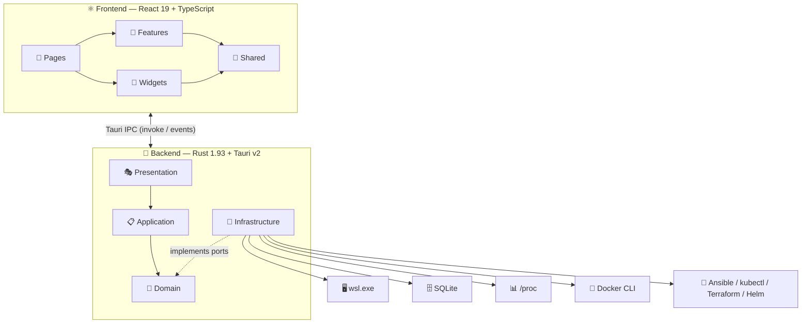
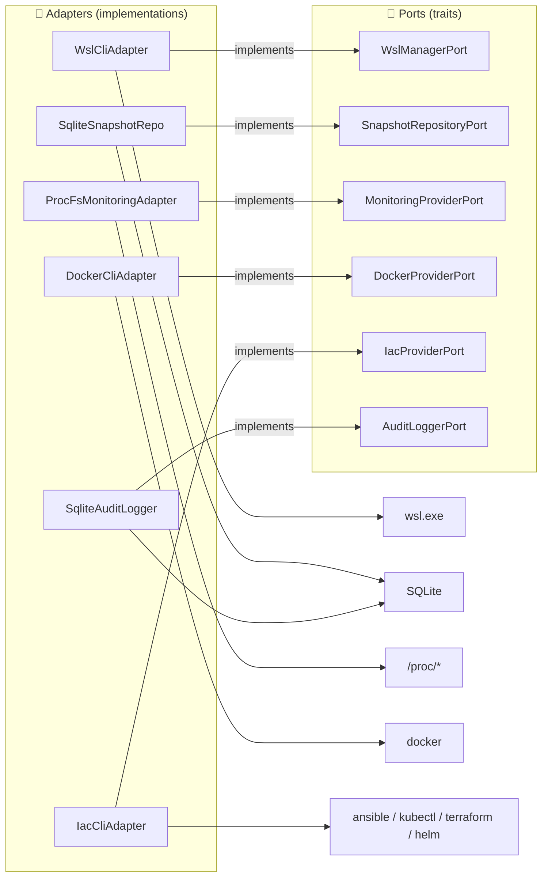
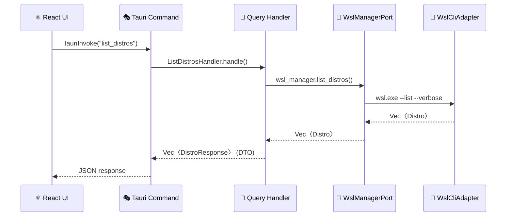
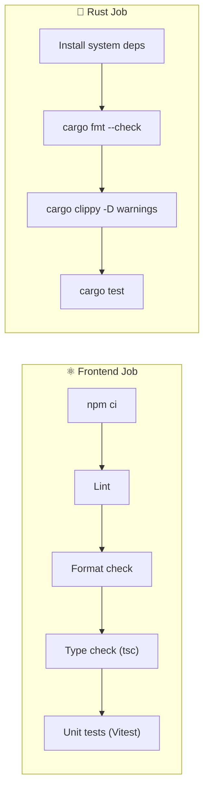

# 🖥️ WSL Nexus

> **Desktop application for comprehensive WSL2 distribution management** — Monitoring, Snapshots, Docker, IaC, and more.


---

## 🎯 Features

| Feature | Description |
|---|---|
| 📦 **Distribution Management** | List, start, stop, restart your WSL distros |
| 💾 **Snapshots** | Create, restore and delete backups (tar, tar.gz, tar.xz, vhdx) |
| 📈 **Real-Time Monitoring** | CPU, memory, disk, network + process table |
| 🐳 **Docker** | Manage containers and images in each distro |
| 🔧 **Infrastructure as Code** | Detect Ansible, kubectl, Terraform, Helm + control K8s |
| ⚙️ **WSL Configuration** | Edit `.wslconfig` + compact VHDX disks |
| 📝 **Audit Log** | Full traceability of all actions |

---

## 🛠️ Tech Stack

| Layer | Technologies |
|---|---|
| **Frontend** | React 19, TypeScript 5.7, Vite 6.1, Tailwind CSS 4 (oklch), TanStack Query 5, TanStack Router, Zustand 5, Recharts, Lucide, shadcn/ui |
| **Backend** | Rust 1.93, Tauri v2, SQLx 0.8 (SQLite), Tokio, async-trait, thiserror |
| **Testing** | Vitest 3 + Testing Library (frontend), mockall + tokio-test (backend) |
| **Architecture** | Hexagonal Architecture + CQRS (backend), Feature-Sliced Design (frontend) |
| **CI/CD** | GitHub Actions (lint, format, clippy, tests), automated release on tag push |

---

## 🏗️ Architecture Overview

### 🔭 High-Level View



### 🔷 Hexagonal Architecture (Ports & Adapters)



### 🔄 CQRS Flow (example: listing distributions)



---

## 📋 Prerequisites

| Tool | Version | Notes |
|---|---|---|
| **Windows** | 10/11 | WSL2 must be enabled |
| **WSL2** | — | At least one distribution installed |
| **Rust** | 1.93+ | Install via `rustup default 1.93` |
| **Node.js** | ≥ 18 | With `npm` |
| **Tauri CLI** | v2 | Included in devDependencies |

---

## 🚀 Getting Started

### 1. Clone the project

```bash
git clone https://github.com/your-user/wsl-nexus.git
cd wsl-nexus
```

### 2. Install dependencies

```bash
# Frontend dependencies
npm install

# Rust dependencies are handled automatically by Cargo
```

### 3. Run in development mode

```bash
# Launches Vite (frontend) + Tauri (backend) with hot-reload
npm run tauri dev
```

### 4. Production build

```bash
npm run tauri build
```

### 5. Run tests

```bash
# Frontend tests (Vitest)
npm run test

# Backend tests (Rust)
cd src-tauri && cargo test
```

---

## 📜 Available Scripts

| Script | Command | Description |
|---|---|---|
| `npm run dev` | `vite` | Frontend dev server (port 1420) |
| `npm run build` | `tsc && vite build` | TypeScript + Vite build |
| `npm run preview` | `vite preview` | Preview the build |
| `npm run lint` | `eslint` | Lint frontend code |
| `npm run format:check` | `prettier --check` | Check code formatting |
| `npm run test` | `vitest run` | Frontend tests (single run) |
| `npm run test:watch` | `vitest` | Frontend tests (watch mode) |
| `npm run tauri dev` | `tauri dev` | Full dev (frontend + backend) |
| `npm run tauri build` | `tauri build` | Production build |
| `cargo test` | — | Backend Rust tests (31 tests) |
| `cargo clippy` | — | Rust linter |
| `cargo fmt --check` | — | Rust format check |

---

## 🔄 CI/CD

### Continuous Integration (`.github/workflows/ci.yml`)

Runs on every **push** and **pull request** to `main`/`master`:



| Job | Steps | Environment |
|---|---|---|
| **Frontend** | `npm ci` → Lint → Format check → Type check → Unit tests | `ubuntu-latest`, Node.js 22 |
| **Rust** | Install system deps → `cargo fmt --check` → `cargo clippy -D warnings` → `cargo test` | `ubuntu-latest`, Rust stable |

**Concurrency**: Duplicate runs on the same branch are automatically cancelled.

### Release (`.github/workflows/release.yml`)

Triggered on tag push (`v*`):

1. ✅ Runs full CI checks (reuses `ci.yml`)
2. 🏗️ Builds Windows installer on `windows-latest`
3. 📦 Creates a draft GitHub Release with `.msi` and `.exe` (NSIS) artifacts

---

## 📁 Project Structure

```
wsl-nexus/
├── 📄 README.md                        ← You are here
├── 📄 package.json                     # Frontend dependencies + scripts
├── 📄 vite.config.ts                   # Vite config (port 1420, @/ alias)
├── 📄 tsconfig.json                    # Strict TypeScript + noUncheckedIndexedAccess
├── 📄 vitest.config.ts                 # jsdom test config
├── 📄 components.json                  # shadcn/ui config (new-york)
├── 📄 index.html                       # HTML entry point
├── 🔄 .github/workflows/              # CI/CD
│   ├── ci.yml                         # Lint, format, clippy, tests
│   └── release.yml                    # Windows build + GitHub Release
│
├── 🦀 src-tauri/                       # Rust Backend + Tauri v2
│   ├── 📄 Cargo.toml                  # Rust dependencies
│   ├── 📄 tauri.conf.json             # Tauri config (1280×800 window)
│   └── src/
│       ├── 💎 domain/                 # Pure business logic
│       ├── 📋 application/            # CQRS handlers + DTOs
│       ├── 🔌 infrastructure/         # Adapters (WSL CLI, SQLite, Docker...)
│       └── 🎭 presentation/           # Tauri commands + AppState
│
└── ⚛️ src/                             # React Frontend
    ├── 📄 main.tsx                     # React 19 entry point
    ├── 📄 app.tsx                      # Providers (QueryClient + Router)
    ├── 📄 router.tsx                   # 7 TanStack Router routes
    ├── 📄 app.css                      # oklch dark theme
    ├── 🧩 features/                   # 8 feature slices
    ├── 📄 pages/                      # 7 routed pages
    ├── 🔧 shared/                     # API, hooks, types, utils
    └── 🧱 widgets/                    # Sidebar + Header
```

> 📖 Each directory has its own README with in-depth details:
> - [🦀 Backend (src-tauri/)](src-tauri/README.md)
>   - [💎 Domain](src-tauri/src/domain/README.md) · [📋 Application](src-tauri/src/application/README.md) · [🔌 Infrastructure](src-tauri/src/infrastructure/README.md) · [🎭 Presentation](src-tauri/src/presentation/README.md)
> - [⚛️ Frontend (src/)](src/README.md)
>   - [🧩 Features](src/features/README.md) · [🔧 Shared](src/shared/README.md) · [📄 Pages](src/pages/README.md) · [🧱 Widgets](src/widgets/README.md)

---

## 🧪 Tests

### Backend Rust — 31 tests

| Layer | Tests | Details |
|---|---|---|
| **Domain** | 13 | Value objects (DistroName, DistroState, WslVersion, MemorySize) + DistroService |
| **Infrastructure** | 14 | UTF-16LE encoding (3), WSL parser (4), Monitoring /proc (3), Docker parsing (4) |
| **Application** | 4 | DistroService (start/stop success/failure) |

```bash
cd src-tauri && cargo test
```

### Frontend — Vitest + Testing Library

```bash
npm run test          # Single run
npm run test:watch    # Watch mode
```

---

## ⚡ Technical Notes

| Topic | Details |
|---|---|
| **Rust 1.93** | Required minimum toolchain version — install via `rustup default 1.93` |
| **UTF-16LE** | `wsl.exe` outputs UTF-16LE on Windows — `encoding.rs` handles BOM detection + UTF-8 fallback |
| **noUncheckedIndexedAccess** | Enabled in `tsconfig.json` — array accesses require `!` or `?.` |
| **SQLite async** | Initialized in Tauri's `setup` hook with `block_on` to avoid blocking the event loop |
| **Tauri icons** | Must be RGBA PNG (color type 6), not RGB |
| **`tauri::Manager`** | The trait must be imported for `app_handle.path()` and `.manage()` |
| **mockall** | Cannot handle `Option<&str>` in async traits — use `Option<String>` instead |

---

## 📄 License

MIT
