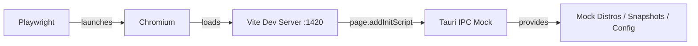

# 🎭 E2E Tests

> End-to-end testing with Playwright against a mocked Tauri backend.

---

## 🗂️ File Inventory

| File / Directory             | Purpose                                                          |
| ---------------------------- | ---------------------------------------------------------------- |
| `navigation.spec.ts`        | Tests page navigation across Distributions, Monitoring, and Settings tabs |
| `distro-list.spec.ts`       | Tests distro list rendering, status filtering, WSL version filtering, sort dropdown, and search |
| `fixtures/tauri-mock.ts`    | Custom Playwright fixture that injects `__TAURI_INTERNALS__` mock into the page |
| `test-results/`             | Auto-generated output directory for test artifacts (screenshots, traces) |

## 🔧 How It Works



The `tauriPage` fixture in `fixtures/tauri-mock.ts` intercepts all Tauri IPC calls (`window.__TAURI_INTERNALS__.invoke`) and returns mock data for every command the app uses — distros, snapshots, WSL config, audit log, metrics, and more. This allows full E2E testing without a running Tauri backend.

## ▶️ Running E2E Tests

```bash
npm run e2e          # Run all E2E tests
```

This starts the Vite dev server on `http://localhost:1420` (reuses an existing one if already running) and runs tests in Chromium.

## ⚙️ Configuration

Configured in [`playwright.config.ts`](../playwright.config.ts):

| Setting               | Value                          |
| --------------------- | ------------------------------ |
| Test directory         | `./e2e`                       |
| Output directory       | `./e2e/test-results`          |
| Browser               | Chromium (Desktop Chrome)      |
| Base URL              | `http://localhost:1420`        |
| Parallel execution    | Enabled                        |
| CI retries            | 2                              |
| Traces                | On first retry                 |
| Screenshots           | On failure only                |

---

> 👀 See also: [`playwright.config.ts`](../playwright.config.ts) — Playwright configuration and web server setup.
