# 🦀 Backend — Rust 1.93 + Tauri v2

> WSL Nexus backend: Hexagonal Architecture + CQRS, powered by Tauri v2.

---

## 🏗️ Layered Architecture

The backend follows a **Hexagonal Architecture** (Ports & Adapters) combined with the **CQRS** pattern (Command Query Responsibility Segregation).


| Layer | Directory | 🎯 Responsibility |
|---|---|---|
| 💎 **Domain** | [`src/domain/`](src/domain/README.md) | Pure business logic, entities, value objects, ports (traits), services |
| 📋 **Application** | [`src/application/`](src/application/README.md) | CQRS orchestration (commands + queries), DTOs, application services |
| 🔌 **Infrastructure** | [`src/infrastructure/`](src/infrastructure/README.md) | Concrete port implementations (WSL CLI, SQLite, ProcFs, Terminal, Port Forwarding, Audit, Debug Log) |
| 🎯 **Presentation** | [`src/presentation/`](src/presentation/README.md) | Tauri commands, AppState, events |

> ⚠️ **Dependency rule**: Inner layers never depend on outer layers. The Domain is the pure core with zero external dependencies.

---

## 🔧 Composition Root (`lib.rs`)

The file `src/lib.rs` is the **assembly point** where all ports are wired to their adapters:

```mermaid
graph LR
    subgraph lib.rs["⚙️ lib.rs — Composition Root"]
        AS["🗃️ AppState"]
    end

    AS --> WCA["🖥️ WslCliAdapter"]
    AS --> SSR["📸 SqliteSnapshotRepo"]
    AS --> PFA["📊 ProcFsMonitoringAdapter"]
    AS --> SMR["📈 SqliteMetricsRepo"]
    AS --> SAR["🔔 SqliteAlertRepo"]
    AS --> SAL["📋 SqliteAuditLogger"]
    AS --> NA["🌐 NetshAdapter"]
    AS --> SPFR["🔀 SqlitePortForwardRepo"]

    WCA -->|"Arc<dyn WslManagerPort>"| wsl["🪟 wsl.exe"]
    SSR -->|"Arc<dyn SnapshotRepositoryPort>"| db["🗄️ SQLite"]
    PFA -->|"Arc<dyn MonitoringProviderPort>"| proc["📊 /proc"]
    SMR -->|"Arc<dyn MetricsRepositoryPort>"| db
    SAR -->|"Arc<dyn AlertingPort>"| db
    SAL -->|"Arc<dyn AuditLoggerPort>"| db
    NA -->|"Arc<dyn PortForwardingPort>"| netsh["🌐 netsh"]
    SPFR -->|"Arc<dyn PortForwardRulesRepository>"| db
```



All adapters are injected as `Arc<dyn Port>` to enable dependency injection and mocking in tests.

💻 `TerminalSessionManager` is managed separately for independent lifecycle.

---

## 📂 File Structure

```
src-tauri/
├── Cargo.toml              # 📦 Rust dependencies (edition 2024)
├── Cargo.lock              # 🔒 Lock file
├── build.rs                # 🔨 Build script (calls tauri_build)
├── tauri.conf.json         # ⚙️ Tauri config (app, window, bundle)
└── src/
    ├── lib.rs              # 🔧 Composition root — port wiring
    ├── main.rs             # ⚡ Entry point (delegates to lib.rs)
    ├── domain/             # 💎 Pure business logic
    ├── application/        # 📋 CQRS handlers + DTOs
    ├── infrastructure/     # 🔌 Concrete adapters
    └── presentation/       # 🎯 Tauri commands
```

---

## 🔌 Tauri Plugins

| Plugin | 🎯 Usage |
|---|---|
| 🐚 `tauri-plugin-shell` | Shell command execution (wsl.exe, netsh) |
| 💾 `tauri-plugin-store` | Persistent preference storage |
| 📁 `tauri-plugin-dialog` | File dialogs (directory selection for snapshots) |
| 🔔 `tauri-plugin-notification` | Desktop notifications for alerts |

---

## 🗄️ SQLite Database

- **ORM**: SQLx 0.8 (async, compile-time checked)
- **Runtime**: Tokio
- **Initialization**: Async in Tauri's `setup` hook with `block_on`

### 📊 Tables

| Table | 🔑 Key Columns | 🎯 Purpose |
|---|---|---|
| `snapshots` | id, distro_name, name, snapshot_type, format, file_path, file_size, status | 📸 Snapshot metadata |
| `audit_log` | id, timestamp, action, target, details | 📋 Audit trail |
| `metrics_raw` | distro_name, timestamp, cpu_*, mem_*, disk_*, net_* | 📊 Raw time-series metrics |
| `metrics_aggregated` | distro_name, period_start, period_end, cpu_*, mem_*, disk_*, net_* | 📈 Aggregated 1-minute metrics |
| `alert_log` | distro_name, alert_type, threshold, actual_value, timestamp, acknowledged | 🔔 Alert history |
| `port_forwarding_rules` | id, distro_name, wsl_port, host_port, protocol, enabled | 🔀 Port forwarding rules |

### 📜 Migrations

SQL migrations are in `src/infrastructure/sqlite/migrations/`:
- `001_initial.sql` — Creates `snapshots` and `audit_log` tables with indexes
- `002_metrics.sql` — Creates `metrics_raw`, `metrics_aggregated`, `alert_log` tables
- `003_port_forwarding.sql` — Creates `port_forwarding_rules` table

---

## 🧪 Tests — ~140 tests

```bash
cargo test
```

| Layer | 🔢 Count | 📝 Details |
|---|---|---|
| 💎 Domain | ~37 | Value objects (DistroName, DistroState, WslVersion, MemorySize, SnapshotId), entities (Snapshot), alerting (AlertType serde + proptest) |
| 📋 Application | ~14 | DTOs (DistroResponse, SnapshotResponse mapping) |
| 🔌 Infrastructure | ~89 | WSL CLI (adapter, encoding, parser), debug log (buffer), SQLite (snapshots, metrics, alerts, port forwarding), monitoring (ProcFS adapter), audit (adapter) |

**🧰 Test tools**: `mockall` (port/trait mocking), `tokio-test` (async), `proptest` (property-based testing)

---

## 📦 Build & Release

```bash
# 🏗️ Production build
npm run tauri build
```

### ⚡ Release Profile (`Cargo.toml`)

| Option | Value | 💡 Effect |
|---|---|---|
| `opt-level` | `"s"` | Optimize for size |
| `lto` | `true` | Link-Time Optimization |
| `codegen-units` | `1` | Better optimization |
| `strip` | `true` | Strip debug symbols |

---

## ⚠️ Gotchas

| 🐛 Pitfall | ✅ Solution |
|---|---|
| `wsl.exe` outputs **UTF-16LE** | `encoding.rs` detects BOM and decodes, with UTF-8 fallback |
| `app_handle.path()` won't compile | You must import the `tauri::Manager` trait |
| SQLite init blocks the event loop | Use `block_on` in Tauri's `setup` hook |
| mockall + `Option<&str>` in async | Use `Option<String>` instead |
| Invalid Tauri icons | PNGs must be RGBA (color type 6), not RGB |

---

## ⚙️ Tauri Config (`tauri.conf.json`)

| Setting | Value |
|---|---|
| 🏷️ Product | WSL Nexus v1.0.0 |
| 🆔 Identifier | `dev.muchini.wsl-nexus` |
| 🌐 Dev URL | `http://localhost:1420` |
| 📁 Frontend build | `../dist` |
| 🪟 Window | 1280 x 800 (min 800 x 500) |

---

> 👀 Dive deeper: [💎 Domain](src/domain/README.md) · [📋 Application](src/application/README.md) · [🔌 Infrastructure](src/infrastructure/README.md) · [🎯 Presentation](src/presentation/README.md)
