# 🦀 Backend — Rust 1.93 + Tauri v2

> WSL Nexus backend: Hexagonal Architecture + CQRS, powered by Tauri v2.

---

## 🏛️ Layered Architecture

The backend follows a **Hexagonal Architecture** (Ports & Adapters) combined with the **CQRS** pattern (Command Query Responsibility Segregation).

```mermaid
graph TD
    P["🎭 Presentation<br/><small>Tauri commands exposed to the frontend</small>"]
    A["📋 Application<br/><small>CQRS handlers, DTOs, Services</small>"]
    D["💎 Domain<br/><small>Entities, Value Objects, Ports, Services</small>"]
    I["🔌 Infrastructure<br/><small>Adapters: WSL CLI, SQLite, Docker...</small>"]

    P --> A
    A --> D
    I -.->|"implements ports (traits)"| D
    P -.->|"uses adapters via AppState"| I

    style D fill:#2d6a4f,stroke:#333,color:#fff
    style A fill:#1d3557,stroke:#333,color:#fff
    style I fill:#e76f51,stroke:#333,color:#fff
    style P fill:#457b9d,stroke:#333,color:#fff
```



| Layer | Directory | Responsibility |
|---|---|---|
| 💎 **Domain** | [`src/domain/`](src/domain/README.md) | Pure business logic, entities, value objects, ports (traits), services |
| 📋 **Application** | [`src/application/`](src/application/README.md) | CQRS orchestration (commands + queries), DTOs, application services |
| 🔌 **Infrastructure** | [`src/infrastructure/`](src/infrastructure/README.md) | Concrete port implementations (WSL CLI, SQLite, Docker, etc.) |
| 🎭 **Presentation** | [`src/presentation/`](src/presentation/README.md) | Tauri commands, AppState, events |

> **Dependency rule**: Inner layers never depend on outer layers. The Domain is the pure core with zero external dependencies.

---

## 📦 Composition Root (`lib.rs`)

The file `src/lib.rs` is the **assembly point** where all ports are wired to their adapters:

```mermaid
graph LR
    subgraph lib.rs["🏠 lib.rs — Composition Root"]
        AS["AppState"]
    end

    AS --> WCA["WslCliAdapter"]
    AS --> SSR["SqliteSnapshotRepo"]
    AS --> PFA["ProcFsMonitoringAdapter"]
    AS --> DCA["DockerCliAdapter"]
    AS --> ICA["IacCliAdapter"]
    AS --> SAL["SqliteAuditLogger"]

    WCA -->|"Arc〈dyn WslManagerPort〉"| wsl["wsl.exe"]
    SSR -->|"Arc〈dyn SnapshotRepositoryPort〉"| db["SQLite"]
    PFA -->|"Arc〈dyn MonitoringProviderPort〉"| proc["/proc"]
    DCA -->|"Arc〈dyn DockerProviderPort〉"| docker["docker"]
    ICA -->|"Arc〈dyn IacProviderPort〉"| tools["IaC tools"]
    SAL -->|"Arc〈dyn AuditLoggerPort〉"| db
```



All adapters are injected as `Arc<dyn Port>` to enable dependency injection and mocking in tests.

---

## 📁 File Structure

```
src-tauri/
├── 📄 Cargo.toml              # Rust dependencies
├── 📄 Cargo.lock              # Lock file
├── 📄 build.rs                # Build script (calls tauri_build)
├── 📄 tauri.conf.json         # Tauri config (app, window, bundle)
└── src/
    ├── 📄 lib.rs              # 🏠 Composition root — port wiring
    ├── 📄 main.rs             # Entry point (delegates to lib.rs)
    ├── 💎 domain/             # Pure business logic
    ├── 📋 application/        # CQRS handlers + DTOs
    ├── 🔌 infrastructure/     # Concrete adapters
    └── 🎭 presentation/       # Tauri commands
```

---

## 🔌 Tauri Plugins

| Plugin | Usage |
|---|---|
| `tauri-plugin-shell` | Shell command execution (wsl.exe, docker, etc.) |
| `tauri-plugin-store` | Persistent preference storage |
| `tauri-plugin-log` | Structured logging |
| `tauri-plugin-dialog` | File dialogs (directory selection for snapshots) |

---

## 🗄️ SQLite Database

- **ORM**: SQLx 0.8 (async, compile-time checked)
- **Runtime**: Tokio
- **Initialization**: Async in Tauri's `setup` hook with `block_on`

### Tables

| Table | Key Columns | Purpose |
|---|---|---|
| `snapshots` | id, distro_name, name, snapshot_type, format, file_path, file_size, status | Snapshot metadata |
| `audit_log` | id, timestamp, action, target, details | Audit trail |

### Migrations

SQL migrations are in `src/infrastructure/sqlite/migrations/`:
- `001_initial.sql` — Creates `snapshots` and `audit_log` tables with indexes

---

## 🧪 Tests — 31 tests

```bash
cargo test
```

| Layer | Count | Details |
|---|---|---|
| Domain | 13 | Value objects (DistroName, DistroState, WslVersion, MemorySize) + DistroService |
| Infrastructure | 14 | UTF-16LE encoding (3), WSL parser (4), Monitoring (3), Docker (4) |
| Application | 4 | DistroService start/stop |

**Test tools**: `mockall` (port/trait mocking), `tokio-test` (async)

---

## ⚙️ Build & Release

```bash
# Production build
npm run tauri build
```

### Release Profile (`Cargo.toml`)

| Option | Value | Effect |
|---|---|---|
| `opt-level` | `"s"` | Optimize for size |
| `lto` | `true` | Link-Time Optimization |
| `codegen-units` | `1` | Better optimization |
| `strip` | `true` | Strip debug symbols |

---

## 💡 Gotchas

| Pitfall | Solution |
|---|---|
| `wsl.exe` outputs **UTF-16LE** | `encoding.rs` detects BOM and decodes, with UTF-8 fallback |
| `app_handle.path()` won't compile | You must import the `tauri::Manager` trait |
| SQLite init blocks the event loop | Use `block_on` in Tauri's `setup` hook |
| mockall + `Option<&str>` in async | Use `Option<String>` instead |
| Invalid Tauri icons | PNGs must be RGBA (color type 6), not RGB |

---

## 📄 Tauri Config (`tauri.conf.json`)

| Setting | Value |
|---|---|
| Product | WSL Nexus v0.1.0 |
| Identifier | `dev.muchini.wsl-nexus` |
| Dev URL | `http://localhost:1420` |
| Frontend build | `../dist` |
| Window | 1280 × 800 (min 960 × 600) |

---

> 📖 Dive deeper: [💎 Domain](src/domain/README.md) · [📋 Application](src/application/README.md) · [🔌 Infrastructure](src/infrastructure/README.md) · [🎭 Presentation](src/presentation/README.md)
