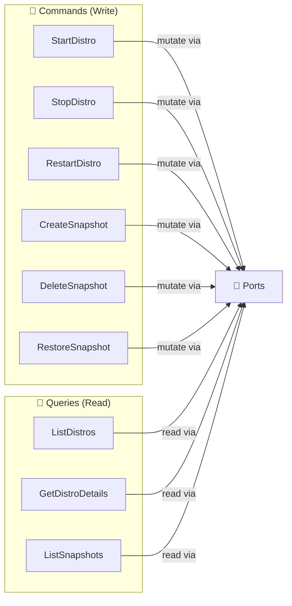
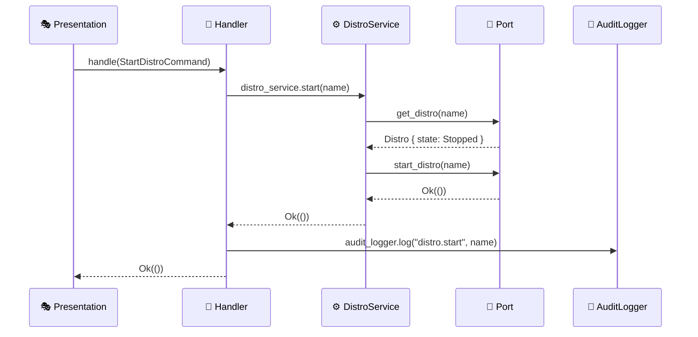
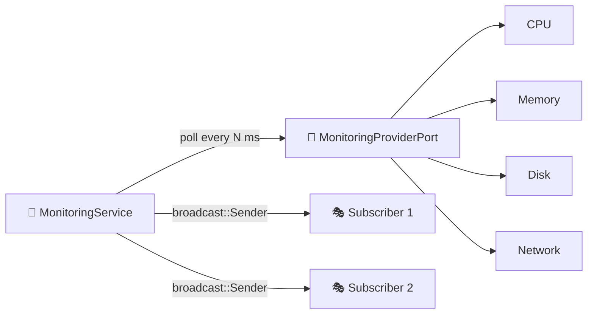

# 📋 Application Layer

> CQRS orchestration — Commands, Queries, DTOs and Application Services.

---

## 🎯 Purpose

The Application layer orchestrates the **use cases** of the application. It follows the **CQRS** pattern (Command Query Responsibility Segregation):

- **Commands** 📝: Actions that **mutate** state (start, stop, create, delete...)
- **Queries** 📖: Actions that **read** state without modifying it



---

## 📁 Structure

```
application/
├── 📄 mod.rs
├── 📝 commands/             # Command handlers (write)
│   ├── start_distro.rs     # StartDistroCommand + Handler
│   ├── stop_distro.rs      # StopDistroCommand + Handler
│   ├── restart_distro.rs   # RestartDistroCommand + Handler
│   ├── create_snapshot.rs  # CreateSnapshotCommand + Handler
│   ├── delete_snapshot.rs  # DeleteSnapshotCommand + Handler
│   └── restore_snapshot.rs # RestoreSnapshotCommand + Handler
├── 📖 queries/              # Query handlers (read)
│   ├── list_distros.rs     # ListDistrosHandler
│   ├── get_distro_details.rs  # GetDistroDetailsHandler
│   └── list_snapshots.rs   # ListSnapshotsHandler
├── 📤 dto/                  # Data Transfer Objects
│   └── responses.rs        # DistroResponse, SnapshotResponse...
└── 📡 services/             # Application services
    └── monitoring_service.rs  # Metrics polling & broadcast
```

---

## 📝 Commands (Write)

Each command is composed of a **Command struct** (the data) and a **Handler** (the logic).

| Handler | Command Struct | What It Does | Audit |
|---|---|---|---|
| `StartDistroHandler` | `StartDistroCommand { distro_name }` | Validates state → starts the distro | `distro.start` |
| `StopDistroHandler` | `StopDistroCommand { distro_name }` | Validates running → stops the distro | `distro.stop` |
| `RestartDistroHandler` | `RestartDistroCommand { distro_name }` | Stop → Start sequentially | `distro.restart` |
| `CreateSnapshotHandler` | `CreateSnapshotCommand { distro_name, name, desc, format, output_dir }` | Export via WSL → save to DB | `snapshot.create` |
| `DeleteSnapshotHandler` | `DeleteSnapshotCommand { snapshot_id }` | Remove from DB | `snapshot.delete` |
| `RestoreSnapshotHandler` | `RestoreSnapshotCommand { snapshot_id, mode, new_name, location }` | Import via WSL | `snapshot.restore` |

### Anatomy of a Handler



Every handler:
1. **Validates** via `DistroService` (business rules)
2. **Executes** via ports (traits)
3. **Logs** via `AuditLoggerPort`

---

## 📖 Queries (Read)

Queries have no Command struct — they take parameters directly.

| Handler | Parameters | Returns |
|---|---|---|
| `ListDistrosHandler` | none | `Vec<DistroResponse>` |
| `GetDistroDetailsHandler` | `name: &str` | `DistroDetailResponse` (distro + config) |
| `ListSnapshotsHandler` | `distro_name: Option<String>` | `Vec<SnapshotResponse>` |

Handlers convert **Domain entities** into **DTOs** via `From` implementations.

---

## 📤 DTOs (Data Transfer Objects)

DTOs are serializable structs sent to the frontend. They **decouple** the internal representation (Domain) from the external API.

### `DistroResponse`

| Field | Type | Source |
|---|---|---|
| `name` | `String` | `Distro.name.to_string()` |
| `state` | `String` | `"Running"`, `"Stopped"`, etc. |
| `wsl_version` | `u8` | `1` or `2` |
| `is_default` | `bool` | — |
| `base_path` | `Option<String>` | — |
| `vhdx_size_bytes` | `Option<u64>` | `MemorySize.bytes()` |
| `last_seen` | `String` | RFC3339 |

### `SnapshotResponse`

| Field | Type | Source |
|---|---|---|
| `id` | `String` | UUID |
| `distro_name` | `String` | — |
| `name` | `String` | — |
| `snapshot_type` | `String` | `"full"` or `"incremental"` |
| `format` | `String` | `"tar"`, `"tar.gz"`, `"tar.xz"`, `"vhdx"` |
| `file_path` | `String` | — |
| `file_size_bytes` | `u64` | — |
| `status` | `String` | `"in_progress"`, `"completed"`, `"failed: ..."` |

---

## 📡 Application Services

### `MonitoringService`

Monitoring service with **async polling** and Tokio **broadcast channel**:



- `start_polling(distro_name, interval_ms)` → Spawns a Tokio task
- Collects CPU + memory + disk + network on each tick
- Broadcasts `SystemMetrics` via a `broadcast::Sender`

---

> 📖 See also: [💎 Domain](../domain/README.md) · [🔌 Infrastructure](../infrastructure/README.md) · [🎭 Presentation](../presentation/README.md)
