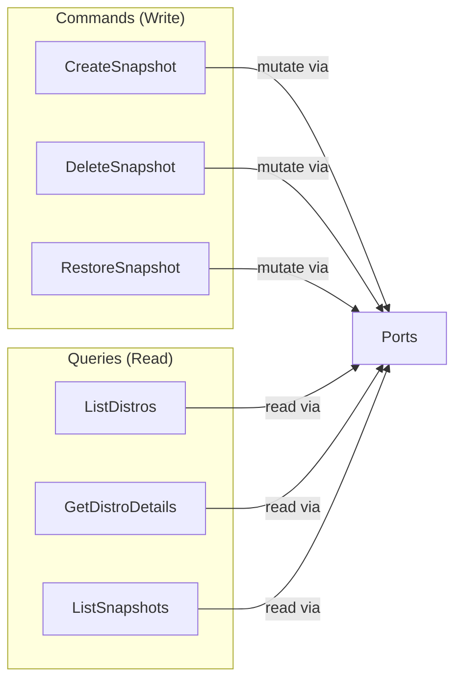

# Application Layer

> CQRS orchestration — Commands, Queries, DTOs and Application Services.

---

## Purpose

The Application layer orchestrates the **use cases** of the application. It follows the **CQRS** pattern (Command Query Responsibility Segregation):

- **Commands**: Actions that **mutate** state (create, delete, restore snapshots)
- **Queries**: Actions that **read** state without modifying it



> **Note:** Distro start/stop/restart commands go directly from the Tauri command layer (presentation) to `DistroService` + `AuditLogger` — there are no application-layer Handlers for these operations.

---

## Structure

```
application/
├── mod.rs
├── commands/             # Command handlers (write)
│   ├── create_snapshot.rs  # CreateSnapshotCommand + Handler
│   ├── delete_snapshot.rs  # DeleteSnapshotCommand + Handler
│   └── restore_snapshot.rs # RestoreSnapshotCommand + Handler
├── queries/              # Query handlers (read)
│   ├── list_distros.rs     # ListDistrosHandler
│   ├── get_distro_details.rs  # GetDistroDetailsHandler
│   └── list_snapshots.rs   # ListSnapshotsHandler
├── dto/                  # Data Transfer Objects
│   └── responses.rs        # DistroResponse, SnapshotResponse...
└── services/             # Application services
    └── (empty)             # No service modules currently
```

---

## Commands (Write)

Each command is composed of a **Command struct** (the data) and a **Handler** (the logic).

| Handler | Command Struct | What It Does | Audit |
|---|---|---|---|
| `CreateSnapshotHandler` | `CreateSnapshotCommand { distro_name, name, desc, format, output_dir }` | Export via WSL -> save to DB | `snapshot.create` |
| `DeleteSnapshotHandler` | `DeleteSnapshotCommand { snapshot_id }` | Remove from DB | `snapshot.delete` |
| `RestoreSnapshotHandler` | `RestoreSnapshotCommand { snapshot_id, mode, new_name, location }` | Import via WSL | `snapshot.restore` |

### Anatomy of a Snapshot Handler


Every handler:
1. **Executes** via ports (traits)
2. **Persists** via `SnapshotRepositoryPort`
3. **Logs** via `AuditLoggerPort`

### Distro Commands — Direct Flow

Distro start/stop/restart bypass application-layer handlers entirely. The Tauri command (presentation layer) calls `DistroService` directly:


---

## Queries (Read)

Queries have no Command struct — they take parameters directly.

| Handler | Parameters | Returns |
|---|---|---|
| `ListDistrosHandler` | none | `Vec<DistroResponse>` |
| `GetDistroDetailsHandler` | `name: &str` | `DistroDetailResponse` (distro + config) |
| `ListSnapshotsHandler` | `distro_name: Option<String>` | `Vec<SnapshotResponse>` |

Handlers convert **Domain entities** into **DTOs** via `From` implementations.

---

## DTOs (Data Transfer Objects)

DTOs are serializable structs sent to the frontend. They **decouple** the internal representation (Domain) from the external API.

### `DistroResponse`

| Field | Type | Source |
|---|---|---|
| `name` | `String` | `Distro.name.to_string()` |
| `state` | `String` | `"Running"`, `"Stopped"`, etc. |
| `wsl_version` | `u8` | `1` or `2` |
| `is_default` | `bool` | — |
| `base_path` | `Option<String>` | — |
| `vhdx_size_bytes` | `Option<u64>` | `MemorySize.bytes()` |
| `last_seen` | `String` | RFC3339 |

### `SnapshotResponse`

| Field | Type | Source |
|---|---|---|
| `id` | `String` | UUID |
| `distro_name` | `String` | — |
| `name` | `String` | — |
| `snapshot_type` | `String` | `"full"` or `"incremental"` |
| `format` | `String` | `"tar"`, `"vhdx"` |
| `file_path` | `String` | — |
| `file_size_bytes` | `u64` | — |
| `status` | `String` | `"in_progress"`, `"completed"`, `"failed: ..."` |

---

## Tests — ~14 tests

```bash
cargo test --lib application
```

| Module | Tests | What's Tested |
|---|---|---|
| `dto/responses` | 14 | DistroResponse and SnapshotResponse mapping from Domain entities |

---

> See also: [Domain](../domain/README.md) · [Infrastructure](../infrastructure/README.md) · [Presentation](../presentation/README.md)
