# 📋 Application Layer

> CQRS orchestration — Commands, Queries, DTOs and Application Services.

---

## 🎯 Purpose

The Application layer orchestrates the **use cases** of the application. It follows the **CQRS** pattern (Command Query Responsibility Segregation):

- ✏️ **Commands**: Actions that **mutate** state (create, delete, restore snapshots)
- 🔍 **Queries**: Actions that **read** state without modifying it

```mermaid
graph LR
    subgraph "✏️ Commands (Write)"
        CS["📸 CreateSnapshot"]
        DS["🗑️ DeleteSnapshot"]
        RS["🔄 RestoreSnapshot"]
    end

    subgraph "🔍 Queries (Read)"
        LD["🖥️ ListDistros"]
        GD["📋 GetDistroDetails"]
        LS["📸 ListSnapshots"]
    end

    CS & DS & RS -->|"mutate via"| P1["🔗 Ports"]
    LD & GD & LS -->|"read via"| P1
```



> 💡 **Note:** Distro start/stop/restart commands go directly from the Tauri command layer (presentation) to `DistroService` + `AuditLogger` — there are no application-layer Handlers for these operations.

---

## 📂 Structure

```
application/
├── mod.rs
├── commands/             # ✏️ Command handlers (write)
│   ├── create_snapshot.rs  # 📸 CreateSnapshotCommand + Handler
│   ├── delete_snapshot.rs  # 🗑️ DeleteSnapshotCommand + Handler
│   └── restore_snapshot.rs # 🔄 RestoreSnapshotCommand + Handler
├── queries/              # 🔍 Query handlers (read)
│   ├── list_distros.rs     # 🖥️ ListDistrosHandler
│   ├── get_distro_details.rs  # 📋 GetDistroDetailsHandler
│   └── list_snapshots.rs   # 📸 ListSnapshotsHandler
├── dto/                  # 📦 Data Transfer Objects
│   └── responses.rs        # DistroResponse, SnapshotResponse...
└── services/             # ⚙️ Application services
    └── (empty)             # No service modules currently
```

---

## ✏️ Commands (Write)

Each command is composed of a **Command struct** (the data) and a **Handler** (the logic).

| Handler | Command Struct | 🎯 What It Does | 📋 Audit |
|---|---|---|---|
| `CreateSnapshotHandler` | `CreateSnapshotCommand { distro_name, name, desc, format, output_dir }` | 📸 Export via WSL → save to DB | `snapshot.create` |
| `DeleteSnapshotHandler` | `DeleteSnapshotCommand { snapshot_id }` | 🗑️ Remove from DB | `snapshot.delete` |
| `RestoreSnapshotHandler` | `RestoreSnapshotCommand { snapshot_id, mode, new_name, location }` | 🔄 Import via WSL | `snapshot.restore` |

### 🔬 Anatomy of a Snapshot Handler


Every handler:
1. ⚡ **Executes** via ports (traits)
2. 💾 **Persists** via `SnapshotRepositoryPort`
3. 📋 **Logs** via `AuditLoggerPort`

### 🖥️ Distro Commands — Direct Flow

Distro start/stop/restart bypass application-layer handlers entirely. The Tauri command (presentation layer) calls `DistroService` directly:

```mermaid
sequenceDiagram
    participant P as 🎯 Tauri Command
    participant S as ⚙️ DistroService
    participant Port as 🔗 WslManagerPort
    participant A as 📋 AuditLogger

    P->>S: distro_service.start(name)
    S->>Port: get_distro(name)
    Port-->>S: Distro { state: Stopped }
    S->>Port: start_distro(name)
    Port-->>S: Ok(())
    S-->>P: Ok(())
    P->>A: audit_logger.log("distro.start", name)
```



---

## 🔍 Queries (Read)

Queries have no Command struct — they take parameters directly.

| Handler | Parameters | 📤 Returns |
|---|---|---|
| `ListDistrosHandler` | none | `Vec<DistroResponse>` |
| `GetDistroDetailsHandler` | `name: &str` | `DistroDetailResponse` (distro + config) |
| `ListSnapshotsHandler` | `distro_name: Option<String>` | `Vec<SnapshotResponse>` |

Handlers convert **Domain entities** into **DTOs** via `From` implementations. 🔄

---

## 📦 DTOs (Data Transfer Objects)

DTOs are serializable structs sent to the frontend. They **decouple** the internal representation (Domain) from the external API.

### 🖥️ `DistroResponse`

| Field | Type | Source |
|---|---|---|
| `name` | `String` | `Distro.name.to_string()` |
| `state` | `String` | `"Running"`, `"Stopped"`, etc. |
| `wsl_version` | `u8` | `1` or `2` |
| `is_default` | `bool` | — |
| `base_path` | `Option<String>` | — |
| `vhdx_size_bytes` | `Option<u64>` | `MemorySize.bytes()` |
| `last_seen` | `String` | RFC3339 |

### 📸 `SnapshotResponse`

| Field | Type | Source |
|---|---|---|
| `id` | `String` | 🆔 UUID |
| `distro_name` | `String` | — |
| `name` | `String` | — |
| `snapshot_type` | `String` | `"full"` or `"incremental"` |
| `format` | `String` | `"tar"`, `"vhdx"` |
| `file_path` | `String` | — |
| `file_size_bytes` | `u64` | — |
| `status` | `String` | `"in_progress"`, `"completed"`, `"failed: ..."` |

---

## 🧪 Tests — ~14 tests

```bash
cargo test --lib application
```

| Module | 🔢 Tests | 📝 What's Tested |
|---|---|---|
| `dto/responses` | 14 | ✅ DistroResponse and SnapshotResponse mapping from Domain entities |

---

> 👀 See also: [💎 Domain](../domain/README.md) · [🔌 Infrastructure](../infrastructure/README.md) · [🎯 Presentation](../presentation/README.md)
