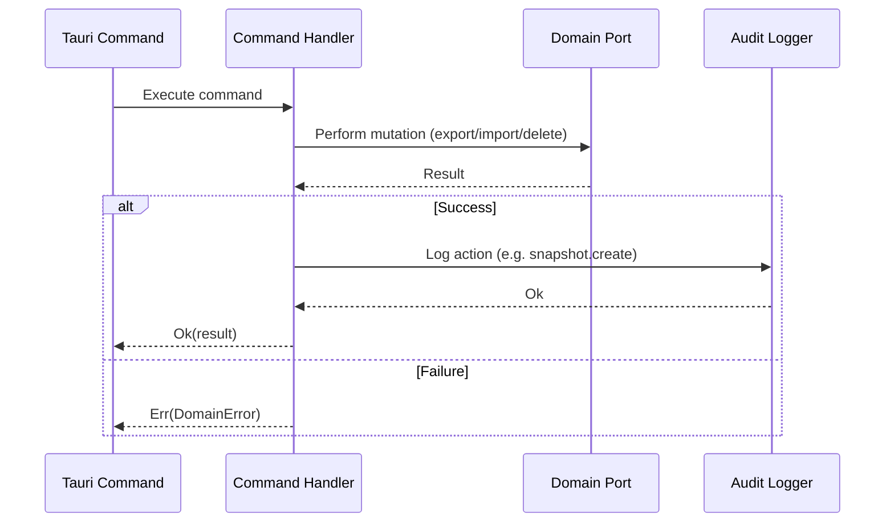

# 📝 Commands

> CQRS write-side handlers that mutate system state through domain ports and record every action in the audit log.

---

## 🔄 Command Flow

## 📂 File Inventory

| File | Command | Description | Ports Used |
|------|---------|-------------|------------|
| `create_snapshot.rs` | `CreateSnapshotCommand` | Exports a WSL distro to a `.tar` or `.vhdx` file, validates the output (size, tar magic), and saves metadata | `WslManagerPort`, `SnapshotRepositoryPort`, `AuditLoggerPort` |
| `restore_snapshot.rs` | `RestoreSnapshotCommand` | Restores a snapshot via `wsl --import` in clone or overwrite mode, with safety backup and VHDX lock handling | `WslManagerPort`, `SnapshotRepositoryPort`, `AuditLoggerPort` |
| `delete_snapshot.rs` | `DeleteSnapshotCommand` | Deletes the snapshot file from disk and removes the metadata record | `SnapshotRepositoryPort`, `AuditLoggerPort` |
| `mod.rs` | — | Module declarations | — |

## 🧩 Key Patterns

- **Audit logging after every mutation** — Each handler calls `AuditLoggerPort::log()` or `log_with_details()` after a successful operation, creating a traceable record of all state changes.
- **Status tracking** — `CreateSnapshotHandler` saves the snapshot with `InProgress` status before starting the export, then updates to `Completed` or `Failed` depending on the outcome.
- **Error mapping** — All handlers return `Result<_, DomainError>` and map infrastructure errors (file I/O, WSL CLI failures) into domain-level error variants.
- **WSL VM shutdown** — Both create and restore commands shut down the entire WSL VM (not just the target distro) before export/import to avoid VHDX file locks.
- **Safety backup on overwrite** — `RestoreSnapshotHandler` creates a pre-restore backup of the existing distro before unregistering it, and auto-restores from the backup if import fails.
- **Windows/Linux path fallback** — All file operations try the stored path first, then fall back to a `windows_to_linux_path()` conversion for cross-environment compatibility.

---

> 👀 See also: [`queries/`](../queries/) | [`dto/`](../dto/) | [`application/`](../)
