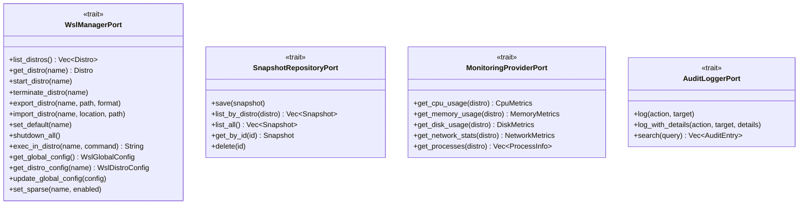

# 💎 Domain Layer

> The business core of WSL Nexus — pure logic, zero external dependencies.

---

## 🎯 Purpose

The Domain layer contains the **pure business logic** of the application. It depends on no external library (no Tauri, no SQLite, no filesystem). All interactions with the outside world go through **ports** (Rust traits) that the Infrastructure layer implements.

---

## 📁 Structure

```
domain/
├── 📄 mod.rs
├── 📦 entities/            # Business objects with identity
│   ├── distro.rs          # WSL Distribution
│   ├── snapshot.rs        # Distribution backup
│   ├── monitoring.rs      # System metrics (CPU, RAM, disk, network, processes)
│   └── wsl_config.rs      # Global and per-distro WSL configuration
├── 🔒 value_objects/       # Immutable objects validated at construction
│   ├── distro_name.rs     # Distribution name (non-empty)
│   ├── distro_state.rs    # State: Running, Stopped, Installing...
│   ├── wsl_version.rs     # Version: V1, V2
│   ├── memory_size.rs     # Memory size (bytes → KB/MB/GB)
│   └── snapshot_id.rs     # UUID identifier
├── 🔌 ports/               # Interfaces (traits) to the outside world
│   ├── wsl_manager.rs     # WSL distribution management
│   ├── snapshot_repository.rs  # Snapshot persistence
│   ├── monitoring_provider.rs  # Metrics collection
│   └── audit_logger.rs         # Audit logging
├── ⚙️ services/            # Orchestrated business logic
│   └── distro_service.rs  # Distribution management rules
└── ❌ errors.rs            # DomainError enum
```

---

## 📦 Entities

Entities are business objects with their own identity.

### `Distro` — WSL Distribution

| Field | Type | Description |
|---|---|---|
| `name` | `DistroName` | Distribution name |
| `state` | `DistroState` | Current state (Running, Stopped...) |
| `wsl_version` | `WslVersion` | V1 or V2 |
| `is_default` | `bool` | Default distribution |
| `base_path` | `Option<String>` | Installation path |
| `vhdx_size` | `Option<MemorySize>` | Virtual disk size |
| `last_seen` | `DateTime<Utc>` | Last detected timestamp |

### `Snapshot` — Backup

| Field | Type | Description |
|---|---|---|
| `id` | `SnapshotId` | Unique UUID |
| `distro_name` | `DistroName` | Source distribution |
| `name` | `String` | User-given name |
| `snapshot_type` | `SnapshotType` | `Full` or `PseudoIncremental` |
| `format` | `ExportFormat` | `Tar`, `TarGz`, `TarXz`, `Vhd` |
| `file_path` | `String` | Exported file path |
| `file_size` | `MemorySize` | File size |
| `parent_id` | `Option<SnapshotId>` | Parent (for incrementals) |
| `status` | `SnapshotStatus` | `InProgress`, `Completed`, `Failed(reason)` |

### Other Entities

| Entity | File | Description |
|---|---|---|
| `CpuMetrics`, `MemoryMetrics`, `DiskMetrics`, `NetworkMetrics`, `ProcessInfo` | `monitoring.rs` | Real-time system metrics |
| `WslGlobalConfig`, `WslDistroConfig` | `wsl_config.rs` | `.wslconfig` and `wsl.conf` configuration |

---

## 🔒 Value Objects

Value objects are **immutable** and **validated at construction**. Two instances with the same values are considered equal.

| Value Object | Validation | Key Methods |
|---|---|---|
| `DistroName` | Rejects empty strings, trims whitespace | `as_str()`, `Display` |
| `DistroState` | Parses from WSL output (case-insensitive) | `is_running()`, `from_wsl_output()` |
| `WslVersion` | Parses "1" or "2" | `as_u8()`, `from_str_version()` |
| `MemorySize` | Wraps `u64` (bytes) | `bytes()`, `kb()`, `mb()`, `gb()`, Display ("5.00 MB") |
| `SnapshotId` | UUID v4 | `new()`, `from_string()`, `as_str()` |

---

## 🔌 Ports (Traits)

Ports define the **interfaces** that the Domain layer exposes to the outside world. Each port is implemented by an adapter in the Infrastructure layer.



---

## ⚙️ Services

### `DistroService`

The `DistroService` encapsulates **business rules** for distribution management:

| Method | Business Rule |
|---|---|
| `start(name)` | ❌ Error if the distro is already `Running` |
| `stop(name)` | ❌ Error if the distro is not `Running` |
| `restart(name)` | Stop then Start sequentially |
| `list_all()` | Delegates to the port without validation |

The service takes an `Arc<dyn WslManagerPort>` — dependency injection via the port.

---

## ❌ Errors — `DomainError`

Centralized enum with `thiserror` derive for explicit messages:

| Variant | When |
|---|---|
| `DistroNotFound(String)` | Unknown distribution |
| `DistroNotRunning(String)` | Attempting to stop a non-running distro |
| `DistroAlreadyRunning(String)` | Attempting to start an already active distro |
| `InvalidDistroName(String)` | Empty or invalid name |
| `SnapshotNotFound(String)` | Snapshot not found |
| `SnapshotError(String)` | Error during export/import |
| `WslCliError(String)` | wsl.exe command error |
| `MonitoringError(String)` | Metrics collection error |
| `DockerError(String)` | Docker error |
| `DatabaseError(String)` | SQLite error |
| `ConfigError(String)` | Configuration error |
| `IacError(String)` | IaC error |
| `IoError(String)` | I/O error |
| `Internal(String)` | Internal error |

`DomainError` implements `Serialize` to be sent to the frontend via Tauri.

---

## 🧪 Tests — 13 tests

| Module | Tests | What's Tested |
|---|---|---|
| `distro_name` | 3 | Valid construction, empty string rejection, whitespace trimming |
| `distro_state` | 4 | State parsing, case-insensitive, unknown state rejection |
| `wsl_version` | 2 | V1 and V2 parsing |
| `memory_size` | 4 | Display bytes, KB, MB, GB |

`DistroService` tests use **mockall** to mock the `WslManagerPort`.

```bash
cargo test --lib domain
```
