# 💎 Domain Layer

> The business core of WSL Nexus — pure logic, zero external dependencies.

---

## 🎯 Purpose

The Domain layer contains the **pure business logic** of the application. It depends on no external library (no Tauri, no SQLite, no filesystem). All interactions with the outside world go through **ports** (Rust traits) that the Infrastructure layer implements.

---

## 📂 Structure

```
domain/
├── mod.rs
├── entities/            # 🏛️ Business objects with identity
│   ├── distro.rs          # 🖥️ WSL Distribution
│   ├── snapshot.rs        # 📸 Distribution backup
│   ├── monitoring.rs      # 📊 System metrics (CPU, RAM, disk, network, processes)
│   ├── wsl_config.rs      # ⚙️ Global and per-distro WSL configuration
│   ├── wsl_version.rs     # 🏷️ WSL version entity
│   └── port_forward.rs    # 🔀 Port forwarding (ListeningPort, PortForwardRule)
├── value_objects/       # 💠 Immutable objects validated at construction
│   ├── distro_name.rs     # 🏷️ Distribution name (non-empty)
│   ├── distro_state.rs    # 🚦 State: Running, Stopped, Installing...
│   ├── wsl_version.rs     # 🔢 Version: V1, V2
│   ├── memory_size.rs     # 💾 Memory size (bytes -> KB/MB/GB)
│   └── snapshot_id.rs     # 🆔 UUID identifier
├── ports/               # 🔗 Interfaces (traits) to the outside world
│   ├── wsl_manager.rs         # 🖥️ WSL distribution management
│   ├── snapshot_repository.rs # 📸 Snapshot persistence
│   ├── monitoring_provider.rs # 📊 Metrics collection
│   ├── metrics_repository.rs  # 📈 Metrics time-series persistence
│   ├── audit_logger.rs        # 📋 Audit logging
│   ├── alerting.rs            # 🔔 Alert thresholds + records (AlertType, AlertThreshold, AlertRecord)
│   └── port_forwarding.rs     # 🔀 Port forwarding (PortForwardingPort + PortForwardRulesRepository)
├── services/            # ⚙️ Orchestrated business logic
│   └── distro_service.rs  # 🖥️ Distribution management rules
└── errors.rs            # ⚠️ DomainError enum
```

---

## 🏛️ Entities

Entities are business objects with their own identity.

### 🖥️ `Distro` — WSL Distribution

| Field | Type | Description |
|---|---|---|
| `name` | `DistroName` | 🏷️ Distribution name |
| `state` | `DistroState` | 🚦 Current state (Running, Stopped...) |
| `wsl_version` | `WslVersion` | 🔢 V1 or V2 |
| `is_default` | `bool` | ⭐ Default distribution |
| `base_path` | `Option<String>` | 📁 Installation path |
| `vhdx_size` | `Option<MemorySize>` | 💾 Virtual disk size |
| `last_seen` | `DateTime<Utc>` | 🕐 Last detected timestamp |

### 📸 `Snapshot` — Backup

| Field | Type | Description |
|---|---|---|
| `id` | `SnapshotId` | 🆔 Unique UUID |
| `distro_name` | `DistroName` | 🖥️ Source distribution |
| `name` | `String` | 🏷️ User-given name |
| `snapshot_type` | `SnapshotType` | 📦 `Full` or `PseudoIncremental` |
| `format` | `ExportFormat` | 💾 `Tar`, `Vhd` |
| `file_path` | `String` | 📁 Exported file path |
| `file_size` | `MemorySize` | 📊 File size |
| `parent_id` | `Option<SnapshotId>` | 🔗 Parent (for incrementals) |
| `status` | `SnapshotStatus` | 🚦 `InProgress`, `Completed`, `Failed(reason)` |

### 🔀 `PortForwardRule` — Port Forwarding Rule

| Field | Type | Description |
|---|---|---|
| `id` | `String` | 🆔 Unique identifier |
| `distro_name` | `String` | 🖥️ Target WSL distribution |
| `wsl_port` | `u16` | 🔌 Port inside WSL |
| `host_port` | `u16` | 🪟 Port on Windows host |
| `protocol` | `String` | 🌐 Protocol (tcp/udp) |
| `enabled` | `bool` | ✅ Whether rule is active |

### 📊 Other Entities

| Entity | File | Description |
|---|---|---|
| `CpuMetrics`, `MemoryMetrics`, `DiskMetrics`, `NetworkMetrics`, `ProcessInfo` | `monitoring.rs` | 📈 Real-time system metrics |
| `WslGlobalConfig`, `WslDistroConfig` | `wsl_config.rs` | ⚙️ `.wslconfig` and `wsl.conf` configuration |
| `ListeningPort` | `port_forward.rs` | 🔌 Port currently listening inside WSL |

---

## 💠 Value Objects

Value objects are **immutable** and **validated at construction**. Two instances with the same values are considered equal.

| Value Object | ✅ Validation | 🔑 Key Methods |
|---|---|---|
| `DistroName` | Rejects empty strings, trims whitespace | `as_str()`, `Display` |
| `DistroState` | Parses from WSL output (case-insensitive) | `is_running()`, `from_wsl_output()` |
| `WslVersion` | Parses "1" or "2" | `as_u8()`, `from_str_version()` |
| `MemorySize` | Wraps `u64` (bytes) | `bytes()`, `kb()`, `mb()`, `gb()`, Display ("5.00 MB") |
| `SnapshotId` | UUID v4 | `new()`, `from_string()`, `as_str()` |

---

## 🔗 Ports (Traits)

Ports define the **interfaces** that the Domain layer exposes to the outside world. Each port is implemented by an adapter in the Infrastructure layer.

```mermaid
classDiagram
    class WslManagerPort {
        <<trait>>
        +list_distros() Vec~Distro~
        +get_distro(name) Distro
        +start_distro(name)
        +terminate_distro(name)
        +export_distro(name, path, format)
        +import_distro(name, location, path)
        +set_default(name)
        +shutdown_all()
        +exec_in_distro(name, command) String
        +get_global_config() WslGlobalConfig
        +update_global_config(config)
        +set_sparse(name, enabled)
    }

    class SnapshotRepositoryPort {
        <<trait>>
        +save(snapshot)
        +list_by_distro(distro) Vec~Snapshot~
        +list_all() Vec~Snapshot~
        +get_by_id(id) Snapshot
        +delete(id)
    }

    class MonitoringProviderPort {
        <<trait>>
        +get_all_metrics(distro) Tuple
        +get_processes(distro) Vec~ProcessInfo~
    }

    class MetricsRepositoryPort {
        <<trait>>
        +store_raw(metrics)
        +query_raw(distro, from, to) Vec~RawMetricsRow~
        +query_aggregated(distro, from, to) Vec~AggregatedMetricsPoint~
        +aggregate_raw_buckets(start, end) u64
        +purge_raw_before(before) u64
        +purge_aggregated_before(before) u64
    }

    class AuditLoggerPort {
        <<trait>>
        +log(action, target)
        +log_with_details(action, target, details)
        +search(query) Vec~AuditEntry~
    }

    class AlertingPort {
        <<trait>>
        +record_alert(distro, type, threshold, value)
        +get_recent_alerts(distro, limit) Vec~AlertRecord~
        +acknowledge_alert(id)
        +purge_before(before) u64
    }

    class PortForwardingPort {
        <<trait>>
        +list_listening_ports(distro) Vec~ListeningPort~
        +get_wsl_ip(distro) String
        +apply_rule(host_port, wsl_ip, wsl_port)
        +remove_rule(host_port)
    }

    class PortForwardRulesRepository {
        <<trait>>
        +save_rule(rule)
        +delete_rule(id)
        +list_rules(distro) Vec~PortForwardRule~
        +get_rule(id) Option~PortForwardRule~
    }
```



---

## ⚙️ Services

### 🖥️ `DistroService`

The `DistroService` encapsulates **business rules** for distribution management:

| Method | 📏 Business Rule |
|---|---|
| `start(name)` | ⚠️ Error if the distro is already `Running` |
| `stop(name)` | ⚠️ Error if the distro is not `Running` |
| `restart(name)` | 🔄 Stop then Start sequentially |
| `list_all()` | ➡️ Delegates to the port without validation |

The service takes an `Arc<dyn WslManagerPort>` — dependency injection via the port.

---

## ⚠️ Errors — `DomainError`

Centralized enum with `thiserror` derive for explicit messages:

| Variant | 🎯 When |
|---|---|
| `DistroNotFound(String)` | ❓ Unknown distribution |
| `DistroNotRunning(String)` | 🛑 Attempting to stop a non-running distro |
| `DistroAlreadyRunning(String)` | 🟢 Attempting to start an already active distro |
| `InvalidDistroName(String)` | 🚫 Empty or invalid name |
| `SnapshotNotFound(String)` | ❓ Snapshot not found |
| `SnapshotError(String)` | 💥 Error during export/import |
| `WslCliError(String)` | 🐚 wsl.exe command error |
| `MonitoringError(String)` | 📊 Metrics collection error |
| `DatabaseError(String)` | 🗄️ SQLite error |
| `ConfigError(String)` | ⚙️ Configuration error |
| `IoError(String)` | 📁 I/O error |
| `Internal(String)` | 💀 Internal error |

`DomainError` implements `Serialize` to be sent to the frontend via Tauri.

---

## 🧪 Tests — ~37 tests

| Module | 🔢 Tests | 📝 What's Tested |
|---|---|---|
| `distro_name` | 5 | ✅ Valid construction, empty string rejection, whitespace trimming |
| `distro_state` | 5 | 🚦 State parsing, case-insensitive, unknown state rejection |
| `wsl_version` | 2 | 🔢 V1 and V2 parsing |
| `memory_size` | 6 | 💾 Display bytes, KB, MB, GB |
| `snapshot_id` | 6 | 🆔 UUID construction, parsing, display |
| `snapshot` | 4 | 📸 Snapshot entity construction and status transitions |
| `alerting` | 9 | 🔔 AlertType display, FromStr, serde, proptest |

`DistroService` tests use **mockall** to mock the `WslManagerPort`.

```bash
cargo test --lib domain
```

---

> 👀 See also: [📋 Application](../application/README.md) · [🔌 Infrastructure](../infrastructure/README.md) · [🎯 Presentation](../presentation/README.md)
