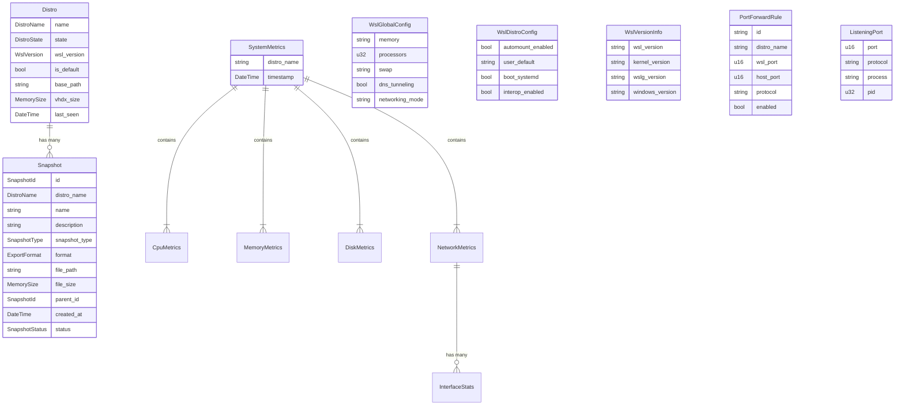

# 🏛️ Entities

> Core business objects with identity and lifecycle that model the WSL management domain.

---

## 🗺️ Entity Relationships

## 📁 File Inventory

| File | Description | Key Types |
|------|-------------|-----------|
| `distro.rs` | WSL distribution with state and metadata | `Distro` |
| `snapshot.rs` | Export snapshot with format and status tracking | `Snapshot`, `SnapshotType`, `ExportFormat`, `SnapshotStatus`, `RestoreMode` |
| `monitoring.rs` | Real-time system metrics from `/proc` | `SystemMetrics`, `CpuMetrics`, `MemoryMetrics`, `DiskMetrics`, `NetworkMetrics`, `InterfaceStats`, `ProcessInfo` |
| `wsl_config.rs` | Global `.wslconfig` and per-distro `/etc/wsl.conf` | `WslGlobalConfig`, `WslDistroConfig` |
| `wsl_version.rs` | WSL installation version info | `WslVersionInfo` |
| `port_forward.rs` | Port forwarding rules and listening port discovery | `PortForwardRule`, `ListeningPort` |
| `mod.rs` | Module declarations | -- |

## 🔍 Key Design Notes

- **`Distro`** uses value objects (`DistroName`, `DistroState`, `WslVersion`, `MemorySize`) rather than raw primitives for type-safe domain modeling.
- **`Snapshot`** supports two formats (`Tar`, `Vhd`) and two types (`Full`, `PseudoIncremental` with `parent_id` chaining). `ExportFormat` exposes `extension()` and `wsl_flag()` helpers used by the CLI adapter.
- **`SystemMetrics`** is a composite entity assembled from four sub-structs. `ProcessInfo` is collected separately via `get_processes()`.
- **`WslGlobalConfig`** maps the `[wsl2]` and `[experimental]` INI sections. All fields are `Option<T>` since every setting is optional.
- **`PortForwardRule`** models a `netsh` port proxy mapping between WSL and Windows host ports.

---

> 👀 See also: [ports/](../ports/) | [value_objects/](../value_objects/) | [services/](../services/) | [💎 domain/](../)
