# 🔗 Ports

> Async trait interfaces that define the domain's boundaries with the outside world.

---

## 🏗️ Port Architecture

```mermaid
classDiagram
    class WslManagerPort {
        +list_distros() Vec~Distro~
        +get_distro(name) Distro
        +start_distro(name)
        +terminate_distro(name)
        +unregister_distro(name)
        +export_distro(name, path, format)
        +import_distro(name, location, path, format)
        +shutdown_all()
        +exec_in_distro(name, command) String
        +get_global_config() WslGlobalConfig
        +get_distro_config(name) WslDistroConfig
        +update_global_config(config)
        +set_sparse(name, enabled)
        +get_version_info() WslVersionInfo
        +get_distro_install_path(name) String
        +resize_vhd(name, size)
        +set_default_distro(name)
    }

    class SnapshotRepositoryPort {
        +save(snapshot)
        +list_by_distro(distro) Vec~Snapshot~
        +list_all() Vec~Snapshot~
        +get_by_id(id) Snapshot
        +delete(id)
    }

    class MonitoringProviderPort {
        +get_cpu_usage(distro) CpuMetrics
        +get_memory_usage(distro) MemoryMetrics
        +get_disk_usage(distro) DiskMetrics
        +get_network_stats(distro) NetworkMetrics
        +get_processes(distro) Vec~ProcessInfo~
        +get_all_metrics(distro) Tuple
    }

    class MetricsRepositoryPort {
        +store_raw(metrics)
        +query_raw(distro, from, to) Vec~RawMetricsRow~
        +query_aggregated(distro, from, to) Vec~AggregatedMetricsPoint~
        +aggregate_raw_buckets(start, end) u64
        +purge_raw_before(before) u64
        +purge_aggregated_before(before) u64
    }

    class AuditLoggerPort {
        +log(action, target)
        +log_with_details(action, target, details)
        +search(query) Vec~AuditEntry~
    }

    class AlertingPort {
        +record_alert(distro, type, threshold, value)
        +get_recent_alerts(distro, limit) Vec~AlertRecord~
        +acknowledge_alert(alert_id)
        +purge_before(before) u64
    }

    class PortForwardingPort {
        +list_listening_ports(distro) Vec~ListeningPort~
        +get_wsl_ip(distro) String
        +apply_rule(host_port, wsl_ip, wsl_port)
        +remove_rule(host_port)
    }

    class PortForwardRulesRepository {
        +save_rule(rule)
        +delete_rule(rule_id)
        +list_rules(distro) Vec~PortForwardRule~
        +get_rule(rule_id) Option~PortForwardRule~
    }
```

## 🔌 Port-to-Adapter Mapping

| Port Trait | Infrastructure Adapter | Transport |
|------------|----------------------|-----------|
| `WslManagerPort` | `WslCliAdapter` | `wsl.exe` CLI (UTF-16LE) |
| `SnapshotRepositoryPort` | `SqliteSnapshotRepository` | SQLite |
| `MonitoringProviderPort` | `ProcFsMonitoringAdapter` | `/proc` filesystem |
| `MetricsRepositoryPort` | `SqliteMetricsRepository` | SQLite |
| `AuditLoggerPort` | `SqliteAuditLogger` | SQLite |
| `AlertingPort` | `SqliteAlertRepository` | SQLite |
| `PortForwardingPort` | `NetshAdapter` | `netsh.exe` CLI |
| `PortForwardRulesRepository` | `SqlitePortForwardRepository` | SQLite |

## 📁 File Inventory

| File | Description | Traits Defined | Associated Types |
|------|-------------|----------------|------------------|
| `wsl_manager.rs` | WSL distribution lifecycle and config management | `WslManagerPort` | -- |
| `snapshot_repository.rs` | Snapshot metadata CRUD operations | `SnapshotRepositoryPort` | -- |
| `monitoring_provider.rs` | Real-time metrics collection from running distros | `MonitoringProviderPort` | -- |
| `metrics_repository.rs` | Time-series storage, aggregation, and purging | `MetricsRepositoryPort` | `AggregatedMetricsPoint`, `RawMetricsRow` |
| `audit_logger.rs` | Action logging and searchable audit trail | `AuditLoggerPort` | `AuditEntry`, `AuditQuery` |
| `alerting.rs` | Threshold-based alerting with acknowledgement | `AlertingPort` | `AlertType`, `AlertThreshold`, `AlertRecord` |
| `port_forwarding.rs` | Network port forwarding and rule persistence | `PortForwardingPort`, `PortForwardRulesRepository` | -- |
| `mod.rs` | Module declarations and re-exports | -- | -- |

## 🔍 Key Design Notes

- All port traits are `async_trait` + `Send + Sync` for safe sharing across Tokio tasks.
- Every trait is annotated with `#[cfg_attr(test, mockall::automock)]` to auto-generate mock implementations for unit testing.
- `MetricsRepositoryPort` defines both DTOs (`RawMetricsRow`, `AggregatedMetricsPoint`) alongside the trait since they are tightly coupled to the persistence contract.
- `port_forwarding.rs` defines two separate traits: `PortForwardingPort` for OS-level `netsh` operations and `PortForwardRulesRepository` for database persistence.
- `AlertType` implements `Display`, `FromStr`, and serde roundtrip with extensive property-based tests.

---

> 👀 See also: [entities/](../entities/) | [value_objects/](../value_objects/) | [services/](../services/) | [💎 domain/](../)
