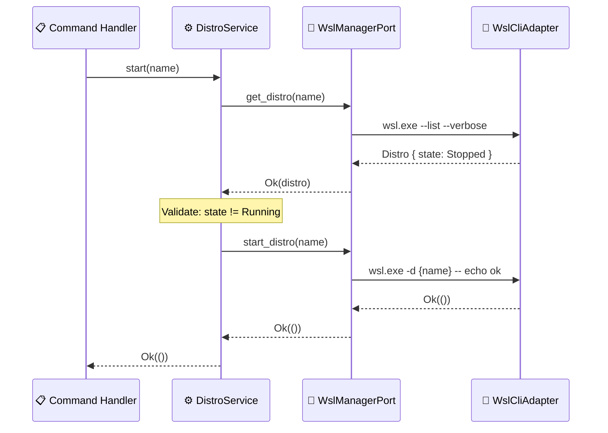
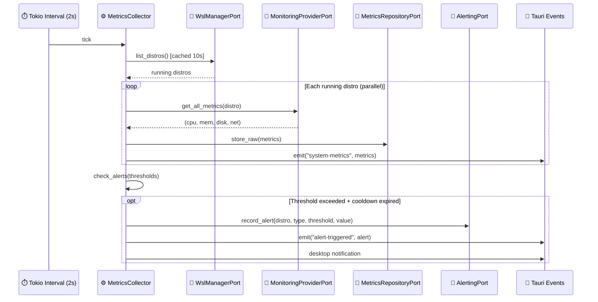

# ⚙️ Services

> Domain services that orchestrate business logic across ports and entities.

---

## 🔄 DistroService Flow

## 📊 MetricsCollector Flow

## 📁 File Inventory

| File | Service | Interval | Dependencies |
|------|---------|----------|-------------|
| `distro_service.rs` | `DistroService` | On-demand | `WslManagerPort` |
| `metrics_collector.rs` | `MetricsCollector` | 2 seconds | `MonitoringProviderPort`, `MetricsRepositoryPort`, `AlertingPort`, `WslManagerPort` |
| `metrics_aggregator.rs` | `MetricsAggregator` | 60 seconds | `MetricsRepositoryPort`, `AlertingPort` |
| `mod.rs` | Module declarations | -- | -- |

## 📋 Business Rules

### DistroService
- **start**: Rejects if distro is already `Running` (`DistroAlreadyRunning` error)
- **stop**: Rejects if distro is not `Running` (`DistroNotRunning` error)
- **restart**: Terminates first if running, then starts (idempotent for stopped distros)

### MetricsCollector
- Collects from all running distros in **parallel** via `futures::join_all`
- Caches distro list for **10 seconds** to avoid calling `wsl.exe --list` every 2s
- Alert cooldown of **5 minutes** per (distro, alert_type) pair to prevent notification spam
- Sends desktop notifications via `tauri-plugin-notification` on threshold breach

### MetricsAggregator
- Aggregates raw metrics into **1-minute buckets** (min/avg/max)
- Aggregation window: 2 to 62 minutes ago (ensures complete buckets)
- **Retention policy**:
  - Raw metrics: **1 hour**
  - Aggregated metrics: **24 hours**
  - Alerts: **24 hours**

---

> 👀 See also: [entities/](../entities/) | [ports/](../ports/) | [value_objects/](../value_objects/) | [💎 domain/](../)
