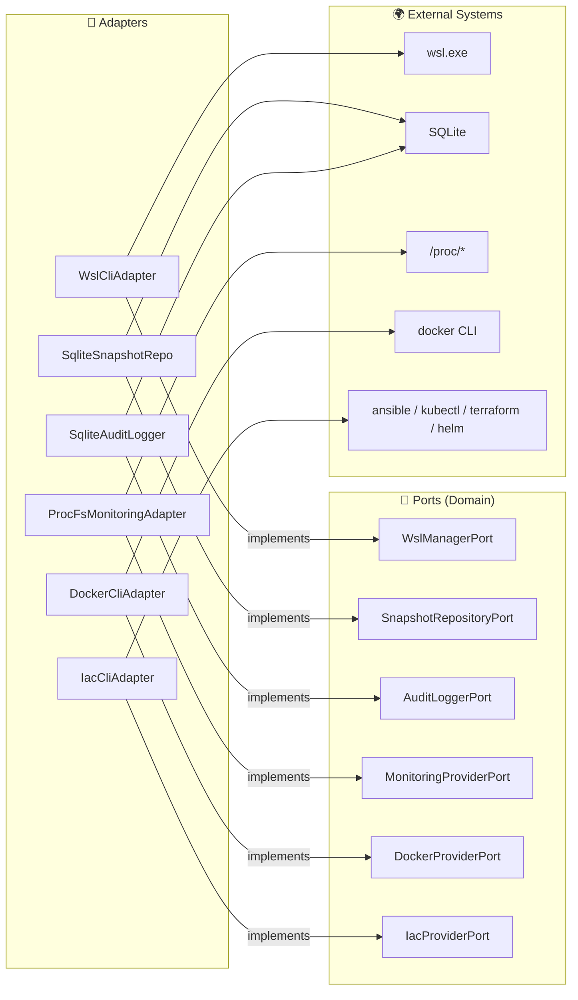

# 🔌 Infrastructure Layer

> Concrete port implementations — where the code touches the real world.

---

## 🎯 Purpose

The Infrastructure layer provides the **concrete implementations** of the ports (traits) defined in the Domain. This is where the code interacts with external systems: `wsl.exe`, SQLite, `/proc`, Docker CLI, IaC tools.



---

## 📁 Structure

```
infrastructure/
├── 📄 mod.rs
├── 🖥️ wsl_cli/              # WSL Adapter
│   ├── adapter.rs           # WslCliAdapter (14 methods)
│   ├── encoding.rs          # UTF-16LE decoder with BOM
│   └── parser.rs            # `wsl --list --verbose` parser
├── 🗄️ sqlite/               # SQLite Adapter
│   ├── adapter.rs           # SqliteDb + SqliteSnapshotRepository + SqliteAuditLogger
│   └── migrations/
│       └── 001_initial.sql  # snapshots + audit_log tables
├── 📈 monitoring/           # /proc Adapter
│   └── adapter.rs           # ProcFsMonitoringAdapter
├── 🐳 docker/               # Docker Adapter
│   └── adapter.rs           # DockerCliAdapter
├── 🔧 iac/                  # IaC Adapter
│   └── adapter.rs           # IacCliAdapter
└── 📝 audit/                # Audit Adapter
    └── adapter.rs           # Delegates to SqliteAuditLogger
```

---

## 📊 Adapter → Port Mapping

| Adapter | Implemented Port | External Dependency | File |
|---|---|---|---|
| `WslCliAdapter` | `WslManagerPort` | `wsl.exe` | `wsl_cli/adapter.rs` |
| `SqliteSnapshotRepository` | `SnapshotRepositoryPort` | SQLite (sqlx) | `sqlite/adapter.rs` |
| `SqliteAuditLogger` | `AuditLoggerPort` | SQLite (sqlx) | `sqlite/adapter.rs` |
| `ProcFsMonitoringAdapter` | `MonitoringProviderPort` | `/proc/*` via WSL | `monitoring/adapter.rs` |
| `DockerCliAdapter` | `DockerProviderPort` | `docker` CLI | `docker/adapter.rs` |
| `IacCliAdapter` | `IacProviderPort` | ansible, kubectl, terraform, helm | `iac/adapter.rs` |

---

## 🖥️ WSL CLI (`wsl_cli/`)

### `WslCliAdapter`

Implements `WslManagerPort` by wrapping calls to `wsl.exe`.

| Internal Method | Purpose |
|---|---|
| `run_wsl_raw(args)` | Executes `wsl.exe` with arguments, decodes UTF-16LE |
| `exec_in_distro_raw(name, cmd)` | Executes a command inside a distro (UTF-8) |
| `parse_ini(content)` | Parses `.wslconfig` and `wsl.conf` INI files |

### `encoding.rs` — UTF-16LE Decoder

`wsl.exe` outputs **UTF-16LE** on Windows. This module:
1. Detects the **BOM** (Byte Order Mark) `FF FE`
2. Decodes UTF-16LE to a Rust String
3. **Falls back to UTF-8** if decoding fails

### `parser.rs` — WSL Parser

Parses the output of `wsl --list --verbose`:

```
  NAME            STATE           VERSION
* Ubuntu-22.04    Running         2
  Debian          Stopped         2
```

Extracts: name, state, WSL version, default marker (`*`).

---

## 🗄️ SQLite (`sqlite/`)

### `SqliteDb`

SQLite connection manager:
- Pool of **5 max connections** via `sqlx::SqlitePool`
- Runs **migrations** at startup (`001_initial.sql`)

### `SqliteSnapshotRepository`

Implements `SnapshotRepositoryPort`:
- `save()` — INSERT OR REPLACE
- `list_by_distro()` — SELECT WHERE distro_name, ORDER BY created_at DESC
- `list_all()` — SELECT ORDER BY created_at DESC
- `get_by_id()` — SELECT WHERE id
- `delete()` — DELETE WHERE id

### `SqliteAuditLogger`

Implements `AuditLoggerPort`:
- `log()` — INSERT with auto timestamp
- `log_with_details()` — INSERT with details field
- `search()` — SELECT with optional filters (action, target) + pagination (limit/offset)

### SQL Schema

```sql
-- snapshots table
CREATE TABLE snapshots (
    id TEXT PRIMARY KEY,
    distro_name TEXT NOT NULL,
    name TEXT NOT NULL,
    description TEXT,
    snapshot_type TEXT,        -- "full" | "incremental"
    format TEXT,               -- "tar" | "tar.gz" | "tar.xz" | "vhdx"
    file_path TEXT NOT NULL,
    file_size INTEGER,
    parent_id TEXT,
    created_at TEXT,
    status TEXT
);

-- audit_log table
CREATE TABLE audit_log (
    id INTEGER PRIMARY KEY AUTOINCREMENT,
    timestamp TEXT DEFAULT (datetime('now')),
    action TEXT NOT NULL,       -- e.g. "distro.start", "snapshot.create"
    target TEXT NOT NULL,       -- e.g. "Ubuntu-22.04", snapshot UUID
    details TEXT
);

-- Performance indexes
CREATE INDEX idx_snapshots_distro ON snapshots(distro_name);
CREATE INDEX idx_snapshots_created ON snapshots(created_at);
CREATE INDEX idx_audit_timestamp ON audit_log(timestamp);
CREATE INDEX idx_audit_action ON audit_log(action);
```

---

## 📈 Monitoring (`monitoring/`)

### `ProcFsMonitoringAdapter`

Collects system metrics by reading the `/proc` pseudo-filesystem **inside** WSL distributions.

| Method | Source | Technique |
|---|---|---|
| `get_cpu_usage()` | `/proc/stat` | 2 samples 500ms apart → delta calculation |
| `get_memory_usage()` | `/proc/meminfo` | Parse MemTotal, MemFree, MemAvailable, Cached, Swap |
| `get_disk_usage()` | `df` command | Parses df output |
| `get_network_stats()` | `/proc/net/dev` | Parse rx_bytes, tx_bytes per interface |
| `get_processes()` | `ps` command | Parse pid, user, cpu%, mem%, command |

---

## 🐳 Docker (`docker/`)

### `DockerCliAdapter`

Executes `docker` commands inside WSL distributions.

| Method | Docker Command | Parsing |
|---|---|---|
| `is_available()` | `docker info` | Checks return code |
| `list_containers()` | `docker ps [--all]` | Parses JSON, maps ports `0.0.0.0:8080->80/tcp` |
| `list_images()` | `docker images` | Parses repository, tag, size (KB/MB/GB) |
| `start_container()` | `docker start <id>` | — |
| `stop_container()` | `docker stop <id>` | — |
| `pull_image()` | `docker pull <image>` | — |

### State Parsing

Docker state mapping: `running`, `paused`, `exited`, `created`, `restarting`, `dead`.

---

## 🔧 IaC (`iac/`)

### `IacCliAdapter`

Detects and controls Infrastructure as Code tools.

| Method | What It Does |
|---|---|
| `detect_tools()` | Runs `{ansible,kubectl,terraform,helm} --version` to detect installed versions |
| `list_ansible_playbooks()` | Recursive YAML file search in a directory |
| `run_ansible_playbook()` | Executes `ansible-playbook` with optional variables |
| `get_k8s_cluster_info()` | Runs `kubectl cluster-info` |
| `get_k8s_pods()` | Runs `kubectl get pods -n <namespace>` |

---

## 🧪 Tests — 14 tests

| Module | Tests | What's Tested |
|---|---|---|
| `encoding` | 3 | UTF-8 fallback, UTF-16LE decoding, UTF-16LE with BOM |
| `parser` | 4 | Typical output, single distro, empty output, blank lines |
| `monitoring` | 3 | CPU `/proc/stat`, memory `/proc/meminfo`, network `/proc/net/dev` parsing |
| `docker` | 4 | Container state parsing, port mapping, image sizes |

```bash
cargo test --lib infrastructure
```

---

> 📖 See also: [💎 Domain](../domain/README.md) · [📋 Application](../application/README.md) · [🎭 Presentation](../presentation/README.md)
