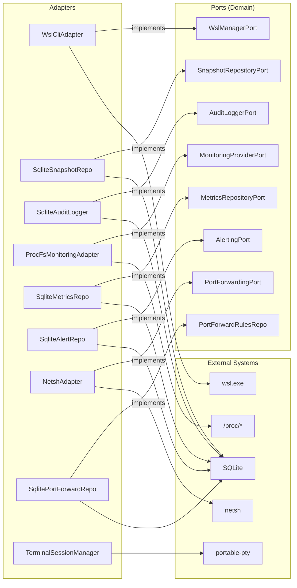

# Infrastructure Layer

> Concrete port implementations — where the code touches the real world.

---

## Purpose

The Infrastructure layer provides the **concrete implementations** of the ports (traits) defined in the Domain. This is where the code interacts with external systems: `wsl.exe`, SQLite, `/proc`, `netsh`, and in-memory debug logging.



---

## Structure

```
infrastructure/
├── mod.rs
├── wsl_cli/              # WSL Adapter
│   ├── adapter.rs           # WslCliAdapter (14+ methods)
│   ├── encoding.rs          # UTF-16LE decoder with BOM
│   └── parser.rs            # `wsl --list --verbose` parser
├── sqlite/               # SQLite Adapters
│   ├── adapter.rs           # SqliteDb + SqliteSnapshotRepository + SqliteAuditLogger
│   ├── metrics_repository.rs    # SqliteMetricsRepository (raw + aggregated)
│   ├── alert_repository.rs      # SqliteAlertRepository
│   ├── port_forwarding_repository.rs  # SqlitePortForwardingRepository
│   └── migrations/
│       ├── 001_initial.sql      # snapshots + audit_log tables
│       ├── 002_metrics.sql      # metrics_raw + metrics_aggregated + alert_log
│       └── 003_port_forwarding.sql  # port_forwarding_rules table
├── monitoring/           # /proc Adapter
│   └── adapter.rs           # ProcFsMonitoringAdapter
├── audit/                # Audit Adapter
│   └── adapter.rs           # Delegates to SqliteAuditLogger
├── port_forwarding/      # Port Forwarding Adapter
│   └── adapter.rs           # NetshAdapter (netsh portproxy commands)
├── terminal/             # Terminal PTY Adapter
│   └── adapter.rs           # TerminalSessionManager (portable-pty sessions)
└── debug_log/            # In-memory debug log capture
    ├── buffer.rs            # DebugLogBuffer (ring buffer, 1000 max entries)
    └── layer.rs             # DebugLogLayer (tracing subscriber layer)
```

---

## Adapter -> Port Mapping

| Adapter | Implemented Port | External Dependency | File |
|---|---|---|---|
| `WslCliAdapter` | `WslManagerPort` | `wsl.exe` | `wsl_cli/adapter.rs` |
| `SqliteSnapshotRepository` | `SnapshotRepositoryPort` | SQLite (sqlx) | `sqlite/adapter.rs` |
| `SqliteAuditLogger` | `AuditLoggerPort` | SQLite (sqlx) | `sqlite/adapter.rs` |
| `ProcFsMonitoringAdapter` | `MonitoringProviderPort` | `/proc/*` via WSL | `monitoring/adapter.rs` |
| `SqliteMetricsRepository` | `MetricsRepositoryPort` | SQLite (sqlx) | `sqlite/metrics_repository.rs` |
| `SqliteAlertRepository` | `AlertingPort` | SQLite (sqlx) | `sqlite/alert_repository.rs` |
| `NetshAdapter` | `PortForwardingPort` | `netsh` | `port_forwarding/adapter.rs` |
| `SqlitePortForwardingRepository` | `PortForwardRulesRepository` | SQLite (sqlx) | `sqlite/port_forwarding_repository.rs` |
| `TerminalSessionManager` | — (standalone) | `portable-pty` | `terminal/adapter.rs` |

---

## WSL CLI (`wsl_cli/`)

### `WslCliAdapter`

Implements `WslManagerPort` by wrapping calls to `wsl.exe`.

| Internal Method | Purpose |
|---|---|
| `run_wsl_raw(args)` | Executes `wsl.exe` with arguments, decodes UTF-16LE |
| `exec_in_distro_raw(name, cmd)` | Executes a command inside a distro (UTF-8) |
| `parse_ini(content)` | Parses `.wslconfig` and `wsl.conf` INI files |

### `encoding.rs` — UTF-16LE Decoder

`wsl.exe` outputs **UTF-16LE** on Windows. This module:
1. Detects the **BOM** (Byte Order Mark) `FF FE`
2. Decodes UTF-16LE to a Rust String
3. **Falls back to UTF-8** if decoding fails

### `parser.rs` — WSL Parser

Parses the output of `wsl --list --verbose`:

```
  NAME            STATE           VERSION
* Ubuntu-22.04    Running         2
  Debian          Stopped         2
```

Extracts: name, state, WSL version, default marker (`*`).

---

## SQLite (`sqlite/`)

### `SqliteDb`

SQLite connection manager:
- Pool of **5 max connections** via `sqlx::SqlitePool`
- Runs **migrations** at startup (3 migration files)

### `SqliteSnapshotRepository`

Implements `SnapshotRepositoryPort`:
- `save()` — INSERT OR REPLACE
- `list_by_distro()` — SELECT WHERE distro_name, ORDER BY created_at DESC
- `list_all()` — SELECT ORDER BY created_at DESC
- `get_by_id()` — SELECT WHERE id
- `delete()` — DELETE WHERE id

### `SqliteAuditLogger`

Implements `AuditLoggerPort`:
- `log()` — INSERT with auto timestamp
- `log_with_details()` — INSERT with details field
- `search()` — SELECT with optional filters (action, target) + pagination (limit/offset)

### `SqliteMetricsRepository`

Implements `MetricsRepositoryPort`:
- `store_raw()` — INSERT raw time-series metrics
- `query_raw()` — SELECT raw metrics in a time range
- `query_aggregated()` — SELECT 1-minute aggregated buckets
- `aggregate_raw_buckets()` — Aggregate raw -> 1-minute buckets
- `purge_raw_before()` / `purge_aggregated_before()` — Retention cleanup

### `SqliteAlertRepository`

Implements `AlertingPort`:
- `record_alert()` — INSERT triggered alert
- `get_recent_alerts()` — SELECT recent alerts for a distro
- `acknowledge_alert()` — UPDATE acknowledged flag
- `purge_before()` — DELETE old alerts

### `SqlitePortForwardingRepository`

Implements `PortForwardRulesRepository`:
- `save_rule()` — INSERT port forwarding rule
- `delete_rule()` — DELETE by ID
- `list_rules()` — SELECT with optional distro filter
- `get_rule()` — SELECT by ID

### SQL Schema

```sql
-- 001_initial.sql
CREATE TABLE snapshots (
    id TEXT PRIMARY KEY,
    distro_name TEXT NOT NULL, name TEXT NOT NULL,
    description TEXT, snapshot_type TEXT, format TEXT,
    file_path TEXT NOT NULL, file_size INTEGER,
    parent_id TEXT, created_at TEXT, status TEXT
);
CREATE TABLE audit_log (
    id INTEGER PRIMARY KEY AUTOINCREMENT,
    timestamp TEXT DEFAULT (datetime('now')),
    action TEXT NOT NULL, target TEXT NOT NULL, details TEXT
);

-- 002_metrics.sql
CREATE TABLE metrics_raw (
    id INTEGER PRIMARY KEY AUTOINCREMENT,
    distro_name TEXT NOT NULL, timestamp TEXT NOT NULL,
    cpu_usage_percent REAL, load_avg_1 REAL, load_avg_5 REAL, load_avg_15 REAL,
    mem_total_bytes INTEGER, mem_used_bytes INTEGER, mem_available_bytes INTEGER,
    mem_cached_bytes INTEGER, swap_total_bytes INTEGER, swap_used_bytes INTEGER,
    disk_total_bytes INTEGER, disk_used_bytes INTEGER, disk_available_bytes INTEGER,
    disk_usage_percent REAL, net_rx_bytes INTEGER, net_tx_bytes INTEGER
);
CREATE TABLE metrics_aggregated (...);  -- min/avg/max per 1-minute bucket
CREATE TABLE alert_log (...);           -- triggered alerts with acknowledgement

-- 003_port_forwarding.sql
CREATE TABLE port_forwarding_rules (
    id TEXT PRIMARY KEY,
    distro_name TEXT NOT NULL, wsl_port INTEGER NOT NULL,
    host_port INTEGER NOT NULL, protocol TEXT DEFAULT 'tcp',
    enabled INTEGER DEFAULT 1, created_at TEXT DEFAULT (datetime('now')),
    UNIQUE(host_port, protocol)
);
```

---

## Monitoring (`monitoring/`)

### `ProcFsMonitoringAdapter`

Collects system metrics by reading the `/proc` pseudo-filesystem **inside** WSL distributions.

| Method | Source | Technique |
|---|---|---|
| `get_cpu_usage()` | `/proc/stat` | 2 samples 500ms apart -> delta calculation |
| `get_memory_usage()` | `/proc/meminfo` | Parse MemTotal, MemFree, MemAvailable, Cached, Swap |
| `get_disk_usage()` | `df` command | Parses df output |
| `get_network_stats()` | `/proc/net/dev` | Parse rx_bytes, tx_bytes per interface |
| `get_processes()` | `ps` command | Parse pid, user, cpu%, mem%, command |

---

## Port Forwarding (`port_forwarding/`)

### `NetshAdapter`

Implements `PortForwardingPort` using Windows `netsh` commands:

| Method | Underlying Command |
|---|---|
| `list_listening_ports(distro)` | `ss -tlnp` inside WSL distro |
| `get_wsl_ip(distro)` | `hostname -I` inside WSL distro |
| `apply_rule(host_port, wsl_ip, wsl_port)` | `netsh interface portproxy add v4tov4` |
| `remove_rule(host_port)` | `netsh interface portproxy delete v4tov4` |

---

## Terminal (`terminal/`)

### `TerminalSessionManager`

Manages interactive PTY sessions inside WSL distributions using `portable-pty`:
- `create_session(distro, app_handle)` — Spawns a new PTY, starts reading output
- `write_to_session(id, data)` — Writes input to PTY stdin
- `resize_session(id, cols, rows)` — Resizes the PTY
- `close_session(id)` — Terminates the PTY process

Output is streamed to the frontend via Tauri events (`terminal-output`).

---

## Debug Log (`debug_log/`)

In-memory log capture system for the frontend debug console.

### `buffer.rs` — `DebugLogBuffer`

A thread-safe **ring buffer** that stores the last 1000 log entries in memory.

| Method | Purpose |
|---|---|
| `push(level, message, target)` | Appends a `LogEntry`, evicts the oldest if at capacity |
| `get_all()` | Returns all buffered entries as a `Vec<LogEntry>` |
| `clear()` | Removes all entries (counter continues incrementing) |

Each `LogEntry` contains: `id` (monotonic u64), `timestamp` (HH:MM:SS.mmm), `level`, `message`, `target`.

### `layer.rs` — `DebugLogLayer`

A custom `tracing_subscriber::Layer` that captures every log event:
1. Extracts the formatted message from the tracing event via a `MessageVisitor`
2. Pushes the entry into the `DebugLogBuffer`
3. Emits a `debug-log-entry` Tauri event for **real-time** frontend updates (best-effort)

The `AppHandle` is set lazily via a `OnceLock` slot initialized during Tauri setup.

---

## Tests — ~89 tests

| Module | Tests | What's Tested |
|---|---|---|
| `debug_log` (buffer) | 20 | Construction, push/retrieve, counter, FIFO ordering, ring buffer eviction, clear, thread safety, timestamp format |
| `sqlite` (adapter) | 20 | Snapshot CRUD, audit log insert/search, migrations |
| `sqlite` (metrics) | 4 | Metrics storage and retrieval |
| `sqlite` (alerts) | 5 | Alert recording, acknowledgement |
| `sqlite` (port forward) | 9 | Rule CRUD, filtering |
| `monitoring` | 22 | CPU `/proc/stat`, memory `/proc/meminfo`, network `/proc/net/dev` parsing |
| `wsl_cli` (encoding) | 8 | UTF-8 fallback, UTF-16LE decoding |
| `wsl_cli` (adapter) | ~47 | WSL output parsing, INI parsing, adapter logic |
| `audit` | 7 | Audit log adapter |

```bash
cargo test --lib infrastructure
```

---

> See also: [Domain](../domain/README.md) · [Application](../application/README.md) · [Presentation](../presentation/README.md)
