# 🔌 Infrastructure Layer

> Concrete port implementations — where the code touches the real world.

---

## 🎯 Purpose

The Infrastructure layer provides the **concrete implementations** of the ports (traits) defined in the Domain. This is where the code interacts with external systems: `wsl.exe`, SQLite, `/proc`, and in-memory debug logging.

```mermaid
graph LR
    subgraph Adapters["🧱 Adapters"]
        WCA["WslCliAdapter"]
        SSR["SqliteSnapshotRepo"]
        SAL["SqliteAuditLogger"]
        PFA["ProcFsMonitoringAdapter"]
    end

    subgraph Ports["🔌 Ports (Domain)"]
        WMP["WslManagerPort"]
        SRP["SnapshotRepositoryPort"]
        ALP["AuditLoggerPort"]
        MPP["MonitoringProviderPort"]
    end

    subgraph External["🌍 External Systems"]
        wsl["wsl.exe"]
        db["SQLite"]
        proc["/proc/*"]
    end

    WCA -->|implements| WMP
    SSR -->|implements| SRP
    SAL -->|implements| ALP
    PFA -->|implements| MPP

    WCA --> wsl
    SSR --> db
    SAL --> db
    PFA --> proc
```



---

## 📁 Structure

```
infrastructure/
├── 📄 mod.rs
├── 🖥️ wsl_cli/              # WSL Adapter
│   ├── adapter.rs           # WslCliAdapter (14 methods)
│   ├── encoding.rs          # UTF-16LE decoder with BOM
│   └── parser.rs            # `wsl --list --verbose` parser
├── 🗄️ sqlite/               # SQLite Adapter
│   ├── adapter.rs           # SqliteDb + SqliteSnapshotRepository + SqliteAuditLogger
│   └── migrations/
│       └── 001_initial.sql  # snapshots + audit_log tables
├── 📈 monitoring/           # /proc Adapter
│   └── adapter.rs           # ProcFsMonitoringAdapter
├── 📝 audit/                # Audit Adapter
│   └── adapter.rs           # Delegates to SqliteAuditLogger
└── 🐛 debug_log/            # In-memory debug log capture
    ├── buffer.rs            # DebugLogBuffer (ring buffer, 1000 max entries)
    └── layer.rs             # DebugLogLayer (tracing subscriber layer)
```

---

## 📊 Adapter → Port Mapping

| Adapter | Implemented Port | External Dependency | File |
|---|---|---|---|
| `WslCliAdapter` | `WslManagerPort` | `wsl.exe` | `wsl_cli/adapter.rs` |
| `SqliteSnapshotRepository` | `SnapshotRepositoryPort` | SQLite (sqlx) | `sqlite/adapter.rs` |
| `SqliteAuditLogger` | `AuditLoggerPort` | SQLite (sqlx) | `sqlite/adapter.rs` |
| `ProcFsMonitoringAdapter` | `MonitoringProviderPort` | `/proc/*` via WSL | `monitoring/adapter.rs` |

---

## 🖥️ WSL CLI (`wsl_cli/`)

### `WslCliAdapter`

Implements `WslManagerPort` by wrapping calls to `wsl.exe`.

| Internal Method | Purpose |
|---|---|
| `run_wsl_raw(args)` | Executes `wsl.exe` with arguments, decodes UTF-16LE |
| `exec_in_distro_raw(name, cmd)` | Executes a command inside a distro (UTF-8) |
| `parse_ini(content)` | Parses `.wslconfig` and `wsl.conf` INI files |

### `encoding.rs` — UTF-16LE Decoder

`wsl.exe` outputs **UTF-16LE** on Windows. This module:
1. Detects the **BOM** (Byte Order Mark) `FF FE`
2. Decodes UTF-16LE to a Rust String
3. **Falls back to UTF-8** if decoding fails

### `parser.rs` — WSL Parser

Parses the output of `wsl --list --verbose`:

```
  NAME            STATE           VERSION
* Ubuntu-22.04    Running         2
  Debian          Stopped         2
```

Extracts: name, state, WSL version, default marker (`*`).

---

## 🗄️ SQLite (`sqlite/`)

### `SqliteDb`

SQLite connection manager:
- Pool of **5 max connections** via `sqlx::SqlitePool`
- Runs **migrations** at startup (`001_initial.sql`)

### `SqliteSnapshotRepository`

Implements `SnapshotRepositoryPort`:
- `save()` — INSERT OR REPLACE
- `list_by_distro()` — SELECT WHERE distro_name, ORDER BY created_at DESC
- `list_all()` — SELECT ORDER BY created_at DESC
- `get_by_id()` — SELECT WHERE id
- `delete()` — DELETE WHERE id

### `SqliteAuditLogger`

Implements `AuditLoggerPort`:
- `log()` — INSERT with auto timestamp
- `log_with_details()` — INSERT with details field
- `search()` — SELECT with optional filters (action, target) + pagination (limit/offset)

### SQL Schema

```sql
-- snapshots table
CREATE TABLE snapshots (
    id TEXT PRIMARY KEY,
    distro_name TEXT NOT NULL,
    name TEXT NOT NULL,
    description TEXT,
    snapshot_type TEXT,        -- "full" | "incremental"
    format TEXT,               -- "tar" | "tar.gz" | "tar.xz" | "vhdx"
    file_path TEXT NOT NULL,
    file_size INTEGER,
    parent_id TEXT,
    created_at TEXT,
    status TEXT
);

-- audit_log table
CREATE TABLE audit_log (
    id INTEGER PRIMARY KEY AUTOINCREMENT,
    timestamp TEXT DEFAULT (datetime('now')),
    action TEXT NOT NULL,       -- e.g. "distro.start", "snapshot.create"
    target TEXT NOT NULL,       -- e.g. "Ubuntu-22.04", snapshot UUID
    details TEXT
);

-- Performance indexes
CREATE INDEX idx_snapshots_distro ON snapshots(distro_name);
CREATE INDEX idx_snapshots_created ON snapshots(created_at);
CREATE INDEX idx_audit_timestamp ON audit_log(timestamp);
CREATE INDEX idx_audit_action ON audit_log(action);
```

---

## 📈 Monitoring (`monitoring/`)

### `ProcFsMonitoringAdapter`

Collects system metrics by reading the `/proc` pseudo-filesystem **inside** WSL distributions.

| Method | Source | Technique |
|---|---|---|
| `get_cpu_usage()` | `/proc/stat` | 2 samples 500ms apart → delta calculation |
| `get_memory_usage()` | `/proc/meminfo` | Parse MemTotal, MemFree, MemAvailable, Cached, Swap |
| `get_disk_usage()` | `df` command | Parses df output |
| `get_network_stats()` | `/proc/net/dev` | Parse rx_bytes, tx_bytes per interface |
| `get_processes()` | `ps` command | Parse pid, user, cpu%, mem%, command |

---

## 🐛 Debug Log (`debug_log/`)

In-memory log capture system for the frontend debug console.

### `buffer.rs` — `DebugLogBuffer`

A thread-safe **ring buffer** that stores the last 1000 log entries in memory.

| Method | Purpose |
|---|---|
| `push(level, message, target)` | Appends a `LogEntry`, evicts the oldest if at capacity |
| `get_all()` | Returns all buffered entries as a `Vec<LogEntry>` |
| `clear()` | Removes all entries (counter continues incrementing) |

Each `LogEntry` contains: `id` (monotonic u64), `timestamp` (HH:MM:SS.mmm), `level`, `message`, `target`.

### `layer.rs` — `DebugLogLayer`

A custom `tracing_subscriber::Layer` that captures every log event:
1. Extracts the formatted message from the tracing event via a `MessageVisitor`
2. Pushes the entry into the `DebugLogBuffer`
3. Emits a `debug-log-entry` Tauri event for **real-time** frontend updates (best-effort)

The `AppHandle` is set lazily via a `OnceLock` slot initialized during Tauri setup.

---

## 🧪 Tests — ~66 tests

| Module | Tests | What's Tested |
|---|---|---|
| `debug_log` (buffer) | 20 | Construction, push/retrieve, counter, FIFO ordering, ring buffer eviction, clear, thread safety, timestamp format |
| `sqlite` | ~19 | Snapshot CRUD, audit log insert/search, migrations |
| `monitoring` | ~15 | CPU `/proc/stat`, memory `/proc/meminfo`, network `/proc/net/dev` parsing |
| `wsl_cli` | ~12 | UTF-8 fallback, UTF-16LE decoding, WSL output parsing, INI parsing |

```bash
cargo test --lib infrastructure
```

---

> 📖 See also: [💎 Domain](../domain/README.md) · [📋 Application](../application/README.md) · [🎭 Presentation](../presentation/README.md)
