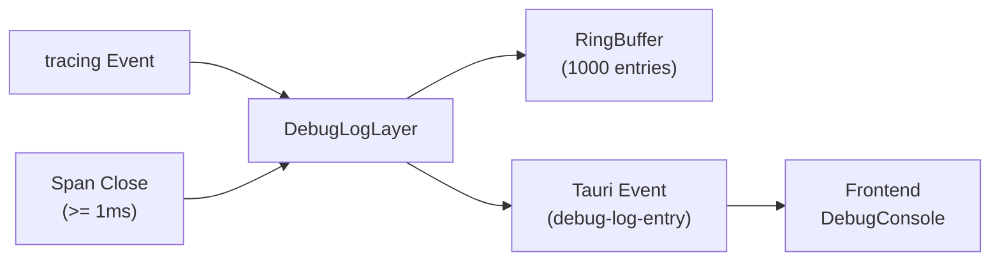

# 🐛 Debug Log

> Captures `tracing` events into a ring buffer and streams them to the frontend debug console in real time.

---

## 🔄 Data Flow

## 📁 Files

| File | Description |
|------|-------------|
| `buffer.rs` | **DebugLogBuffer** — thread-safe ring buffer (`Mutex<VecDeque<LogEntry>>`) capped at 1000 entries. Each entry has an `AtomicU64` auto-incrementing ID, timestamp (`HH:MM:SS.mmm`), level, message, and target. Methods: `push`, `get_all`, `clear`. Counter does not reset on clear. |
| `layer.rs` | **DebugLogLayer** — custom `tracing_subscriber::Layer` that captures every log event via `on_event` and tracks span timing via `on_new_span`/`on_close`. Emits `debug-log-entry` Tauri events for real-time frontend updates. Only emits span-close entries for spans lasting >= 1ms to avoid flooding. Uses `OnceLock<AppHandle>` for deferred Tauri handle initialization. |
| `mod.rs` | Module re-exports. `layer` module is gated behind `#[cfg(not(fuzzing))]`. |

## 🔑 Key Technical Details

- **Ring buffer eviction**: oldest entries are dropped when capacity (1000) is exceeded
- **Span timing**: `SpanTiming` stores `Instant` on span creation; duration computed on close
- **Message extraction**: `MessageVisitor` handles both `record_str` and `record_debug` for the `message` field, stripping Debug-formatting quotes
- **Thread safety**: `DebugLogBuffer` is safe for concurrent push/read/clear (verified by concurrent tests)
- **Deferred AppHandle**: the layer is created before Tauri initializes; `app_handle_slot()` returns an `Arc<OnceLock>` to set the handle later from the `setup` hook

## 🧪 Tests

- `buffer.rs`: 20+ tests covering push/retrieve, FIFO ordering, counter increments, ring buffer eviction at capacity, clear behavior, concurrent push/read/clear thread safety, timestamp format

---

> 👀 See also: [`widgets/debug-console/`](../../../../src/widgets/debug-console/) for the frontend component that consumes these events.
