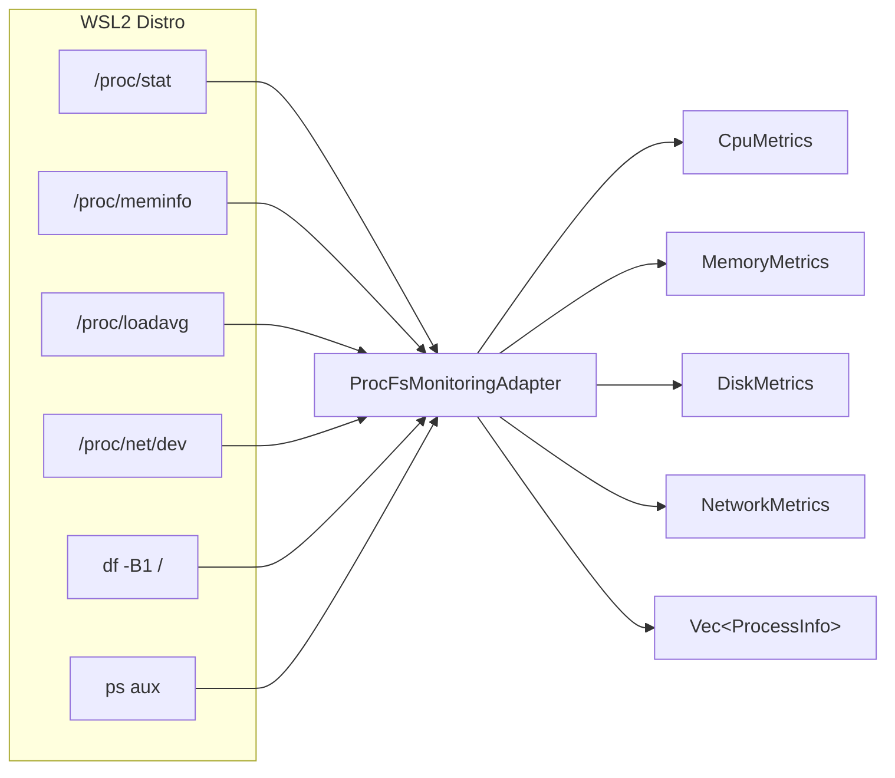

# 📊 Monitoring Adapter

> Collects real-time system metrics from WSL2 distros by reading `/proc` filesystems and system commands.

---

## 🔄 Data Flow

## 📁 Files

| File | Description |
|------|-------------|
| `adapter.rs` | **ProcFsMonitoringAdapter** — implements `MonitoringProviderPort`. Collects CPU (dual-sample `/proc/stat` with 200ms interval), memory (`/proc/meminfo`), disk (`df -B1`), network (`/proc/net/dev`), and process list (`ps aux`). Includes a batched `get_all_metrics()` that fetches CPU + memory + disk + network in a single `wsl.exe` invocation using `__NEXUS_SEP__` delimiters. Also exposes standalone parsers: `parse_meminfo()`, `parse_df_output()`, `parse_proc_net_dev()`, `parse_ps_aux()`. |
| `mod.rs` | Module re-export. |

## 🔑 Key Technical Details

- **CPU measurement** uses two `/proc/stat` snapshots 200ms apart to compute delta-based usage percentage (idle+iowait vs total)
- **Batched collection** reduces 4+ `wsl.exe` process spawns to 1 by concatenating commands with separator tokens
- **Per-core metrics** parsed from `cpu0`, `cpu1`, ... lines in `/proc/stat`
- All parsers use `saturating_sub` and `unwrap_or(0)` for robustness against malformed input

## 🧪 Tests

- Unit tests for `parse_cpu_line`, `cpu_usage_from_samples`, and all parser functions
- Integration tests using `MockWslManagerPort` for `get_memory_usage`, `get_disk_usage`, `get_network_stats`, `get_processes`
- Proptest fuzzing: `parse_cpu_line_never_panics`, `cpu_usage_always_in_range`, `parse_meminfo_never_panics`, `parse_df_never_panics`, `parse_proc_net_dev_never_panics`, `parse_ps_aux_never_panics`

---

> 👀 See also: [`domain/ports/monitoring_provider.rs`](../../domain/ports/monitoring_provider.rs) for the port trait this adapter implements.
