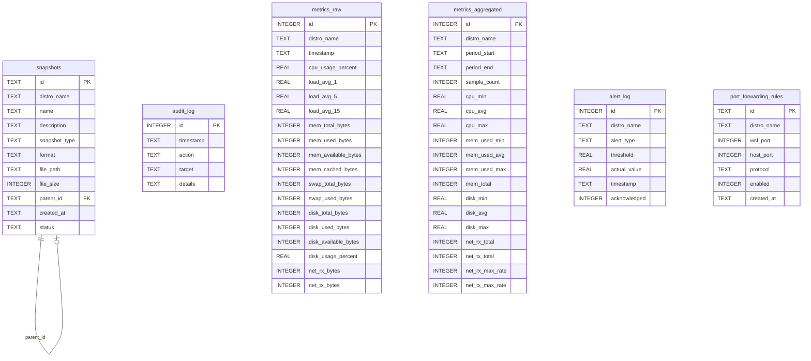

# 🗄️ SQLite Persistence

> Durable storage for snapshots, audit logs, metrics, alerts, and port forwarding rules via SQLite (sqlx).

---

## 🗃️ Database Schema

## 📁 Files

| File | Description |
|------|-------------|
| `adapter.rs` | **SqliteDb** (connection pool), **SqliteSnapshotRepository**, and **SqliteAuditLogger** — core persistence with WAL mode, mmap, and `busy_timeout`. Runs migrations on init. |
| `metrics_repository.rs` | **SqliteMetricsRepository** — stores raw time-series data, queries raw/aggregated metrics, aggregates into 1-minute buckets via `INSERT...SELECT`, and purges old data. |
| `alert_repository.rs` | **SqliteAlertRepository** — records threshold alerts (CPU/Memory/Disk), retrieves recent alerts per distro, supports acknowledgement and purging. |
| `port_forwarding_repository.rs` | **SqlitePortForwardingRepository** — CRUD for port forwarding rules with a `UNIQUE(host_port, protocol)` constraint. |
| `mod.rs` | Module re-exports and `SqlxResultExt` trait for converting `sqlx::Error` to `DomainError`. |
| `migrations/001_initial.sql` | Creates `snapshots` and `audit_log` tables with indexes. |
| `migrations/002_metrics.sql` | Creates `metrics_raw`, `metrics_aggregated`, and `alert_log` tables with time-series indexes. |
| `migrations/003_port_forwarding.sql` | Creates `port_forwarding_rules` table. |

## 🔌 Port Implementations

| Repository | Port Implemented |
|------------|------------------|
| `SqliteSnapshotRepository` | `SnapshotRepositoryPort` |
| `SqliteAuditLogger` | `AuditLoggerPort` |
| `SqliteMetricsRepository` | `MetricsRepositoryPort` |
| `SqliteAlertRepository` | `AlertingPort` |
| `SqlitePortForwardingRepository` | `PortForwardRulesRepository` |

## ⚙️ Configuration

- **Journal mode**: WAL (Write-Ahead Logging)
- **Synchronous**: Normal
- **Busy timeout**: 5 seconds
- **mmap size**: 256 MB
- **Cache size**: 8000 pages
- **Max connections**: 2
- **Metrics retention**: raw ~1h, aggregated 1-min ~24h, alerts ~24h

---

> 👀 See also: [`domain/ports/`](../../domain/ports/) for the port traits these repositories implement.
