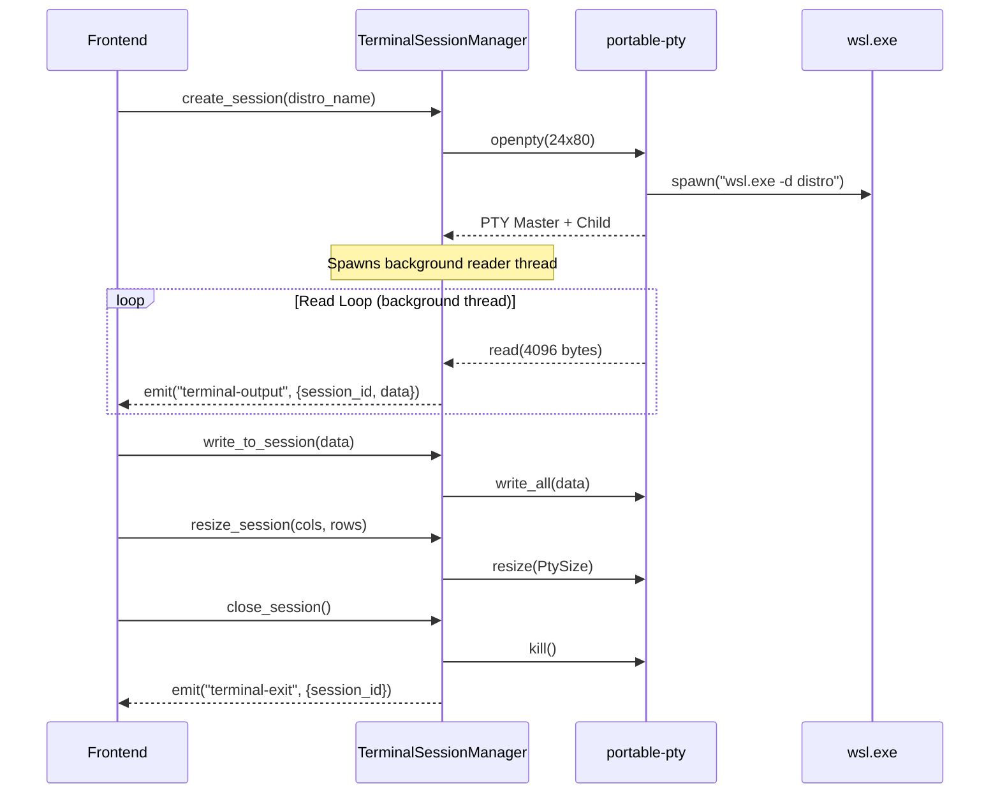

# 💻 Terminal Adapter

> Manages interactive terminal sessions connected to WSL2 distros via pseudo-terminals (PTY).

---

## 🔄 Session Lifecycle

## 📁 Files

| File | Description |
|------|-------------|
| `adapter.rs` | **TerminalSessionManager** — stored as Tauri managed state. Maintains a `RwLock<HashMap<String, PtySessionHandle>>` of active sessions. Each session holds a PTY writer, child process handle, and master PTY reference. Methods: `create_session`, `write_to_session`, `resize_session`, `is_session_alive`, `close_session`. |
| `mod.rs` | Module re-export. |

## 🔑 Key Technical Details

- Sessions identified by UUID v4 strings
- Uses `portable-pty` crate for cross-platform PTY support
- Background reader thread emits `terminal-output` Tauri events with raw byte data
- `terminal-exit` event emitted when the PTY read loop ends (process exited)
- Writer and child process wrapped in `Arc<Mutex<...>>` for thread-safe access
- Default terminal size: 24 rows x 80 columns

---

> 👀 See also: [`presentation/terminal_commands.rs`](../../presentation/terminal_commands.rs) for the Tauri IPC commands that expose this adapter.
