# 🎯 Presentation Layer

> Interface between the React frontend and the Rust backend — Tauri commands, events and application state.

---

## 🎯 Purpose

The Presentation layer exposes **Tauri commands** that the frontend can invoke via `tauriInvoke()`. It also handles real-time **events** and maintains the **AppState** (composition root).

```mermaid
graph LR
    FE["🖼️ React Frontend"] <-->|"tauriInvoke() / events"| CMD["🎮 Tauri Commands"]
    CMD --> AS["🗃️ AppState"]
    AS --> QH["🔍 Query Handlers"]
    AS --> CH["✏️ Command Handlers"]
    QH --> P["🔗 Ports"]
    CH --> P
```



---

## 📂 Structure

```
presentation/
├── mod.rs
├── state.rs              # 🗃️ AppState — composition root
├── events.rs             # ⚡ Tauri event definitions
└── commands/             # 🎮 Tauri commands
    ├── distro_commands.rs       # 🖥️ Distribution management
    ├── snapshot_commands.rs     # 📸 Snapshot management
    ├── monitoring_commands.rs   # 📊 System metrics + alerts
    ├── settings_commands.rs     # ⚙️ WSL config + VHDX
    ├── debug_commands.rs        # 🐛 Debug log buffer access
    ├── audit_commands.rs        # 📋 Audit log
    ├── terminal_commands.rs     # 💻 Terminal PTY sessions
    └── port_forwarding_commands.rs  # 🔀 Port forwarding rules
```

---

## 🗃️ AppState

The `AppState` is the **composition root** — it holds all injected dependencies as `Arc<dyn Port>`:

```rust
pub struct AppState {
    pub wsl_manager:   Arc<dyn WslManagerPort>,       // 🖥️
    pub snapshot_repo: Arc<dyn SnapshotRepositoryPort>,// 📸
    pub monitoring:    Arc<dyn MonitoringProviderPort>, // 📊
    pub metrics_repo:  Arc<dyn MetricsRepositoryPort>, // 📈
    pub alerting:      Arc<dyn AlertingPort>,           // 🔔
    pub audit_logger:  Arc<dyn AuditLoggerPort>,        // 📋
    pub alert_thresholds: Arc<RwLock<Vec<AlertThreshold>>>, // ⚠️
    pub port_forwarding:  Arc<dyn PortForwardingPort>,  // 🔀
    pub port_rules_repo:  Arc<dyn PortForwardRulesRepository>, // 🗄️
}
```

The `AppState` is injected into Tauri via `app_handle.manage(app_state)` in `lib.rs`, then accessible in each command via `tauri::State<AppState>`.

💻 `TerminalSessionManager` is managed separately via `app_handle.manage(TerminalSessionManager::new())`.

---

## 🎮 Tauri Commands

All commands are registered in `lib.rs` via `invoke_handler![...]`.

### 🖥️ Distributions (`distro_commands.rs`)

| Command | Parameters | Returns | Description |
|---|---|---|---|
| `list_distros` | — | `Vec<DistroResponse>` | 📋 List all distributions |
| `start_distro` | `name: String` | `()` | ▶️ Start a distribution |
| `stop_distro` | `name: String` | `()` | ⏹️ Stop a distribution |
| `restart_distro` | `name: String` | `()` | 🔄 Restart a distribution |
| `shutdown_all` | — | `()` | ⏹️ Shut down all WSL instances |
| `get_distro_install_path` | `name: String` | `String` | 📁 Get distro installation path |

### 📸 Snapshots (`snapshot_commands.rs`)

| Command | Parameters | Returns | Description |
|---|---|---|---|
| `list_snapshots` | `distro_name: Option<String>` | `Vec<SnapshotResponse>` | 📋 List snapshots |
| `create_snapshot` | distro_name, name, description, format, output_dir | `SnapshotResponse` | ➕ Create a snapshot |
| `delete_snapshot` | `snapshot_id: String` | `()` | 🗑️ Delete a snapshot |
| `restore_snapshot` | snapshot_id, mode, new_name, install_location | `()` | 🔄 Restore a snapshot |

### 📊 Monitoring (`monitoring_commands.rs`)

| Command | Parameters | Returns | Description |
|---|---|---|---|
| `get_system_metrics` | `distro_name: String` | `SystemMetrics` | 📈 CPU + RAM + Disk + Network |
| `get_processes` | `distro_name: String` | `Vec<ProcessInfo>` | 📋 Top processes |
| `get_metrics_history` | distro_name, from, to | `MetricsHistoryResponse` | 📊 Historical metrics (raw or aggregated) |
| `get_alert_thresholds` | — | `Vec<AlertThreshold>` | 🔔 Get current alert thresholds |
| `set_alert_thresholds` | `thresholds: Vec<AlertThreshold>` | `()` | ⚙️ Update alert thresholds |
| `get_recent_alerts` | distro_name, limit | `Vec<AlertRecord>` | 🔔 Recent alerts for a distro |
| `acknowledge_alert` | `alert_id: i64` | `()` | ✅ Acknowledge a triggered alert |

### ⚙️ Settings (`settings_commands.rs`)

| Command | Parameters | Returns | Description |
|---|---|---|---|
| `get_wsl_config` | — | `WslGlobalConfig` | 📖 Read `.wslconfig` |
| `update_wsl_config` | `config: WslGlobalConfig` | `()` | ✏️ Write `.wslconfig` |
| `compact_vhdx` | `distro_name: String` | `()` | 💾 Enable sparse mode |
| `get_wsl_version` | — | `String` | ℹ️ Get WSL version info |

### 🐛 Debug (`debug_commands.rs`)

| Command | Parameters | Returns | Description |
|---|---|---|---|
| `get_debug_logs` | — | `Vec<LogEntry>` | 📋 Returns all buffered log entries from the in-memory ring buffer |
| `clear_debug_logs` | — | `()` | 🗑️ Clears the debug log buffer |

These commands access the `Arc<DebugLogBuffer>` directly via `tauri::State`, separate from `AppState`.

### 📋 Audit (`audit_commands.rs`)

| Command | Parameters | Returns | Description |
|---|---|---|---|
| `search_audit_log` | action_filter, target_filter, limit, offset | `Vec<AuditEntry>` | 🔎 Search the audit log |

### 💻 Terminal (`terminal_commands.rs`)

| Command | Parameters | Returns | Description |
|---|---|---|---|
| `terminal_create` | `distro_name: String` | `String` (session ID) | ➕ Create a new PTY terminal session |
| `terminal_write` | session_id, data | `()` | ⌨️ Write input data to terminal |
| `terminal_resize` | session_id, cols, rows | `()` | 📐 Resize terminal dimensions |
| `terminal_close` | `session_id: String` | `()` | 🗑️ Close and terminate a session |

Uses `TerminalSessionManager` (managed state, separate from AppState).

### 🔀 Port Forwarding (`port_forwarding_commands.rs`)

| Command | Parameters | Returns | Description |
|---|---|---|---|
| `list_listening_ports` | `distro_name: String` | `Vec<ListeningPort>` | 📋 List ports listening inside WSL |
| `get_port_forwarding_rules` | `distro_name: Option<String>` | `Vec<PortForwardRule>` | 📋 List forwarding rules |
| `add_port_forwarding` | distro_name, wsl_port, host_port | `PortForwardRule` | ➕ Create a new forwarding rule |
| `remove_port_forwarding` | `rule_id: String` | `()` | 🗑️ Remove a forwarding rule |
| `get_wsl_ip` | `distro_name: String` | `String` | 🌐 Get WSL distro IP address |

---

## ⚡ Events

The backend defines event constants in `events.rs`:

| Event Constant | Event Name | Payload | 🚦 Status |
|---|---|---|---|
| `EVENT_DISTRO_STATE_CHANGED` | `distro-state-changed` | `DistroStateChangedEvent { distro_name, new_state, timestamp }` | ✅ Actively emitted when a distribution changes state |
| `EVENT_SYSTEM_METRICS` | `system-metrics` | `SystemMetrics` | 📝 Defined but not actively pushed to frontend |
| `EVENT_SNAPSHOT_PROGRESS` | `snapshot-progress` | `SnapshotProgressEvent { snapshot_id, phase, progress_percent }` | 📝 Defined but not actively pushed to frontend |

Additionally:
- 🐛 The `DebugLogLayer` (infrastructure) emits `debug-log-entry` events in real-time as log entries are captured
- 💻 The `TerminalSessionManager` emits `terminal-output` events with PTY output data

On the frontend side, events are listened to via `useTauriEvent()`. 📡

---

## ⚠️ Error Handling

Tauri commands return `Result<T, DomainError>`. `DomainError` implements `Serialize`, allowing Tauri to automatically convert it to a JSON error readable by the frontend:

```
Tauri Command -> Result<T, DomainError>
    |-- ✅ Ok(value) -> JSON serialized to the frontend
    |-- ❌ Err(error) -> { message: "DistroNotFound: Ubuntu" }
```

---

> 👀 See also: [💎 Domain](../domain/README.md) · [📋 Application](../application/README.md) · [🔌 Infrastructure](../infrastructure/README.md)
