# 🎭 Presentation Layer

> Interface between the React frontend and the Rust backend — Tauri commands, events and application state.

---

## 🎯 Purpose

The Presentation layer exposes **Tauri commands** that the frontend can invoke via `tauriInvoke()`. It also handles real-time **events** and maintains the **AppState** (composition root).

```mermaid
graph LR
    FE["⚛️ React Frontend"] <-->|"tauriInvoke() / events"| CMD["🎭 Tauri Commands"]
    CMD --> AS["🏠 AppState"]
    AS --> QH["📖 Query Handlers"]
    AS --> CH["📝 Command Handlers"]
    QH --> P["🔌 Ports"]
    CH --> P
```



---

## 📁 Structure

```
presentation/
├── 📄 mod.rs
├── 🏠 state.rs              # AppState — composition root
├── 📢 events.rs             # Tauri event definitions
└── 📡 commands/             # Tauri commands
    ├── distro_commands.rs   # Distribution management
    ├── snapshot_commands.rs # Snapshot management
    ├── monitoring_commands.rs  # System metrics
    ├── docker_commands.rs   # Docker containers
    ├── settings_commands.rs # WSL config + VHDX
    ├── iac_commands.rs      # IaC tools + K8s
    └── audit_commands.rs    # Audit log
```

---

## 🏠 AppState

The `AppState` is the **composition root** — it holds all injected dependencies as `Arc<dyn Port>`:

```rust
pub struct AppState {
    pub wsl_manager:   Arc<dyn WslManagerPort>,
    pub snapshot_repo: Arc<dyn SnapshotRepositoryPort>,
    pub monitoring:    Arc<dyn MonitoringProviderPort>,
    pub docker:        Arc<dyn DockerProviderPort>,
    pub iac:           Arc<dyn IacProviderPort>,
    pub audit_logger:  Arc<dyn AuditLoggerPort>,
}
```

The `AppState` is injected into Tauri via `app_handle.manage(app_state)` in `lib.rs`, then accessible in each command via `tauri::State<AppState>`.

---

## 📡 Tauri Commands

All commands are registered in `lib.rs` via `invoke_handler![...]`.

### 📦 Distributions (`distro_commands.rs`)

| Command | Parameters | Returns | Description |
|---|---|---|---|
| `list_distros` | — | `Vec<DistroResponse>` | List all distributions |
| `get_distro_details` | `name: String` | `DistroDetailResponse` | Details + config for a distro |
| `start_distro` | `name: String` | `()` | Start a distribution |
| `stop_distro` | `name: String` | `()` | Stop a distribution |
| `restart_distro` | `name: String` | `()` | Restart a distribution |
| `shutdown_all` | — | `()` | Shut down all WSL instances |

### 💾 Snapshots (`snapshot_commands.rs`)

| Command | Parameters | Returns | Description |
|---|---|---|---|
| `list_snapshots` | `distro_name: Option<String>` | `Vec<SnapshotResponse>` | List snapshots |
| `create_snapshot` | distro_name, name, description, format, output_dir | `SnapshotResponse` | Create a snapshot |
| `delete_snapshot` | `snapshot_id: String` | `()` | Delete a snapshot |
| `restore_snapshot` | snapshot_id, mode, new_name, install_location | `()` | Restore a snapshot |

### 📈 Monitoring (`monitoring_commands.rs`)

| Command | Parameters | Returns | Description |
|---|---|---|---|
| `get_system_metrics` | `distro_name: String` | `SystemMetricsResponse` | CPU + RAM + Disk + Network |
| `get_processes` | `distro_name: String` | `Vec<ProcessInfo>` | Top processes |

### 🐳 Docker (`docker_commands.rs`)

| Command | Parameters | Returns | Description |
|---|---|---|---|
| `get_docker_status` | `distro_name: String` | `DockerStatusResponse` | Availability + containers + images |
| `docker_start_container` | distro_name, container_id | `()` | Start a container |
| `docker_stop_container` | distro_name, container_id | `()` | Stop a container |

### ⚙️ Settings (`settings_commands.rs`)

| Command | Parameters | Returns | Description |
|---|---|---|---|
| `get_wsl_config` | — | `WslGlobalConfig` | Read `.wslconfig` |
| `update_wsl_config` | `config: WslGlobalConfig` | `()` | Write `.wslconfig` |
| `compact_vhdx` | `distro_name: String` | `()` | Enable sparse mode |

### 🔧 IaC (`iac_commands.rs`)

| Command | Parameters | Returns | Description |
|---|---|---|---|
| `detect_iac_tools` | `distro_name: String` | `IacToolset` | Installed tool versions |
| `get_k8s_info` | `distro_name: String` | `KubernetesCluster` | K8s cluster info |
| `run_playbook` | distro_name, playbook_path, extra_vars | `String` | Run an Ansible playbook |

### 📝 Audit (`audit_commands.rs`)

| Command | Parameters | Returns | Description |
|---|---|---|---|
| `search_audit_log` | action_filter, target_filter, limit, offset | `Vec<AuditEntry>` | Search the audit log |

---

## 📢 Events

The backend emits **real-time events** to the frontend:

| Event | Payload | When |
|---|---|---|
| `distro-state-changed` | `{ name, old_state, new_state }` | A distribution changes state |
| `system-metrics` | `SystemMetrics` | New metrics (continuous polling) |
| `snapshot-progress` | `{ snapshot_id, progress_percent }` | Export/import progress |

On the frontend side, these events are listened to via `useTauriEvent()`.

---

## ❌ Error Handling

Tauri commands return `Result<T, DomainError>`. `DomainError` implements `Serialize`, allowing Tauri to automatically convert it to a JSON error readable by the frontend:

```
Tauri Command → Result<T, DomainError>
    ├── Ok(value) → JSON serialized to the frontend
    └── Err(error) → { message: "DistroNotFound: Ubuntu" }
```

---

> 📖 See also: [💎 Domain](../domain/README.md) · [📋 Application](../application/README.md) · [🔌 Infrastructure](../infrastructure/README.md)
