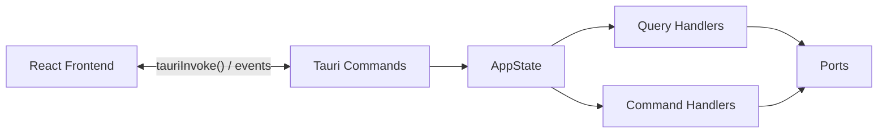

# Presentation Layer

> Interface between the React frontend and the Rust backend — Tauri commands, events and application state.

---

## Purpose

The Presentation layer exposes **Tauri commands** that the frontend can invoke via `tauriInvoke()`. It also handles real-time **events** and maintains the **AppState** (composition root).



---

## Structure

```
presentation/
├── mod.rs
├── state.rs              # AppState — composition root
├── events.rs             # Tauri event definitions
└── commands/             # Tauri commands
    ├── distro_commands.rs       # Distribution management
    ├── snapshot_commands.rs     # Snapshot management
    ├── monitoring_commands.rs   # System metrics + alerts
    ├── settings_commands.rs     # WSL config + VHDX
    ├── debug_commands.rs        # Debug log buffer access
    ├── audit_commands.rs        # Audit log
    ├── terminal_commands.rs     # Terminal PTY sessions
    └── port_forwarding_commands.rs  # Port forwarding rules
```

---

## AppState

The `AppState` is the **composition root** — it holds all injected dependencies as `Arc<dyn Port>`:

```rust
pub struct AppState {
    pub wsl_manager:   Arc<dyn WslManagerPort>,
    pub snapshot_repo: Arc<dyn SnapshotRepositoryPort>,
    pub monitoring:    Arc<dyn MonitoringProviderPort>,
    pub metrics_repo:  Arc<dyn MetricsRepositoryPort>,
    pub alerting:      Arc<dyn AlertingPort>,
    pub audit_logger:  Arc<dyn AuditLoggerPort>,
    pub alert_thresholds: Arc<RwLock<Vec<AlertThreshold>>>,
    pub port_forwarding:  Arc<dyn PortForwardingPort>,
    pub port_rules_repo:  Arc<dyn PortForwardRulesRepository>,
}
```

The `AppState` is injected into Tauri via `app_handle.manage(app_state)` in `lib.rs`, then accessible in each command via `tauri::State<AppState>`.

`TerminalSessionManager` is managed separately via `app_handle.manage(TerminalSessionManager::new())`.

---

## Tauri Commands

All commands are registered in `lib.rs` via `invoke_handler![...]`.

### Distributions (`distro_commands.rs`)

| Command | Parameters | Returns | Description |
|---|---|---|---|
| `list_distros` | — | `Vec<DistroResponse>` | List all distributions |
| `start_distro` | `name: String` | `()` | Start a distribution |
| `stop_distro` | `name: String` | `()` | Stop a distribution |
| `restart_distro` | `name: String` | `()` | Restart a distribution |
| `shutdown_all` | — | `()` | Shut down all WSL instances |
| `get_distro_install_path` | `name: String` | `String` | Get distro installation path |

### Snapshots (`snapshot_commands.rs`)

| Command | Parameters | Returns | Description |
|---|---|---|---|
| `list_snapshots` | `distro_name: Option<String>` | `Vec<SnapshotResponse>` | List snapshots |
| `create_snapshot` | distro_name, name, description, format, output_dir | `SnapshotResponse` | Create a snapshot |
| `delete_snapshot` | `snapshot_id: String` | `()` | Delete a snapshot |
| `restore_snapshot` | snapshot_id, mode, new_name, install_location | `()` | Restore a snapshot |

### Monitoring (`monitoring_commands.rs`)

| Command | Parameters | Returns | Description |
|---|---|---|---|
| `get_system_metrics` | `distro_name: String` | `SystemMetrics` | CPU + RAM + Disk + Network |
| `get_processes` | `distro_name: String` | `Vec<ProcessInfo>` | Top processes |
| `get_metrics_history` | distro_name, from, to | `MetricsHistoryResponse` | Historical metrics (raw or aggregated) |
| `get_alert_thresholds` | — | `Vec<AlertThreshold>` | Get current alert thresholds |
| `set_alert_thresholds` | `thresholds: Vec<AlertThreshold>` | `()` | Update alert thresholds |
| `get_recent_alerts` | distro_name, limit | `Vec<AlertRecord>` | Recent alerts for a distro |
| `acknowledge_alert` | `alert_id: i64` | `()` | Acknowledge a triggered alert |

### Settings (`settings_commands.rs`)

| Command | Parameters | Returns | Description |
|---|---|---|---|
| `get_wsl_config` | — | `WslGlobalConfig` | Read `.wslconfig` |
| `update_wsl_config` | `config: WslGlobalConfig` | `()` | Write `.wslconfig` |
| `compact_vhdx` | `distro_name: String` | `()` | Enable sparse mode |
| `get_wsl_version` | — | `String` | Get WSL version info |

### Debug (`debug_commands.rs`)

| Command | Parameters | Returns | Description |
|---|---|---|---|
| `get_debug_logs` | — | `Vec<LogEntry>` | Returns all buffered log entries from the in-memory ring buffer |
| `clear_debug_logs` | — | `()` | Clears the debug log buffer |

These commands access the `Arc<DebugLogBuffer>` directly via `tauri::State`, separate from `AppState`.

### Audit (`audit_commands.rs`)

| Command | Parameters | Returns | Description |
|---|---|---|---|
| `search_audit_log` | action_filter, target_filter, limit, offset | `Vec<AuditEntry>` | Search the audit log |

### Terminal (`terminal_commands.rs`)

| Command | Parameters | Returns | Description |
|---|---|---|---|
| `terminal_create` | `distro_name: String` | `String` (session ID) | Create a new PTY terminal session |
| `terminal_write` | session_id, data | `()` | Write input data to terminal |
| `terminal_resize` | session_id, cols, rows | `()` | Resize terminal dimensions |
| `terminal_close` | `session_id: String` | `()` | Close and terminate a session |

Uses `TerminalSessionManager` (managed state, separate from AppState).

### Port Forwarding (`port_forwarding_commands.rs`)

| Command | Parameters | Returns | Description |
|---|---|---|---|
| `list_listening_ports` | `distro_name: String` | `Vec<ListeningPort>` | List ports listening inside WSL |
| `get_port_forwarding_rules` | `distro_name: Option<String>` | `Vec<PortForwardRule>` | List forwarding rules |
| `add_port_forwarding` | distro_name, wsl_port, host_port | `PortForwardRule` | Create a new forwarding rule |
| `remove_port_forwarding` | `rule_id: String` | `()` | Remove a forwarding rule |
| `get_wsl_ip` | `distro_name: String` | `String` | Get WSL distro IP address |

---

## Events

The backend defines event constants in `events.rs`:

| Event Constant | Event Name | Payload | Status |
|---|---|---|---|
| `EVENT_DISTRO_STATE_CHANGED` | `distro-state-changed` | `DistroStateChangedEvent { distro_name, new_state, timestamp }` | Actively emitted when a distribution changes state |
| `EVENT_SYSTEM_METRICS` | `system-metrics` | `SystemMetrics` | Defined but not actively pushed to frontend |
| `EVENT_SNAPSHOT_PROGRESS` | `snapshot-progress` | `SnapshotProgressEvent { snapshot_id, phase, progress_percent }` | Defined but not actively pushed to frontend |

Additionally:
- The `DebugLogLayer` (infrastructure) emits `debug-log-entry` events in real-time as log entries are captured
- The `TerminalSessionManager` emits `terminal-output` events with PTY output data

On the frontend side, events are listened to via `useTauriEvent()`.

---

## Error Handling

Tauri commands return `Result<T, DomainError>`. `DomainError` implements `Serialize`, allowing Tauri to automatically convert it to a JSON error readable by the frontend:

```
Tauri Command -> Result<T, DomainError>
    |-- Ok(value) -> JSON serialized to the frontend
    |-- Err(error) -> { message: "DistroNotFound: Ubuntu" }
```

---

> See also: [Domain](../domain/README.md) · [Application](../application/README.md) · [Infrastructure](../infrastructure/README.md)
