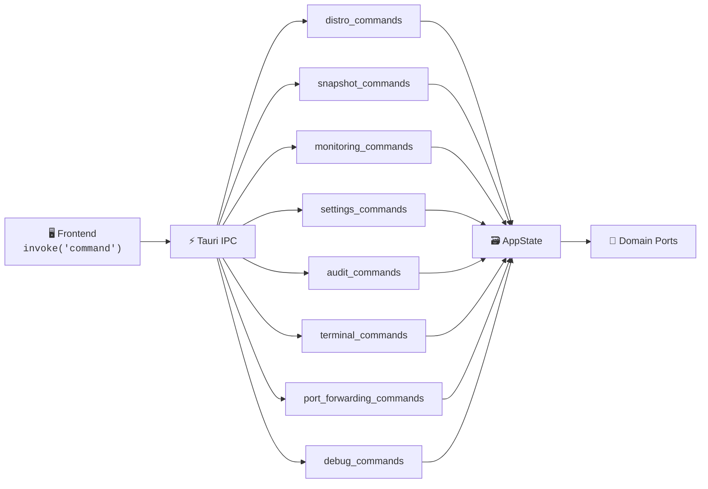

# 🎯 Tauri Commands

> IPC command handlers that bridge the React frontend to the Rust backend via Tauri's invoke system.

---

## 🏗️ Architecture



Each command function is annotated with `#[tauri::command]` and receives `State<'_, AppState>` (or `State<'_, TerminalSessionManager>` / `State<'_, Arc<DebugLogBuffer>>`) via Tauri's dependency injection. All commands use `#[instrument]` from `tracing` for structured logging.

## 📁 File Inventory

| File | Module | Commands | Description |
|------|--------|:--------:|-------------|
| `mod.rs` | — | — | Re-exports all 8 command modules |
| `distro_commands.rs` | `distro_commands` | 8 | Distribution lifecycle and management |
| `snapshot_commands.rs` | `snapshot_commands` | 4 | Snapshot CRUD via CQRS handlers |
| `monitoring_commands.rs` | `monitoring_commands` | 7 | Real-time metrics, history, and alerts |
| `settings_commands.rs` | `settings_commands` | 4 | `.wslconfig` editing, VHDX compaction, version info |
| `audit_commands.rs` | `audit_commands` | 1 | Audit log search with filtering |
| `terminal_commands.rs` | `terminal_commands` | 5 | PTY session lifecycle (create/write/resize/close) |
| `port_forwarding_commands.rs` | `port_forwarding_commands` | 5 | Port forwarding rules and WSL IP discovery |
| `debug_commands.rs` | `debug_commands` | 2 | Debug log buffer access |
| | **Total** | **36** | |

## 📋 Commands Per Module

### `distro_commands` — Distribution Lifecycle

| Command | Parameters | Returns |
|---------|-----------|---------|
| `list_distros` | — | `Vec<DistroResponse>` |
| `start_distro` | `name` | `()` |
| `stop_distro` | `name` | `()` |
| `restart_distro` | `name` | `()` |
| `shutdown_all` | — | `()` |
| `get_distro_install_path` | `name` | `String` |
| `set_default_distro` | `name` | `()` |
| `resize_vhd` | `name`, `size` | `()` |

### `snapshot_commands` — Snapshot Management

| Command | Parameters | Returns |
|---------|-----------|---------|
| `list_snapshots` | `distro_name?` | `Vec<SnapshotResponse>` |
| `create_snapshot` | `CreateSnapshotArgs` | `SnapshotResponse` |
| `delete_snapshot` | `snapshot_id` | `()` |
| `restore_snapshot` | `RestoreSnapshotArgs` | `()` |

### `monitoring_commands` — Metrics & Alerts

| Command | Parameters | Returns |
|---------|-----------|---------|
| `get_system_metrics` | `distro_name` | `SystemMetrics` |
| `get_processes` | `distro_name` | `Vec<ProcessInfo>` |
| `get_metrics_history` | `distro_name`, `from`, `to` | `MetricsHistoryResponse` |
| `get_alert_thresholds` | — | `Vec<AlertThreshold>` |
| `set_alert_thresholds` | `thresholds` | `()` |
| `get_recent_alerts` | `distro_name`, `limit?` | `Vec<AlertRecord>` |
| `acknowledge_alert` | `alert_id` | `()` |

### `settings_commands` — WSL Configuration

| Command | Parameters | Returns |
|---------|-----------|---------|
| `get_wsl_config` | — | `WslGlobalConfig` |
| `update_wsl_config` | `config` | `()` |
| `compact_vhdx` | `distro_name` | `()` |
| `get_wsl_version` | — | `WslVersionInfo` |

### `audit_commands` — Audit Log

| Command | Parameters | Returns |
|---------|-----------|---------|
| `search_audit_log` | `SearchAuditArgs` | `Vec<AuditEntry>` |

### `terminal_commands` — Terminal Sessions

| Command | Parameters | Returns |
|---------|-----------|---------|
| `terminal_create` | `distro_name` | `String` (session ID) |
| `terminal_write` | `session_id`, `data` | `()` |
| `terminal_resize` | `session_id`, `cols`, `rows` | `()` |
| `terminal_is_alive` | `session_id` | `bool` |
| `terminal_close` | `session_id` | `()` |

### `port_forwarding_commands` — Port Forwarding

| Command | Parameters | Returns |
|---------|-----------|---------|
| `list_listening_ports` | `distro_name` | `Vec<ListeningPort>` |
| `get_port_forwarding_rules` | `distro_name?` | `Vec<PortForwardRule>` |
| `add_port_forwarding` | `distro_name`, `wsl_port`, `host_port` | `PortForwardRule` |
| `remove_port_forwarding` | `rule_id` | `()` |
| `get_wsl_ip` | `distro_name` | `String` |

### `debug_commands` — Debug Logs

| Command | Parameters | Returns |
|---------|-----------|---------|
| `get_debug_logs` | — | `Vec<LogEntry>` |
| `clear_debug_logs` | — | `()` |

## 🔌 Registration

All 36 commands are registered in `lib.rs` via Tauri's `invoke_handler` macro:

```rust
.invoke_handler(tauri::generate_handler![
    distro_commands::list_distros,
    distro_commands::start_distro,
    // ... all 36 commands
    port_forwarding_commands::get_wsl_ip,
])
```

The `generate_handler!` macro produces the IPC routing table that maps frontend `invoke("command_name")` calls to the corresponding Rust async functions. Commands receive shared state through Tauri's managed state system (`State<'_,T>`).

## 🔑 Key Patterns

- **CQRS**: Snapshot commands delegate to dedicated `CreateSnapshotHandler`, `DeleteSnapshotHandler`, and `RestoreSnapshotHandler` in the application layer. Distro listing uses `ListDistrosHandler`.
- **Audit trail**: Most mutating commands (start, stop, config updates, port forwarding) log actions via `state.audit_logger` before returning.
- **Tracing**: Every command is annotated with `#[instrument]` for structured span logging, skipping the `state` parameter to avoid noise.
- **Validation**: `DistroName::new()` and `SnapshotId::from_string()` validate inputs at the boundary before reaching domain logic.

---

> 👀 See also: [`../` Presentation layer](../), [`../state.rs` AppState](../state.rs), [`../events.rs` Events](../events.rs), [`../tray.rs` System tray](../tray.rs)
