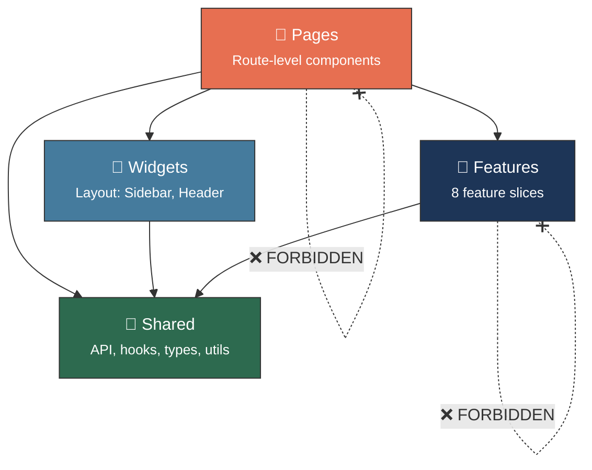
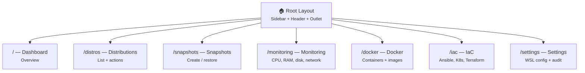

# ⚛️ Frontend — React 19 + TypeScript 5.7

> WSL Nexus user interface — Feature-Sliced Design, TanStack Query, Tailwind CSS v4.

---

## 🏗️ Feature-Sliced Design Architecture (FSD)

The frontend follows the **Feature-Sliced Design** architecture with 4 layers and strict import rules:



| Layer | Directory | Can Import From |
|---|---|---|
| 🔧 **Shared** | [`shared/`](shared/README.md) | Nothing (lowest layer) |
| 🧩 **Features** | [`features/`](features/README.md) | `shared/` only |
| 🧱 **Widgets** | [`widgets/`](widgets/README.md) | `shared/` only |
| 📄 **Pages** | [`pages/`](pages/README.md) | `features/`, `widgets/`, `shared/` |

> **Golden rule**: A feature can **never** import from another feature. A page can **never** import from another page.

---

## 📁 Structure

```
src/
├── 📄 main.tsx              # React 19 entry point (createRoot)
├── 📄 app.tsx               # Providers: QueryClientProvider + RouterProvider
├── 📄 router.tsx            # 7 TanStack Router routes
├── 🎨 app.css               # oklch dark theme (Tailwind CSS v4)
├── 📄 vite-env.d.ts         # Vite types
│
├── 🧩 features/             # 8 self-contained feature slices
│   ├── distro-list/         # Distribution management
│   ├── snapshot-list/       # Snapshots
│   ├── monitoring-dashboard/# Real-time metrics
│   ├── docker-containers/   # Docker
│   ├── iac-integrations/    # IaC (Ansible, K8s, Terraform, Helm)
│   ├── wsl-config/          # .wslconfig editor
│   ├── audit-log/           # Audit trail
│   └── distro-events/       # Real-time events
│
├── 📄 pages/                # 7 routed pages
│   ├── dashboard/           # /
│   ├── distros/             # /distros
│   ├── snapshots/           # /snapshots
│   ├── monitoring/          # /monitoring
│   ├── docker/              # /docker
│   ├── iac/                 # /iac
│   └── settings/            # /settings
│
├── 🔧 shared/               # Shared utilities
│   ├── api/                 # Tauri bridge (invoke + events)
│   ├── config/              # QueryClient
│   ├── hooks/               # useTauriEvent, useThemeStore
│   ├── lib/                 # cn(), formatters
│   ├── types/               # TypeScript interfaces
│   └── ui/                  # ErrorBoundary
│
├── 🧱 widgets/              # Layout components
│   ├── sidebar/             # Main navigation
│   └── header/              # Top bar + theme toggle
│
└── 🧪 test/                 # Vitest setup + mocks
    ├── setup.ts
    └── mocks/
```

---

## 🛣️ Routing — TanStack Router

7 code-based routes (no file-based routing) defined in `router.tsx`:



### Root Layout

```tsx
<div className="flex h-screen overflow-hidden bg-background text-foreground">
  <Sidebar />                    {/* w-64, border-r */}
  <div className="flex flex-1 flex-col overflow-hidden">
    <Header />                   {/* h-14, border-b */}
    <main className="flex-1 overflow-y-auto p-6">
      <ErrorBoundary>
        <Outlet />               {/* Page content */}
      </ErrorBoundary>
    </main>
  </div>
</div>
```

---

## 📊 State Management

### TanStack Query 5 — Server State

Manages all data coming from the Tauri backend:

| Config | Value |
|---|---|
| `staleTime` | 5 seconds |
| `retry` | 1 attempt |
| `refetchOnWindowFocus` | Disabled |

**Query key pattern** (for caching):
```typescript
distroKeys = {
  all: ["distros"],
  list: () => [...all, "list"],
  detail: (name) => [...all, "detail", name]
}
```

**Refetch intervals**:
| Feature | Interval |
|---|---|
| Distributions | 10s |
| System metrics | 2s |
| Processes | 3s |
| Docker | 5s |
| Audit log | 10s |

### Zustand 5 — UI State

Used only for the **theme** (dark/light) with localStorage persistence:
- Store: `useThemeStore()`
- Key: `wsl-nexus-theme`
- Actions: `theme`, `toggleTheme()`

---

## 🎨 Styling

### Tailwind CSS v4 + oklch

Dark theme using the **oklch** color space for perceptually uniform colors:

| Token | Color | Usage |
|---|---|---|
| `--background` | `oklch(0.145 0 0)` | Main background (near-black) |
| `--foreground` | `oklch(0.985 0 0)` | Main text (near-white) |
| `--primary` | `oklch(0.7 0.15 250)` | Vibrant blue (actions, links) |
| `--success` | `oklch(0.7 0.18 145)` | Green (Running state) |
| `--warning` | `oklch(0.75 0.15 75)` | Orange (alerts) |
| `--destructive` | `oklch(0.6 0.2 25)` | Red (deletion, errors) |
| `--card` | `oklch(0.17 0 0)` | Card backgrounds |
| `--border` | `oklch(0.3 0 0)` | Subtle borders |

### shadcn/ui

- **Style**: new-york
- **Components**: in `shared/ui/`
- **Utility**: `cn()` = `clsx` + `tailwind-merge`
- **Icons**: Lucide React (Play, Square, Archive, Server, Activity, Container, Wrench, Settings...)

---

## 🔗 Tauri Bridge

### `tauriInvoke<T>(cmd, args?)`

Typed wrapper around `@tauri-apps/api/core.invoke()`:
- Handles errors and converts them to `TauriError`
- Used by all TanStack Query hooks

### `useTauriEvent<T>(event, handler)`

React hook for listening to Tauri events:
- Automatic setup/cleanup in `useEffect`
- Used by `distro-events` for cache invalidation

### Listened Events

| Constant | Event | Usage |
|---|---|---|
| `EVENTS.DISTRO_STATE_CHANGED` | `distro-state-changed` | Distro query invalidation |
| `EVENTS.SYSTEM_METRICS` | `system-metrics` | Continuous metrics stream |
| `EVENTS.SNAPSHOT_PROGRESS` | `snapshot-progress` | Progress bar |

---

## 📁 Entry Point


1. **`main.tsx`** — Mounts React 19 on `#root`
2. **`app.tsx`** — Wraps with `QueryClientProvider` (TanStack Query) + `RouterProvider` (TanStack Router)
3. **`router.tsx`** — Defines routes and the root layout (Sidebar + Header + Outlet)

---

## ⚙️ TypeScript Configuration

| Option | Value | Impact |
|---|---|---|
| `noUncheckedIndexedAccess` | `true` | `array[0]` returns `T \| undefined` → requires `!` or `?.` |
| `strict` | `true` | All strict checks enabled |
| `paths` | `@/* → ./src/*` | Import alias to avoid deep relative paths |
| `target` | ES2020 | Modern JS features support |

---

## 🧪 Tests

```bash
npm run test          # Single run
npm run test:watch    # Watch mode
```

- **Framework**: Vitest 3.0.0
- **Environment**: jsdom (browser simulation)
- **Setup**: `test/setup.ts` (imports `@testing-library/jest-dom`)
- **Utilities**: `@testing-library/react` for component rendering

---

> 📖 Dive deeper: [🧩 Features](features/README.md) · [🔧 Shared](shared/README.md) · [📄 Pages](pages/README.md) · [🧱 Widgets](widgets/README.md)
