# 🖼️ Frontend — React 19 + TypeScript 5.9

> WSL Nexus user interface — Feature-Sliced Design, TanStack Query, Tailwind CSS v4.

---

## 🏗️ Feature-Sliced Design Architecture (FSD)

The frontend follows the **Feature-Sliced Design** architecture with 4 layers and strict import rules:

```mermaid
graph TD
    P["📄 Pages<br/><small>Route-level components</small>"]
    W["🔲 Widgets<br/><small>Layout: Header, DebugConsole</small>"]
    F["🧩 Features<br/><small>8 feature slices + 1 hook-only</small>"]
    S["📦 Shared<br/><small>API, hooks, types, stores, utils</small>"]

    P --> F
    P --> W
    P --> S
    W --> S
    F --> S

    P -.-x|"🚫 FORBIDDEN"| P
    F -.-x|"🚫 FORBIDDEN"| F

    style S fill:#2d6a4f,stroke:#333,color:#fff
    style F fill:#1d3557,stroke:#333,color:#fff
    style W fill:#457b9d,stroke:#333,color:#fff
    style P fill:#e76f51,stroke:#333,color:#fff
```



| Layer | Directory | Can Import From |
|---|---|---|
| 📦 **Shared** | [`shared/`](shared/README.md) | Nothing (lowest layer) |
| 🧩 **Features** | [`features/`](features/README.md) | `shared/` only |
| 🔲 **Widgets** | [`widgets/`](widgets/README.md) | `shared/` only |
| 📄 **Pages** | [`pages/`](pages/README.md) | `features/`, `widgets/`, `shared/` |

> 🚫 **Golden rule**: A feature can **never** import from another feature. A page can **never** import from another page.

---

## 📂 Structure

```
src/
├── main.tsx              # ⚡ React 19 entry point (createRoot)
├── app.tsx               # 🔗 Providers: QueryClientProvider + RouterProvider
├── router.tsx            # 🗺️ 3 TanStack Router routes
├── app.css               # 🎨 Catppuccin Mocha/Latte theme (Tailwind CSS v4)
├── vite-env.d.ts         # 📝 Vite types
│
├── locales/              # 🌍 i18n translations
│   ├── en/                  # 🇬🇧 English
│   ├── es/                  # 🇪🇸 Spanish
│   ├── fr/                  # 🇫🇷 French
│   └── zh/                  # 🇨🇳 Chinese
│
├── features/             # 🧩 8 self-contained feature slices + 1 hook-only
│   ├── distro-list/         # 🖥️ Distribution management
│   ├── snapshot-list/       # 📸 Snapshots
│   ├── monitoring-dashboard/# 📊 Real-time metrics
│   ├── wsl-config/          # ⚙️ .wslconfig editor
│   ├── audit-log/           # 📋 Audit trail
│   ├── terminal/            # 💻 Interactive WSL terminal (xterm)
│   ├── port-forwarding/     # 🔀 WSL-to-Windows port mapping
│   ├── app-preferences/     # 🎨 Language and theme preferences
│   └── distro-events/       # ⚡ Real-time events (hook only)
│
├── pages/                # 📄 3 routed pages
│   ├── distros/             # 🏠 / (home)
│   ├── monitoring/          # 📊 /monitoring
│   └── settings/            # ⚙️ /settings
│
├── shared/               # 📦 Shared utilities
│   ├── api/                 # 🔗 Tauri bridge (invoke, events, queries, mutations)
│   ├── config/              # ⚙️ QueryClient, i18n
│   ├── hooks/               # 🪝 useDebugConsoleStore, useThemeStore, useTauriEvent, useDebounce
│   ├── stores/              # 🗃️ useLocaleStore, usePreferencesStore
│   ├── lib/                 # 🔧 cn(), formatters
│   ├── types/               # 📝 TypeScript interfaces (distro, monitoring, snapshot)
│   ├── ui/                  # 🎨 Shared components (ErrorBoundary, Select, Toast, Dialog, etc.)
│   └── assets/              # 🏳️ Static assets (flag SVGs for i18n)
│
├── widgets/              # 🔲 Layout components
│   ├── header/              # 📌 Top bar with pill tabs + theme toggle
│   └── debug-console/       # 🐛 Collapsible in-app log viewer
│
└── test/                 # 🧪 Vitest setup + mocks
    ├── setup.ts
    ├── test-utils.tsx
    └── mocks/
```

---

## 🗺️ Routing — TanStack Router

3 code-based routes (no file-based routing) defined in `router.tsx`:

```mermaid
graph TD
    Root["🏠 Root Layout<br/><small>Header + Outlet + DebugConsole</small>"]
    Root --> DI["🖥️ / — Distributions<br/><small>Distro grid + snapshots + terminal</small>"]
    Root --> MO["📊 /monitoring — Monitoring<br/><small>CPU, RAM, disk, network</small>"]
    Root --> SE["⚙️ /settings — Settings<br/><small>WSL config + port forwarding + preferences + audit</small>"]
```



### 🖼️ Root Layout

```tsx
<div className="flex h-screen flex-col overflow-hidden bg-background text-foreground">
  <Header />
  <main className="min-h-0 flex-1 overflow-y-auto p-4 sm:p-6">
    <ErrorBoundary>
      <Outlet />
    </ErrorBoundary>
  </main>
  <DebugConsole />
</div>
```

---

## 🗃️ State Management

### ⚡ TanStack Query 5 — Server State

Manages all data coming from the Tauri backend:

| ⚙️ Config | Value |
|---|---|
| `staleTime` | 5 seconds |
| `retry` | 1 attempt |
| `refetchOnWindowFocus` | Disabled |

**🔑 Query key patterns** (for caching):
```typescript
distroKeys = {
  all: ["distros"],
  list: () => [...all, "list"]
}

monitoringKeys = {
  all: ["monitoring"],
  metrics: (distro) => [...all, "metrics", distro],
  processes: (distro) => [...all, "processes", distro]
}
```

**🔄 Refetch intervals**:
| 🧩 Feature | ⏱️ Interval |
|---|---|
| Distributions | 10s |
| System metrics | 2s |
| Processes | 3s |
| Audit log | 10s |

### 🗃️ Zustand 5 — UI State

Four Zustand stores with no cross-dependencies:

🎨 **`useThemeStore()`** — Theme (dark/light) with localStorage persistence:
- Key: `wsl-nexus-theme`
- State: `theme`
- Actions: `toggleTheme()`
- Synced to DOM via `data-theme` attribute on `<html>`

🐛 **`useDebugConsoleStore()`** — Debug console panel state:
- State: `isOpen`, `logs`, `filter`
- Actions: `toggle()`, `setFilter()`, `addLog()`, `setLogs()`, `clear()`
- Capped at 1000 log entries (oldest evicted)
- Keyboard shortcut: `Ctrl+Shift+D`

🌍 **`useLocaleStore()`** — Language preference:
- Persists selected locale
- Drives i18next language switching

⚙️ **`usePreferencesStore()`** — General user preferences:
- Persists user settings via Tauri plugin-store

---

## 🎨 Styling

### 🐱 Tailwind CSS v4 + Catppuccin

Dual-theme system using **Catppuccin Mocha** 🌙 (dark, default) and **Catppuccin Latte** ☀️ (light), toggled via the `data-theme` attribute:

| Token | 🌙 Mocha (dark) | ☀️ Latte (light) | Usage |
|---|---|---|---|
| `--color-background` | `#1e1e2e` (base) | `#eff1f5` (base) | Main background |
| `--color-foreground` | `#cdd6f4` (text) | `#4c4f69` (text) | Main text |
| `--color-primary` | `#89b4fa` (blue) | `#1e66f5` (blue) | Actions, links |
| `--color-success` | `#a6e3a1` (green) | `#40a02b` (green) | Running state |
| `--color-warning` | `#f9e2af` (yellow) | `#df8e1d` (yellow) | Alerts |
| `--color-destructive` | `#f38ba8` (red) | `#d20f39` (red) | Deletion, errors |
| `--color-card` | `#181825` (mantle) | `#e6e9ef` (mantle) | Card backgrounds |
| `--color-border` | `#45475a` (surface-1) | `#bcc0cc` (surface-1) | Subtle borders |

### 🧩 shadcn/ui

- **Style**: new-york
- **Components**: in `shared/ui/`
- **Utility**: `cn()` = `clsx` + `tailwind-merge`
- **Icons**: Lucide React (Play, Square, Archive, Server, Activity, Wrench, Settings...)

---

## 🔗 Tauri Bridge

### `tauriInvoke<T>(cmd, args?)`

Typed wrapper around `@tauri-apps/api/core.invoke()`:
- ⚠️ Handles errors and converts them to `TauriError`
- 🧩 Used by all TanStack Query hooks

### `useTauriEvent<T>(event, handler)`

React hook for listening to Tauri events:
- 🔄 Automatic setup/cleanup in `useEffect`
- ⚡ Used by `distro-events` for cache invalidation

### 📡 Listened Events

| Constant | Event | Usage |
|---|---|---|
| `EVENTS.DISTRO_STATE_CHANGED` | `distro-state-changed` | 🔄 Distro query invalidation |

---

## 📝 Shared Types

Three type files in `shared/types/`:

**`distro.ts`** — `Distro`, `DistroState`
```typescript
interface Distro {
  name: string;
  state: DistroState;          // "Running" | "Stopped" | "Installing" | "Converting" | "Uninstalling"
  wsl_version: number;
  is_default: boolean;
  base_path: string | null;
  vhdx_size_bytes: number | null;
  last_seen: string;
}
```

**`monitoring.ts`** — `SystemMetrics`, `CpuMetrics`, `MemoryMetrics`, `DiskMetrics`, `NetworkMetrics`, `InterfaceStats`

**`snapshot.ts`** — `Snapshot`, `CreateSnapshotArgs`, `RestoreSnapshotArgs`

---

## 🌍 Internationalization (i18n)

- **Framework**: i18next + react-i18next
- **Languages**: 🇬🇧 English · 🇪🇸 Spanish · 🇫🇷 French · 🇨🇳 Chinese
- **Config**: `shared/config/i18n.ts`
- **Translations**: `locales/{en,es,fr,zh}/translation.json`
- **Locale store**: `shared/stores/use-locale-store.ts`
- **Flag assets**: `shared/assets/flags/` (gb.svg, es.svg, fr.svg, cn.svg)

---

## ⚡ Entry Point

```mermaid
graph LR
    M["⚡ main.tsx<br/><small>createRoot()</small>"]
    A["🔗 app.tsx<br/><small>QueryClientProvider + RouterProvider</small>"]
    R["🗺️ router.tsx<br/><small>3 routes + root layout</small>"]

    M --> A --> R
```



1. **`main.tsx`** — Mounts React 19 on `#root` (with StrictMode)
2. **`app.tsx`** — Wraps with `QueryClientProvider` (TanStack Query) + `RouterProvider` (TanStack Router), calls `useThemeSync()`
3. **`router.tsx`** — Defines routes and the root layout (Header + Outlet + DebugConsole), calls `useDebugConsoleSetup()`

---

## ⚙️ TypeScript Configuration

| Option | Value | 💡 Impact |
|---|---|---|
| `noUncheckedIndexedAccess` | `true` | `array[0]` returns `T \| undefined` — requires `!` or `?.` |
| `strict` | `true` | All strict checks enabled |
| `paths` | `@/* -> ./src/*` | Import alias to avoid deep relative paths |
| `target` | ES2020 | Modern JS features support |

---

## 🧪 Tests

```bash
npm run test          # ▶️ Single run
npm run test:watch    # 👁️ Watch mode
```

- **Framework**: Vitest 4
- **Environment**: jsdom (browser simulation)
- **Setup**: `test/setup.ts` (imports `@testing-library/jest-dom`)
- **Utilities**: `test/test-utils.tsx` (`renderWithProviders` wraps with QueryClientProvider + I18nextProvider)
- **Test count**: ✅ 383 tests across 40 test files

---

> 👀 Dive deeper: [🧩 Features](features/README.md) | [📦 Shared](shared/README.md) | [📄 Pages](pages/README.md) | [🔲 Widgets](widgets/README.md)
