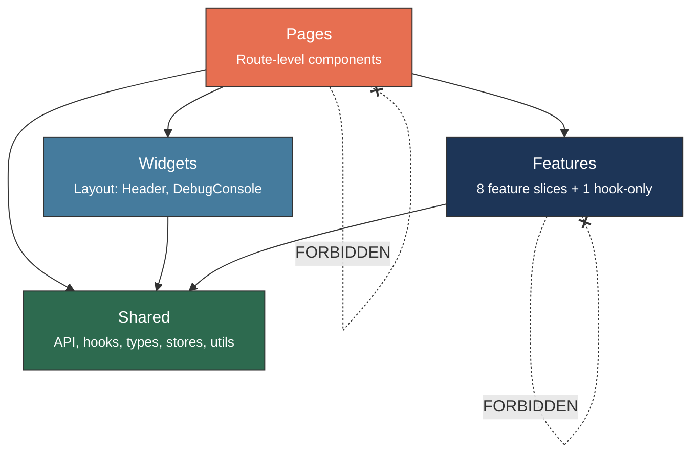
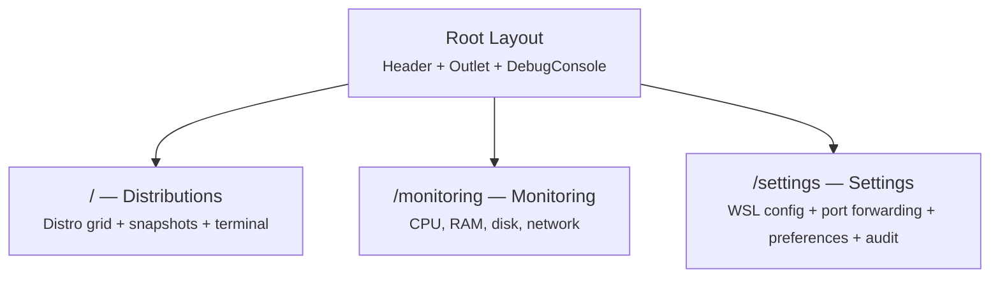

# Frontend — React 19 + TypeScript 5.9

> WSL Nexus user interface — Feature-Sliced Design, TanStack Query, Tailwind CSS v4.

---

## Feature-Sliced Design Architecture (FSD)

The frontend follows the **Feature-Sliced Design** architecture with 4 layers and strict import rules:



| Layer | Directory | Can Import From |
|---|---|---|
| **Shared** | [`shared/`](shared/README.md) | Nothing (lowest layer) |
| **Features** | [`features/`](features/README.md) | `shared/` only |
| **Widgets** | [`widgets/`](widgets/README.md) | `shared/` only |
| **Pages** | [`pages/`](pages/README.md) | `features/`, `widgets/`, `shared/` |

> **Golden rule**: A feature can **never** import from another feature. A page can **never** import from another page.

---

## Structure

```
src/
├── main.tsx              # React 19 entry point (createRoot)
├── app.tsx               # Providers: QueryClientProvider + RouterProvider
├── router.tsx            # 3 TanStack Router routes
├── app.css               # Catppuccin Mocha/Latte theme (Tailwind CSS v4)
├── vite-env.d.ts         # Vite types
│
├── locales/              # i18n translations
│   ├── en/                  # English
│   ├── es/                  # Spanish
│   ├── fr/                  # French
│   └── zh/                  # Chinese
│
├── features/             # 8 self-contained feature slices + 1 hook-only
│   ├── distro-list/         # Distribution management
│   ├── snapshot-list/       # Snapshots
│   ├── monitoring-dashboard/# Real-time metrics
│   ├── wsl-config/          # .wslconfig editor
│   ├── audit-log/           # Audit trail
│   ├── terminal/            # Interactive WSL terminal (xterm)
│   ├── port-forwarding/     # WSL-to-Windows port mapping
│   ├── app-preferences/     # Language and theme preferences
│   └── distro-events/       # Real-time events (hook only)
│
├── pages/                # 3 routed pages
│   ├── distros/             # / (home)
│   ├── monitoring/          # /monitoring
│   └── settings/            # /settings
│
├── shared/               # Shared utilities
│   ├── api/                 # Tauri bridge (invoke, events, queries, mutations)
│   ├── config/              # QueryClient, i18n
│   ├── hooks/               # useDebugConsoleStore, useThemeStore, useTauriEvent, useDebounce
│   ├── stores/              # useLocaleStore, usePreferencesStore
│   ├── lib/                 # cn(), formatters
│   ├── types/               # TypeScript interfaces (distro, monitoring, snapshot)
│   ├── ui/                  # Shared components (ErrorBoundary, Select, Toast, Dialog, etc.)
│   └── assets/              # Static assets (flag SVGs for i18n)
│
├── widgets/              # Layout components
│   ├── header/              # Top bar with pill tabs + theme toggle
│   └── debug-console/       # Collapsible in-app log viewer
│
└── test/                 # Vitest setup + mocks
    ├── setup.ts
    ├── test-utils.tsx
    └── mocks/
```

---

## Routing — TanStack Router

3 code-based routes (no file-based routing) defined in `router.tsx`:



### Root Layout

```tsx
<div className="flex h-screen flex-col overflow-hidden bg-background text-foreground">
  <Header />
  <main className="min-h-0 flex-1 overflow-y-auto p-4 sm:p-6">
    <ErrorBoundary>
      <Outlet />
    </ErrorBoundary>
  </main>
  <DebugConsole />
</div>
```

---

## State Management

### TanStack Query 5 — Server State

Manages all data coming from the Tauri backend:

| Config | Value |
|---|---|
| `staleTime` | 5 seconds |
| `retry` | 1 attempt |
| `refetchOnWindowFocus` | Disabled |

**Query key patterns** (for caching):
```typescript
distroKeys = {
  all: ["distros"],
  list: () => [...all, "list"]
}

monitoringKeys = {
  all: ["monitoring"],
  metrics: (distro) => [...all, "metrics", distro],
  processes: (distro) => [...all, "processes", distro]
}
```

**Refetch intervals**:
| Feature | Interval |
|---|---|
| Distributions | 10s |
| System metrics | 2s |
| Processes | 3s |
| Audit log | 10s |

### Zustand 5 — UI State

Four Zustand stores with no cross-dependencies:

**`useThemeStore()`** — Theme (dark/light) with localStorage persistence:
- Key: `wsl-nexus-theme`
- State: `theme`
- Actions: `toggleTheme()`
- Synced to DOM via `data-theme` attribute on `<html>`

**`useDebugConsoleStore()`** — Debug console panel state:
- State: `isOpen`, `logs`, `filter`
- Actions: `toggle()`, `setFilter()`, `addLog()`, `setLogs()`, `clear()`
- Capped at 1000 log entries (oldest evicted)
- Keyboard shortcut: `Ctrl+Shift+D`

**`useLocaleStore()`** — Language preference:
- Persists selected locale
- Drives i18next language switching

**`usePreferencesStore()`** — General user preferences:
- Persists user settings via Tauri plugin-store

---

## Styling

### Tailwind CSS v4 + Catppuccin

Dual-theme system using **Catppuccin Mocha** (dark, default) and **Catppuccin Latte** (light), toggled via the `data-theme` attribute:

| Token | Mocha (dark) | Latte (light) | Usage |
|---|---|---|---|
| `--color-background` | `#1e1e2e` (base) | `#eff1f5` (base) | Main background |
| `--color-foreground` | `#cdd6f4` (text) | `#4c4f69` (text) | Main text |
| `--color-primary` | `#89b4fa` (blue) | `#1e66f5` (blue) | Actions, links |
| `--color-success` | `#a6e3a1` (green) | `#40a02b` (green) | Running state |
| `--color-warning` | `#f9e2af` (yellow) | `#df8e1d` (yellow) | Alerts |
| `--color-destructive` | `#f38ba8` (red) | `#d20f39` (red) | Deletion, errors |
| `--color-card` | `#181825` (mantle) | `#e6e9ef` (mantle) | Card backgrounds |
| `--color-border` | `#45475a` (surface-1) | `#bcc0cc` (surface-1) | Subtle borders |

### shadcn/ui

- **Style**: new-york
- **Components**: in `shared/ui/`
- **Utility**: `cn()` = `clsx` + `tailwind-merge`
- **Icons**: Lucide React (Play, Square, Archive, Server, Activity, Wrench, Settings...)

---

## Tauri Bridge

### `tauriInvoke<T>(cmd, args?)`

Typed wrapper around `@tauri-apps/api/core.invoke()`:
- Handles errors and converts them to `TauriError`
- Used by all TanStack Query hooks

### `useTauriEvent<T>(event, handler)`

React hook for listening to Tauri events:
- Automatic setup/cleanup in `useEffect`
- Used by `distro-events` for cache invalidation

### Listened Events

| Constant | Event | Usage |
|---|---|---|
| `EVENTS.DISTRO_STATE_CHANGED` | `distro-state-changed` | Distro query invalidation |

---

## Shared Types

Three type files in `shared/types/`:

**`distro.ts`** — `Distro`, `DistroState`
```typescript
interface Distro {
  name: string;
  state: DistroState;          // "Running" | "Stopped" | "Installing" | "Converting" | "Uninstalling"
  wsl_version: number;
  is_default: boolean;
  base_path: string | null;
  vhdx_size_bytes: number | null;
  last_seen: string;
}
```

**`monitoring.ts`** — `SystemMetrics`, `CpuMetrics`, `MemoryMetrics`, `DiskMetrics`, `NetworkMetrics`, `InterfaceStats`

**`snapshot.ts`** — `Snapshot`, `CreateSnapshotArgs`, `RestoreSnapshotArgs`

---

## Internationalization (i18n)

- **Framework**: i18next + react-i18next
- **Languages**: English, Spanish, French, Chinese
- **Config**: `shared/config/i18n.ts`
- **Translations**: `locales/{en,es,fr,zh}/translation.json`
- **Locale store**: `shared/stores/use-locale-store.ts`
- **Flag assets**: `shared/assets/flags/` (gb.svg, es.svg, fr.svg, cn.svg)

---

## Entry Point


1. **`main.tsx`** — Mounts React 19 on `#root` (with StrictMode)
2. **`app.tsx`** — Wraps with `QueryClientProvider` (TanStack Query) + `RouterProvider` (TanStack Router), calls `useThemeSync()`
3. **`router.tsx`** — Defines routes and the root layout (Header + Outlet + DebugConsole), calls `useDebugConsoleSetup()`

---

## TypeScript Configuration

| Option | Value | Impact |
|---|---|---|
| `noUncheckedIndexedAccess` | `true` | `array[0]` returns `T \| undefined` — requires `!` or `?.` |
| `strict` | `true` | All strict checks enabled |
| `paths` | `@/* -> ./src/*` | Import alias to avoid deep relative paths |
| `target` | ES2020 | Modern JS features support |

---

## Tests

```bash
npm run test          # Single run
npm run test:watch    # Watch mode
```

- **Framework**: Vitest 4
- **Environment**: jsdom (browser simulation)
- **Setup**: `test/setup.ts` (imports `@testing-library/jest-dom`)
- **Utilities**: `test/test-utils.tsx` (`renderWithProviders` wraps with QueryClientProvider + I18nextProvider)
- **Test count**: 383 tests across 40 test files

---

> Dive deeper: [Features](features/README.md) | [Shared](shared/README.md) | [Pages](pages/README.md) | [Widgets](widgets/README.md)
