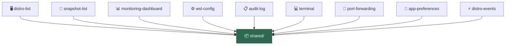

# 🧩 Features

> 8 self-contained feature slices + 1 hook-only slice — each encapsulates a complete application capability.

---

## 🎯 Principle

Each feature is a **vertical slice** that contains everything it needs: API calls, UI components, and specific hooks. Features are **independent** from each other — they only import from `shared/`.



---

## 📐 Internal Convention

Each feature follows this structure:

```
feature-name/
├── api/
│   ├── queries.ts       # 🔍 TanStack Query hooks (read)
│   └── mutations.ts     # ✏️ TanStack Query hooks (write)
├── ui/
│   ├── component-a.tsx  # 🖼️ React components
│   └── component-b.tsx
├── model/               # (optional) 🗃️ Feature-specific stores
│   └── use-xxx-store.ts
└── hooks/               # (optional) 🪝 Feature-specific hooks
    └── use-xxx.ts
```

---

## 📋 Feature Inventory

| | Feature | Description | Queries | Mutations | UI Components |
|---|---|---|---|---|---|
| 🖥️ | `distro-list` | WSL distribution management | `useDistros` | `useStartDistro`, `useStopDistro`, `useRestartDistro`, `useShutdownAll` | `distro-list`, `distro-card` |
| 📸 | `snapshot-list` | Snapshot creation and restoration | `useSnapshots` | `useCreateSnapshot`, `useDeleteSnapshot`, `useRestoreSnapshot` | `snapshot-list`, `snapshot-card`, `create-snapshot-dialog`, `restore-snapshot-dialog` |
| 📊 | `monitoring-dashboard` | Real-time system metrics + alerting | `useSystemMetrics`, `useProcesses`, `useAlertThresholds` | `useSetAlertThresholds` | `cpu-chart`, `memory-chart`, `network-chart`, `disk-gauge`, `process-table` |
| ⚙️ | `wsl-config` | .wslconfig editor + VHDX | `useWslConfig` | `useUpdateWslConfig`, `useCompactVhdx` | `wslconfig-editor`, `vhdx-compact-panel` |
| 📋 | `audit-log` | Searchable audit trail | `useAuditLog` | — | `audit-log-viewer` |
| 💻 | `terminal` | Interactive WSL terminal (xterm) | — | `useCreateTerminalSession` | `terminal-panel`, `terminal-instance`, `terminal-tab-bar` |
| 🔀 | `port-forwarding` | WSL-to-Windows port mapping | `useListeningPorts`, `usePortForwardingRules` | `useAddPortForwarding`, `useRemovePortForwarding` | `port-forwarding-panel`, `add-rule-dialog` |
| 🎨 | `app-preferences` | Language, theme, monitoring preferences | — | — | `preferences-panel` |
| ⚡ | `distro-events` | Tauri event listener | — | — | — (hook only) |

---

## 🖥️ `distro-list` — Distribution Management

**Purpose**: List, start, stop, restart WSL distributions.

```
distro-list/
├── api/
│   ├── queries.ts       # 🔍 useDistros (10s refetch)
│   └── mutations.ts     # ✏️ useStartDistro, useStopDistro, useRestartDistro, useShutdownAll
└── ui/
    ├── distro-list.tsx  # 📋 Grid of DistroCards with loading/error states
    └── distro-card.tsx  # 🃏 Card with state badge, default indicator, action buttons
```

🔑 **Query Key Pattern**: `["distros", "list"]`

Mutations **automatically invalidate** the distro cache after success.

---

## 📸 `snapshot-list` — Snapshots

**Purpose**: Create, list, delete and restore distribution snapshots.

```
snapshot-list/
├── api/
│   ├── queries.ts       # 🔍 useSnapshots (filterable by distro)
│   └── mutations.ts     # ✏️ useCreateSnapshot, useDeleteSnapshot, useRestoreSnapshot
└── ui/
    ├── snapshot-list.tsx          # 📋 Grid of SnapshotCards
    ├── snapshot-card.tsx          # 🃏 Metadata (size, format, date, status)
    ├── create-snapshot-dialog.tsx # ➕ Modal: distro choice, name, format (tar/vhdx)
    └── restore-snapshot-dialog.tsx # 🔄 Modal: clone or overwrite mode, install path
```

📦 **Supported formats**: `tar`, `vhdx`
🔄 **Restore modes**: Clone (new name) or Overwrite (replaces existing)

---

## 📊 `monitoring-dashboard` — Real-Time Metrics

**Purpose**: Visualize CPU, memory, disk, network and processes in real-time, with alert threshold support.

```
monitoring-dashboard/
├── api/
│   └── queries.ts               # 🔍 useSystemMetrics (2s), useProcesses (3s), useAlertThresholds, useSetAlertThresholds
├── hooks/
│   └── use-metrics-history.ts   # 📈 Accumulates 60 points, computes network rates
└── ui/
    ├── cpu-chart.tsx            # 📈 Recharts Area chart + load average
    ├── memory-chart.tsx         # 📈 Recharts Area chart (%, usage)
    ├── network-chart.tsx        # 📈 Dual-area chart (RX/TX rates)
    ├── disk-gauge.tsx           # 📊 Color-coded progress bar
    └── process-table.tsx        # 📋 Sortable/filterable table (top 100)
```

🪝 **Special hook**: `useMetricsHistory()` maintains a **60-point sliding window** and computes **network rates** (bytes/s) from deltas.

---

## ⚙️ `wsl-config` — WSL Configuration

**Purpose**: Edit global `.wslconfig` settings and optimize VHDX disks.

```
wsl-config/
├── api/
│   ├── queries.ts       # 🔍 useWslConfig
│   └── mutations.ts     # ✏️ useUpdateWslConfig, useCompactVhdx
└── ui/
    ├── wslconfig-editor.tsx    # 📝 Form: memory, processors, swap, nested virt, DNS...
    └── vhdx-compact-panel.tsx  # 💾 Button to enable sparse mode
```

🛠️ **Editable settings**: memory, processors, swap, nestedVirtualization, dnsTunneling, autoProxy, etc.

---

## 📋 `audit-log` — Audit Trail

**Purpose**: Browse the full history of all actions performed.

```
audit-log/
├── api/
│   └── queries.ts             # 🔍 useAuditLog (action/target filters, pagination)
└── ui/
    └── audit-log-viewer.tsx   # 📋 Searchable table: timestamp, action, target, details
```

🔎 **Filters**: By action (`distro.start`, `snapshot.create`...) and by target (distro name, snapshot UUID).

---

## 💻 `terminal` — Interactive WSL Terminal

**Purpose**: Open interactive terminal sessions inside WSL distributions using xterm.

```
terminal/
├── api/
│   └── mutations.ts           # ✏️ useCreateTerminalSession, writeTerminal, resizeTerminal, closeTerminal
├── model/
│   └── use-terminal-store.ts  # 🗃️ Zustand store for terminal sessions (add, remove, set active)
└── ui/
    ├── terminal-panel.tsx     # 🖼️ Terminal container with tab bar
    ├── terminal-instance.tsx  # 💻 Single xterm instance with fit addon
    └── terminal-tab-bar.tsx   # 📑 Tab bar for multiple sessions
```

⚡ Uses `@xterm/xterm` with `@xterm/addon-fit` and `@xterm/addon-web-links`. Backend creates PTY sessions via `portable-pty`.

---

## 🔀 `port-forwarding` — Port Forwarding

**Purpose**: Configure WSL-to-Windows port forwarding rules via netsh.

```
port-forwarding/
├── api/
│   ├── queries.ts       # 🔍 useListeningPorts (20s), usePortForwardingRules (20s)
│   └── mutations.ts     # ✏️ useAddPortForwarding, useRemovePortForwarding
└── ui/
    ├── port-forwarding-panel.tsx  # 🖼️ Panel: listening ports table + forwarding rules table
    └── add-rule-dialog.tsx        # ➕ Modal: select port, host port, apply rule
```

🔑 **Query Key Pattern**: `["port-forwarding", "listening", distro]` and `["port-forwarding", "rules", distro]`

---

## 🎨 `app-preferences` — Application Preferences

**Purpose**: Configure application settings — language, theme, monitoring intervals, snapshot defaults, alert thresholds.

```
app-preferences/
└── ui/
    └── preferences-panel.tsx  # ⚙️ Settings form: locale, theme, intervals, alerts
```

🗃️ Uses `useThemeStore`, `useLocaleStore`, `usePreferencesStore` from `shared/`.

---

## ⚡ `distro-events` — Real-Time Events

**Purpose**: Listen for distribution state changes via Tauri events.

```
distro-events/
└── hooks/
    └── use-distro-events.ts   # 📡 Tauri listener → TanStack Query cache invalidation
```

This hook is activated at the root layout level. When a distribution changes state (start/stop), it **automatically invalidates** the `distro-list` feature queries to force a refetch. 🔄

---

> 👀 See also: [📦 Shared](../shared/README.md) · [📄 Pages](../pages/README.md) · [🔲 Widgets](../widgets/README.md)
