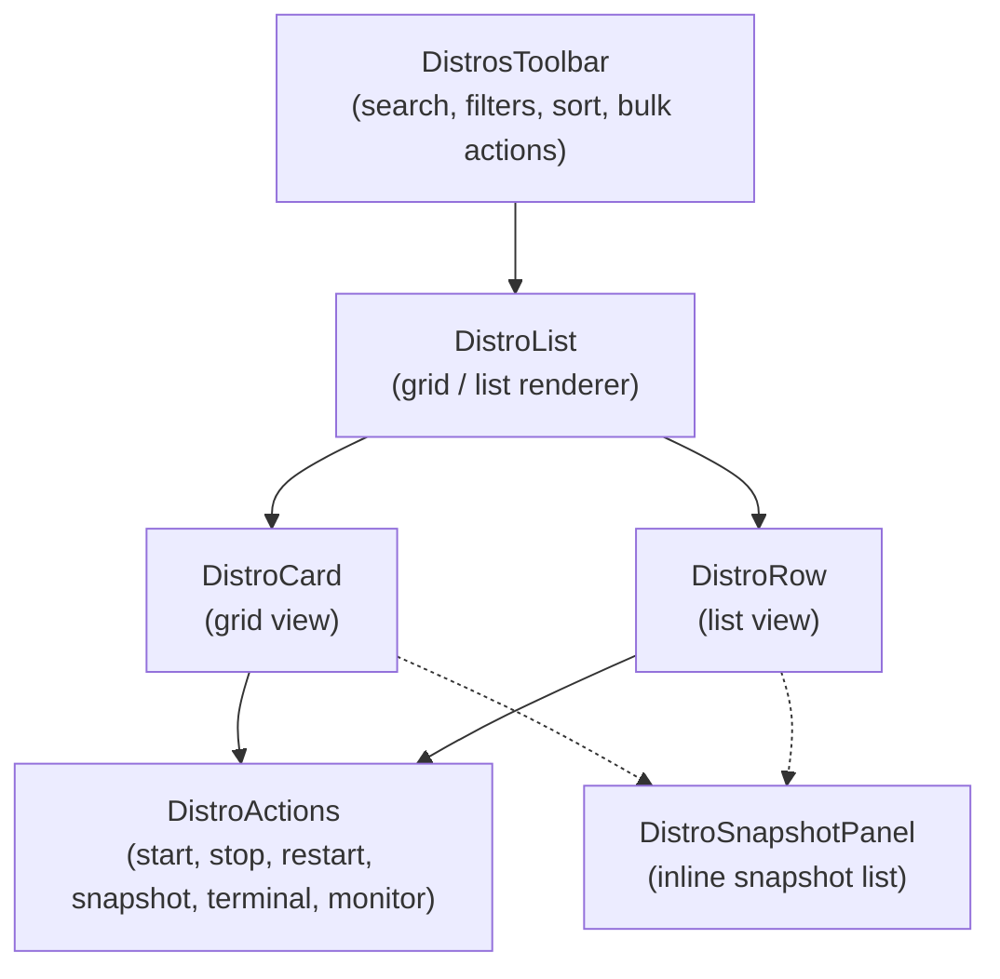

# 🖥️ Distro List

> Core feature for browsing, filtering, and managing WSL distributions with grid/list views and inline actions.

---

## 🏗️ Component Tree



## 📁 Structure

```
distro-list/
├── api/
│   ├── queries.ts              # Re-exports useDistros, distroKeys from shared
│   ├── queries.test.ts
│   ├── mutations.ts            # Distro lifecycle mutations
│   └── mutations.test.ts
├── hooks/
│   └── use-distro-actions.ts   # Shared action logic for card/row
└── ui/
    ├── distros-toolbar.tsx      # Search, filters, sort, view toggle, bulk actions
    ├── distros-toolbar.test.tsx
    ├── distro-list.tsx          # Renders DistroCard or DistroRow based on viewMode
    ├── distro-list.test.tsx
    ├── distro-card.tsx          # Grid card view (memoized)
    ├── distro-card.test.tsx
    ├── distro-row.tsx           # Compact list row view (memoized)
    ├── distro-row.test.tsx
    ├── distro-actions.tsx       # Shared action buttons (presentational)
    ├── distro-snapshot-panel.tsx # Expandable inline snapshot panel
    └── distro-snapshot-panel.test.tsx
```

## 📡 API Layer

### Queries

| Hook | Source | Description |
|------|--------|-------------|
| `useDistros` | Re-exported from `@/shared/api/distro-queries` | Fetches all WSL distributions |
| `distroKeys` | Re-exported from `@/shared/api/distro-queries` | TanStack Query key factory |

### Mutations

| Hook | Tauri Command | Description |
|------|---------------|-------------|
| `useStartDistro` | `start_distro` | Start a single distribution |
| `useStopDistro` | `stop_distro` | Stop a single distribution |
| `useRestartDistro` | `restart_distro` | Restart a single distribution |
| `useSetDefaultDistro` | `set_default_distro` | Set a distribution as the WSL default |
| `useResizeVhd` | `resize_vhd` | Resize a distribution's VHDX disk |
| `useShutdownAll` | `shutdown_all` | Shut down all running distributions |
| `useStartAll` | `start_distro` (batched) | Start all stopped distributions via `Promise.allSettled` |

All single-distro mutations use the shared `useTauriMutation` helper with automatic query invalidation and i18n toast messages.

## 🪝 Hooks

### `useDistroActions`

Shared hook consumed by both `DistroCard` and `DistroRow` to derive:

- `isRunning` / `isPending` / `stateLabel` computed state
- Click handlers with `stopPropagation` for nested interactive elements
- Terminal session creation via `useCreateTerminalSession`
- Keyboard navigation (Enter / Space to expand)
- Accessible `ariaLabel` with distro name, state, and default status

## 🖼️ UI Components

| Component | Role |
|-----------|------|
| `DistrosToolbar` | Search input, status/WSL-version pill filters, sort dropdown (6 options), grid/list toggle, bulk Start All / Shutdown All / New Snapshot buttons, live stats counter |
| `DistroList` | Conditional renderer — loading skeletons, error state, empty states (no distros / no matches), then delegates to `DistroCard` (grid) or `DistroRow` (list) based on `viewMode` |
| `DistroCard` | Grid card with status dot, name, default star, WSL version badge, snapshot count, pending action spinner, and `DistroActions` |
| `DistroRow` | Compact horizontal row with the same data plus VHDX size column |
| `DistroActions` | Presentational button group: Play/Stop/Restart, Snapshot, Terminal (running only), Monitor link (navigates to `/monitoring`) |
| `DistroSnapshotPanel` | Expandable panel embedding `SnapshotList` from the `snapshot-list` feature, with a "New Snapshot" button |

## 🧪 Test Coverage

7 test files covering queries, mutations, toolbar interactions, list rendering with both view modes, card/row action handlers, and snapshot panel behavior.

---

> 👀 See also: [features/](../) · [snapshot-list](../snapshot-list/) · [terminal](../terminal/) · [monitoring-dashboard](../monitoring-dashboard/)
