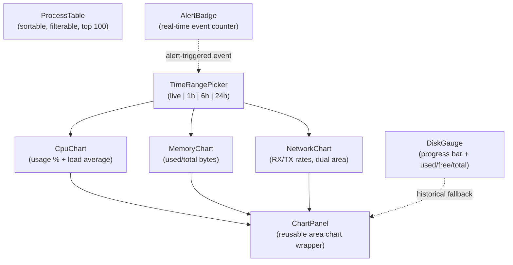

# 📊 Monitoring Dashboard

> Real-time and historical system metrics visualization for WSL distributions with CPU, memory, network, and disk charts.

---

## 🏗️ Chart Composition



## 📁 Structure

```
monitoring-dashboard/
├── api/
│   ├── queries.ts              # useProcesses, useMetricsHistory, useAlertThresholds
│   └── queries.test.ts
├── hooks/
│   ├── use-live-metrics.ts     # Event-driven live metrics with sliding window
│   └── use-metrics-history.ts  # MetricsPoint type definition
└── ui/
    ├── chart-panel.tsx          # Reusable Recharts AreaChart wrapper
    ├── cpu-chart.tsx            # CPU usage percentage chart
    ├── cpu-chart.test.tsx
    ├── memory-chart.tsx         # Memory usage chart with bytes subtitle
    ├── memory-chart.test.tsx
    ├── network-chart.tsx        # Dual-area RX/TX network I/O chart
    ├── network-chart.test.tsx
    ├── disk-gauge.tsx           # Disk usage progress bar with thresholds
    ├── disk-gauge.test.tsx
    ├── process-table.tsx        # Sortable process list table
    ├── process-table.test.tsx
    ├── time-range-picker.tsx    # Time range selector pills
    ├── time-range-picker.test.tsx
    ├── alert-badge.tsx          # Unacknowledged alert counter
    └── alert-badge.test.tsx
```

## 📡 API Layer

### Queries

| Hook | Tauri Command | Description |
|------|---------------|-------------|
| `useProcesses(distro, enabled)` | `get_processes` | Fetches process list with configurable polling interval from preferences |
| `useMetricsHistory(distro, range)` | `get_metrics_history` | Fetches historical metrics for 1h/6h/24h time ranges |
| `useAlertThresholds()` | `get_alert_thresholds` | Reads configured alert thresholds |
| `useSetAlertThresholds()` | `set_alert_thresholds` | Mutation to update alert threshold configuration |

### Query Key Factory

```typescript
monitoringKeys.metrics(distro)        // live metrics
monitoringKeys.processes(distro)      // process list
monitoringKeys.history(distro, range) // historical data
monitoringKeys.alertThresholds        // threshold config
monitoringKeys.alerts(distro)         // alert state
```

## 🪝 Custom Hooks

### `useLiveMetrics(distroName)`

Event-driven hook that subscribes to `"system-metrics"` Tauri events from the background collector (2s interval):

- Filters events by selected distro name
- Computes network RX/TX rates from cumulative byte counters
- Maintains a sliding window of **60 data points** (~2 minutes)
- Fires a one-shot `get_system_metrics` fetch on distro selection for immediate display
- Returns `{ history: MetricsPoint[], latestMetrics: SystemMetrics | null }`

### `MetricsPoint` (type)

| Field | Type | Description |
|-------|------|-------------|
| `time` | `string` | Locale-formatted timestamp |
| `cpu` | `number` | CPU usage percentage |
| `memUsed` | `number` | Used memory in bytes |
| `memTotal` | `number` | Total memory in bytes |
| `memPercent` | `number` | Computed memory percentage |
| `diskPercent` | `number` | Disk usage percentage |
| `netRx` | `number` | Network receive rate (bytes/s) |
| `netTx` | `number` | Network transmit rate (bytes/s) |

## 🖼️ UI Components

| Component | Role |
|-----------|------|
| `ChartPanel` | Reusable Recharts `AreaChart` wrapper with gradient fills, dark tooltip styling, skeleton loading bars, configurable Y-axis domain/formatter, optional legend. Used by CPU, Memory, and Network charts |
| `CpuChart` | CPU usage area chart (0-100%) with current value header and load average subtitle |
| `MemoryChart` | Memory usage area chart with used/total bytes subtitle |
| `NetworkChart` | Dual-area chart for RX (download) and TX (upload) rates with `formatBytes/s` labels and legend |
| `DiskGauge` | Progress bar gauge with color thresholds: blue (normal), yellow (>80%), red (>90%). Shows used/free/total breakdown. Falls back to historical data when live disk info is unavailable |
| `ProcessTable` | Sortable table (PID, User, CPU%, MEM%, RSS, State, Command) with text filter. Capped at 100 rows with overflow indicator |
| `TimeRangePicker` | Pill-button group for Live / 1h / 6h / 24h. Live mode shows a pulsing green dot |
| `AlertBadge` | Listens to `"alert-triggered"` Tauri events, shows unacknowledged count (caps at 99+) |

## 🧪 Test Coverage

8 test files covering API queries, all 5 chart/gauge components, process table sorting and filtering, time range picker, and alert badge rendering.

---

> 👀 See also: [features/](../) · [distro-list](../distro-list/) · [wsl-config](../wsl-config/)
