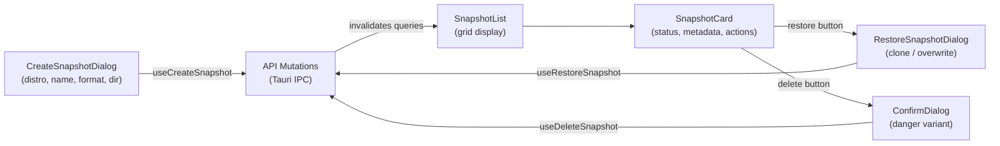

# 📸 Snapshot List

> Create, browse, restore, and delete WSL distribution snapshots with support for tar and VHDX formats.

---

## 🔄 Snapshot Lifecycle



## 📁 Structure

```
snapshot-list/
├── api/
│   ├── queries.ts              # useSnapshots, useSnapshotCounts
│   ├── queries.test.ts
│   ├── mutations.ts            # create, delete, restore mutations
│   └── mutations.test.ts
└── ui/
    ├── snapshot-list.tsx        # Grid of SnapshotCards with delete confirmation
    ├── snapshot-card.tsx        # Individual snapshot display (memoized)
    ├── snapshot-card.test.tsx
    ├── create-snapshot-dialog.tsx   # Full creation form with file browser
    ├── create-snapshot-dialog.test.tsx
    ├── restore-snapshot-dialog.tsx  # Clone/overwrite mode selector
    └── restore-snapshot-dialog.test.tsx
```

## 📡 API Layer

### Queries

| Hook | Tauri Command | Description |
|------|---------------|-------------|
| `useSnapshots(distroName?)` | `list_snapshots` | Fetch all snapshots, optionally filtered by distro |
| `useSnapshotCounts()` | — | Derived hook computing `Record<string, number>` from `useSnapshots` |

### Mutations

| Hook | Tauri Command | Description |
|------|---------------|-------------|
| `useCreateSnapshot` | `create_snapshot` | Export a distribution snapshot (tar/VHDX) |
| `useDeleteSnapshot` | `delete_snapshot` | Remove a snapshot by ID |
| `useRestoreSnapshot` | `restore_snapshot` | Restore a snapshot (clone or overwrite mode) |

All mutations invalidate `snapshotKeys.all`; `useRestoreSnapshot` also invalidates `distroKeys.all` since it creates or modifies distributions.

## 🖼️ UI Components

| Component | Role |
|-----------|------|
| `SnapshotList` | Fetches snapshots via `useSnapshots`, renders a responsive grid of `SnapshotCard` components, manages delete confirmation via `ConfirmDialog` |
| `SnapshotCard` | Displays snapshot name, description, status badge (completed / exporting / failed), distro name, relative timestamp, file size, format, and type. Actions: restore (completed only) and delete |
| `CreateSnapshotDialog` | Modal form with distro selector (`Select`), name/description inputs, format picker (tar/VHDX), output directory with native file browser via `@tauri-apps/plugin-dialog` |
| `RestoreSnapshotDialog` | Modal with clone/overwrite radio toggle. Clone mode: new distro name + install location. Overwrite mode: auto-detects existing install path via `get_distro_install_path` with manual fallback. Shows warning banner for overwrite |

## 🔑 Key Details

- **Snapshot statuses**: `completed`, `in_progress` (animated pulse), `failed*` (prefix match)
- **Format options**: `tar` (wsl --export) and `vhdx` (raw disk copy)
- **Restore modes**: `clone` (creates new distro) and `overwrite` (replaces existing, with safety warning)
- **Default directories**: Sourced from `usePreferencesStore` (`defaultSnapshotDir`, `defaultInstallLocation`)
- **Distro name validation**: `^[a-zA-Z0-9][a-zA-Z0-9._-]*$` regex in restore dialog

## 🧪 Test Coverage

5 test files covering query hooks, mutation hooks, snapshot card rendering, create dialog form validation, and restore dialog mode switching.

---

> 👀 See also: [features/](../) · [distro-list](../distro-list/) · [audit-log](../audit-log/)
