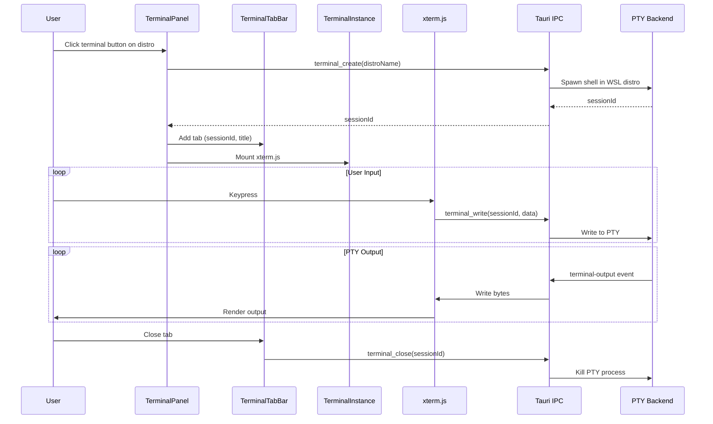

# 💻 Terminal

> Integrated terminal emulator with multi-tab support, powered by xterm.js and Tauri's portable-pty backend.

---

## 🔄 Data Flow



## 📁 Structure

```
terminal/
├── api/
│   ├── mutations.ts            # Tauri IPC functions + useCreateTerminalSession
│   └── mutations.test.ts
├── model/
│   ├── use-terminal-store.ts   # Zustand store for session/panel state
│   └── use-terminal-store.test.ts
└── ui/
    ├── terminal-panel.tsx       # Panel container with resize handle
    ├── terminal-panel.test.tsx
    ├── terminal-tab-bar.tsx     # Tab strip with close buttons + new tab
    ├── terminal-tab-bar.test.tsx
    └── terminal-instance.tsx    # xterm.js integration per session
```

## 📡 API Layer

### Functions

| Function | Tauri Command | Description |
|----------|---------------|-------------|
| `createTerminal(distroName)` | `terminal_create` | Creates a new PTY session, returns `sessionId` |
| `writeTerminal(sessionId, data)` | `terminal_write` | Sends user input bytes to the PTY |
| `resizeTerminal(sessionId, cols, rows)` | `terminal_resize` | Updates PTY dimensions on terminal resize |
| `isTerminalAlive(sessionId)` | `terminal_is_alive` | Health check before mounting xterm |
| `closeTerminal(sessionId)` | `terminal_close` | Closes the PTY session |

### Mutation Hook

| Hook | Description |
|------|-------------|
| `useCreateTerminalSession` | TanStack Mutation with retry (2 attempts, exponential backoff). On success, adds session to Zustand store and opens panel. On error, shows toast notification |

### Tauri Events (Subscribed)

| Event | Payload | Description |
|-------|---------|-------------|
| `terminal-output` | `{ session_id, data: number[] }` | PTY stdout/stderr bytes |
| `terminal-exit` | `{ session_id }` | PTY process exited, auto-removes session |

## 🗄️ Zustand Store

### `useTerminalStore`

| State | Type | Description |
|-------|------|-------------|
| `sessions` | `TerminalSession[]` | Active terminal sessions (`id`, `distroName`, `title`) |
| `activeSessionId` | `string \| null` | Currently visible tab |
| `isOpen` | `boolean` | Panel visibility toggle |
| `panelHeight` | `number` | Resizable panel height (clamped 150-600px, default 300px) |

| Action | Description |
|--------|-------------|
| `addSession(session)` | Appends session, sets it as active, opens panel |
| `removeSession(id)` | Removes session, falls back to last remaining tab, auto-closes panel if empty |
| `setActiveSession(id)` | Switches active tab |
| `togglePanel()` | Toggles panel open/closed |
| `openPanel()` / `closePanel()` | Explicit panel visibility control |
| `setPanelHeight(height)` | Sets height with min/max clamping |

## 🖼️ UI Components

| Component | Role |
|-----------|------|
| `TerminalPanel` | Container with drag-to-resize handle (mouse events), minimize/expand/hide controls. Always mounts all `TerminalInstance` components (hidden via CSS) to preserve session state. Auto-creates terminal in the first running distro via the "+" button |
| `TerminalTabBar` | Horizontal scrollable tab strip. Each tab shows the session title with a close button (visible on hover). "+" button creates a new terminal |
| `TerminalInstance` | Core xterm.js integration. Initializes `Terminal` with `FitAddon` and `WebLinksAddon`. Buffers PTY output arriving before xterm is ready. Uses `ResizeObserver` for container-driven resizing. Handles visibility changes (minimize/restore). Supports dark (Neon) and light (Frosted) color themes synced via `useThemeStore` |

## 🎨 Terminal Themes

| Theme | Background | Cursor | Palette |
|-------|-----------|--------|---------|
| **Neon Dark** | `#0a0a1a` | `#00f0ff` (cyan) | Vibrant neon colors matching Catppuccin Mocha |
| **Frosted Light** | `#f0f0f5` | `#0891b2` (teal) | Muted colors matching Catppuccin Latte |

## 🔑 Key Technical Details

- **Output buffering**: PTY events are registered _before_ xterm.js is created; data arriving during setup is buffered and flushed once ready
- **Session lifecycle check**: `isTerminalAlive` is called before mounting xterm; on error during HMR, assumes alive to avoid removing valid sessions
- **Font stack**: JetBrains Mono > Cascadia Code > Fira Code > monospace
- **Scrollback**: 5000 lines

## 🧪 Test Coverage

4 test files covering the Zustand store (session management, panel state), mutation hook (creation, retry, error handling), tab bar (rendering, close behavior), and panel (toggle, resize).

---

> 👀 See also: [features/](../) · [distro-list](../distro-list/) · [app-preferences](../app-preferences/)
