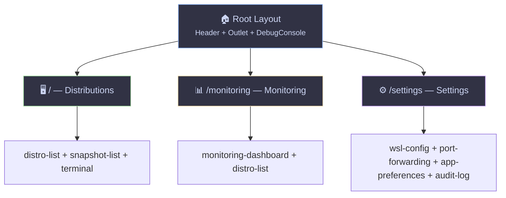
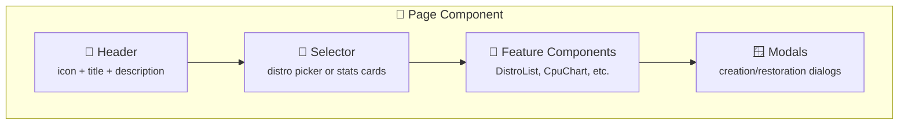

# 📄 Pages

> Route-level components — orchestrate features to build each view.

---

## 🎯 Purpose

Pages are **thin components** that compose multiple features together. They manage page-level state (selected distro, active tab, modal visibility) and are associated with a TanStack Router route.



---

## 📐 Convention

```
pages/
└── <name>/
    └── ui/
        └── <name>-page.tsx
```

Each page is registered as a route in `router.tsx`.

---

## 📋 Page Inventory

| Route | Page | 🧩 Features Used | Description |
|---|---|---|---|
| `/` | 🖥️ `DistrosPage` | `distro-list`, `distro-events`, `snapshot-list`, `terminal` | Distribution management with snapshots and terminal |
| `/monitoring` | 📊 `MonitoringPage` | `monitoring-dashboard`, `distro-list` | Real-time metrics (requires distro selection) |
| `/settings` | ⚙️ `SettingsPage` | `wsl-config`, `audit-log`, `port-forwarding`, `app-preferences` | .wslconfig editor + port forwarding + preferences + audit trail |

---

## 🖼️ Typical Page Structure



1. 📌 **Header**: Lucide icon + title + description + optional action button
2. 🔽 **Selector**: Many pages require choosing a distro (`useDistros()`)
3. 🧩 **Content**: One or more feature components
4. 🪟 **Modals**: Creation/restoration dialogs (hoisted to page level)

---

## 📖 Page Details

### 🖥️ `/` — Distributions

Full grid of `DistroCard` components with Start/Stop/Restart buttons, Shutdown All, terminal launch, and integrated snapshot management. This is the home page. 🏠

### 📊 `/monitoring` — Monitoring

Distro selector, then 4 charts (CPU, memory, network, disk) + process table. 📈

### ⚙️ `/settings` — Settings

Multiple sections: `.wslconfig` editor (form) + VHDX compact panel + port forwarding panel + app preferences (language, theme, alerts) + searchable audit trail. 🛠️

---

> 👀 See also: [🧩 Features](../features/README.md) · [📦 Shared](../shared/README.md) · [🔲 Widgets](../widgets/README.md)
