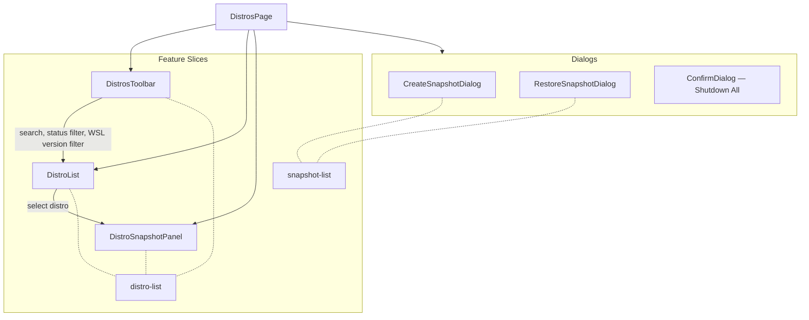

# 📄 Distributions Page

> Main page composing distro-list, snapshot-list, and terminal features into a unified distribution management view.

---

## 🧩 Component Composition

The Distributions page assembles multiple feature slices into a cohesive workflow: a toolbar for filtering/sorting, a distro grid or list, a contextual snapshot panel, and modal dialogs for snapshot operations.

## ⚙️ Key Behaviors

| Behavior | Details |
|---|---|
| **Filtering** | Search by name (debounced 200ms), status (`all` / `running` / `stopped`), WSL version (`all` / `1` / `2`) |
| **Sorting** | 6 sort keys: name asc/desc, status running/stopped first, default first, VHDX size — persisted via `usePreferencesStore` |
| **View mode** | Grid or list — persisted via `usePreferencesStore` |
| **Selection** | Click a distro card to toggle the snapshot panel below |
| **Shutdown All** | Confirmation dialog with danger variant; shows running count |

## 📂 Files

| File | Description |
|---|---|
| `ui/distros-page.tsx` | Page component — filtering, sorting, selection state, dialog orchestration |

## 🔗 Dependencies

| Dependency | Source |
|---|---|
| `DistroList`, `DistrosToolbar`, `DistroSnapshotPanel` | `@/features/distro-list` |
| `CreateSnapshotDialog`, `RestoreSnapshotDialog` | `@/features/snapshot-list` |
| `ConfirmDialog`, `toast` | `@/shared/ui` |
| `useDistros` | `@/shared/api/distro-queries` |
| `useShutdownAll` | `@/features/distro-list/api/mutations` |
| `usePreferencesStore` | `@/shared/stores` |

---

> 👀 See also: [Pages](../README.md) · [Monitoring Page](../monitoring/README.md) · [Settings Page](../settings/README.md)
