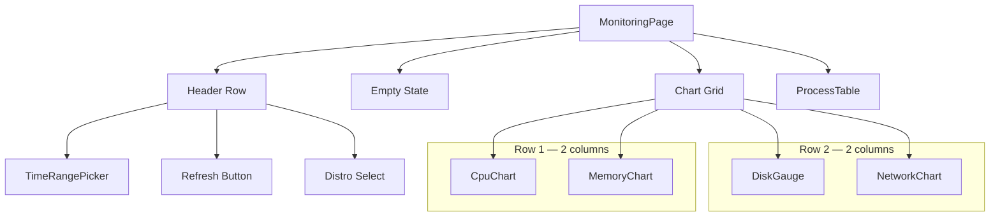

# 📄 Monitoring Page

> Real-time and historical system metrics monitoring for running WSL2 distributions.

---

## 🧩 Layout Composition

The page is organized into a header with controls (distro selector, time range picker, refresh) and a 2-column chart grid followed by a process table.

## ⚙️ Key Behaviors

| Behavior | Details |
|---|---|
| **Distro selection** | Priority: manual pick > URL `?distro=` param > first running distro |
| **Time ranges** | `live` (push-based via Tauri events) or historical (`5m`, `15m`, `1h`, `6h`, `24h` via TanStack Query) |
| **Live metrics** | `useLiveMetrics` hook subscribes to Tauri event stream for real-time updates |
| **Historical metrics** | `useMetricsHistoryQuery` fetches aggregated data from the backend |
| **Processes** | Always polling-based via `useProcesses`, displayed in a sortable table |
| **Empty state** | Shown when no running distros are available or none is selected |
| **Alert badge** | `AlertBadge` overlays the page icon when active alerts exist |

## 📂 Files

| File | Description |
|---|---|
| `ui/monitoring-page.tsx` | Page component — distro selection, time range, data source switching, chart grid layout |

## 🔗 Dependencies

| Dependency | Source |
|---|---|
| `CpuChart`, `MemoryChart`, `NetworkChart`, `DiskGauge` | `@/features/monitoring-dashboard/ui` |
| `ProcessTable`, `TimeRangePicker`, `AlertBadge` | `@/features/monitoring-dashboard/ui` |
| `useLiveMetrics` | `@/features/monitoring-dashboard/hooks` |
| `useProcesses`, `useMetricsHistory` | `@/features/monitoring-dashboard/api/queries` |
| `Select` | `@/shared/ui` |
| `useDistros` | `@/shared/api/distro-queries` |

---

> 👀 See also: [Pages](../README.md) · [Distributions Page](../distros/README.md) · [Settings Page](../settings/README.md)
