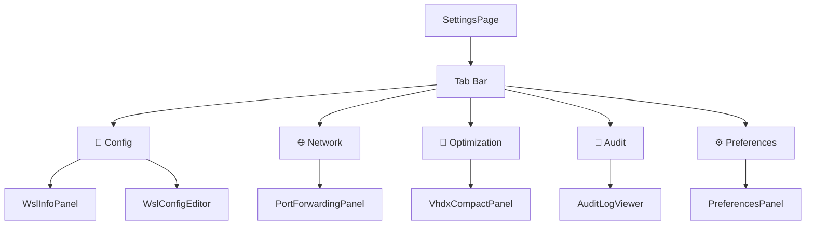

# 📄 Settings Page

> Tabbed settings page composing WSL configuration, port forwarding, disk optimization, audit log, and app preferences.

---

## 🧩 Tab Layout

The page uses an internal tab bar (not router-based) to switch between five settings sections. Each tab renders a feature slice component.

## ⚙️ Tab Details

| Tab | ID | Icon | Feature Slice | Components |
|---|---|---|---|---|
| **Config** | `config` | `FileText` | `wsl-config` | `WslInfoPanel` + `WslConfigEditor` |
| **Network** | `network` | `Network` | `port-forwarding` | `PortForwardingPanel` |
| **Optimization** | `optimization` | `HardDrive` | `wsl-config` | `VhdxCompactPanel` |
| **Audit** | `audit` | `ScrollText` | `audit-log` | `AuditLogViewer` |
| **Preferences** | `preferences` | `SlidersHorizontal` | `app-preferences` | `PreferencesPanel` |

## 🎨 Accessibility

- Tab bar uses proper `role="tablist"` / `role="tab"` / `role="tabpanel"` ARIA pattern
- Each tab panel is linked via `aria-controls` and `aria-labelledby`
- Active tab has `aria-selected="true"`

## 📂 Files

| File | Description |
|---|---|
| `ui/settings-page.tsx` | Page component — tab state, ARIA tab pattern, conditional panel rendering |

## 🔗 Dependencies

| Dependency | Source |
|---|---|
| `WslConfigEditor`, `WslInfoPanel`, `VhdxCompactPanel` | `@/features/wsl-config` |
| `PortForwardingPanel` | `@/features/port-forwarding` |
| `AuditLogViewer` | `@/features/audit-log` |
| `PreferencesPanel` | `@/features/app-preferences` |

---

> 👀 See also: [Pages](../README.md) · [Distributions Page](../distros/README.md) · [Monitoring Page](../monitoring/README.md)
