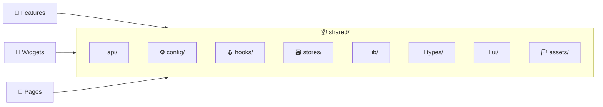

# 📦 Shared

> Cross-cutting layer — Tauri API, hooks, stores, TypeScript types, utilities and shared UI components.

---

## 🎯 Purpose

The `shared/` layer contains everything used by **multiple features and pages**. It is the lowest layer in the frontend — it imports from no other application layer.



---

## 📂 Structure

```
shared/
├── api/               # 🔗 Tauri backend communication
│   ├── tauri-client.ts      # tauriInvoke<T>() — typed wrapper
│   ├── distro-queries.ts    # Distro query keys and hooks
│   ├── events.ts            # EVENTS constants
│   └── use-tauri-mutation.ts # Generic mutation wrapper with toast + invalidation
├── config/            # ⚙️ Global configuration
│   ├── query-client.ts      # QueryClient (TanStack Query)
│   ├── i18n.ts              # i18next initialization
│   └── i18n.d.ts            # i18n type definitions
├── hooks/             # 🪝 Reusable React hooks
│   ├── use-debug-console.ts  # 🐛 Zustand store for debug console panel
│   ├── use-tauri-event.ts    # ⚡ Tauri event listener
│   ├── use-theme.ts          # 🎨 Zustand theme store
│   └── use-debounce.ts       # ⏳ Debounce hook
├── stores/            # 🗃️ Zustand stores
│   ├── use-locale-store.ts       # 🌍 Language persistence
│   └── use-preferences-store.ts  # ⚙️ User preferences (monitoring intervals, etc.)
├── lib/               # 🔧 Utilities
│   ├── utils.ts          # cn() — Tailwind class merging
│   └── formatters.ts     # Bytes, percent, relative time formatting
├── types/             # 📝 TypeScript interfaces
│   ├── distro.ts         # Distro, DistroState
│   ├── snapshot.ts       # Snapshot, CreateSnapshotArgs, RestoreSnapshotArgs
│   └── monitoring.ts     # SystemMetrics, CpuMetrics, MemoryMetrics, DiskMetrics, NetworkMetrics, AlertThreshold
├── ui/                # 🎨 Shared UI components
│   ├── action-icon-button.tsx  # 🔘 Icon-only button with spinner support
│   ├── confirm-dialog.tsx      # ✅ Confirmation dialog with pending state
│   ├── dialog-shell.tsx        # 🪟 Base dialog shell
│   ├── error-boundary.tsx      # ⚠️ React Error Boundary with retry
│   ├── root-layout.tsx         # 🖼️ Root layout component
│   ├── select.tsx              # 📋 Custom select dropdown
│   ├── toast.tsx               # 🍞 Toast notification component
│   ├── toast-store.ts          # 🗃️ Toast state management
│   └── toggle-switch.tsx       # 🔀 Toggle switch component
└── assets/            # 🏳️ Static assets
    └── flags/             # Locale flag SVGs (gb, es, fr, cn)
```

---

## 🔗 `api/` — Tauri Communication

### `tauri-client.ts`

```typescript
async function tauriInvoke<T>(cmd: string, args?: Record<string, unknown>): Promise<T>
```

- ⚡ Typed wrapper around `@tauri-apps/api/core.invoke()`
- ⚠️ Converts errors to `TauriError` with explicit messages
- 🧩 **Used by**: all `useQuery` and `useMutation` hooks in features

### `distro-queries.ts`

🔑 Distro query key factory and shared hooks used by multiple features.

### `use-tauri-mutation.ts`

🔄 Generic mutation wrapper that combines TanStack Query mutations with:
- ✅ Automatic query invalidation on success
- 🍞 Toast notifications for success/error

### `events.ts`

```typescript
const EVENTS = {
  DISTRO_STATE_CHANGED: "distro-state-changed",
}
```

📡 Single event constant for distro state change notifications.

---

## ⚙️ `config/` — Configuration

### `query-client.ts`

| ⚙️ Setting | Value | 💡 Why |
|---|---|---|
| `staleTime` | 5,000 ms | Avoids excessive refetching |
| `retry` | 1 | Single retry attempt |
| `refetchOnWindowFocus` | `false` | No refetch on window focus (desktop app) |

### `i18n.ts`

🌍 i18next initialization with:
- 4 languages: 🇬🇧 English · 🇪🇸 Spanish · 🇫🇷 French · 🇨🇳 Chinese
- 🔍 Language detection from stored preferences
- ⏳ Lazy-loaded translation files

---

## 🪝 `hooks/` — React Hooks

### 🐛 `useDebugConsoleStore()`

Zustand store managing the in-app debug console panel:

| Property | Type | Description |
|---|---|---|
| `isOpen` | `boolean` | 👁️ Panel visibility |
| `logs` | `LogEntry[]` | 📋 Log entries (max 1000) |
| `filter` | `LogFilter` | 🔍 Active level filter (`"ALL"` or a specific `LogLevel`) |
| `toggle()` | `() => void` | 🔄 Toggle panel open/closed |
| `setFilter()` | `(filter) => void` | 🎚️ Change level filter |
| `addLog()` | `(entry) => void` | ➕ Append a log entry |
| `setLogs()` | `(entries) => void` | 📥 Replace all log entries |
| `clear()` | `() => void` | 🗑️ Clear logs (also calls `clear_debug_logs` backend command) |

Also exports `useDebugConsoleSetup()` — a one-time setup hook (called at app root) that:
- 📥 Fetches existing backend logs via `get_debug_logs`
- 📡 Listens for real-time `debug-log-entry` Tauri events
- 🔴 Intercepts `console.error` and `console.warn`
- 💥 Catches unhandled promise rejections and global errors
- ⌨️ Registers **Ctrl+Shift+D** keyboard shortcut

### ⚡ `useTauriEvent<T>(event, handler)`

Generic hook for listening to Tauri events:
- 🔄 Setup in `useEffect` with automatic cleanup
- 📡 Accepts a typed callback `(payload: T) => void`
- 🧩 **Used by**: `distro-events`, monitoring pages

### 🎨 `useThemeStore()`

Zustand store with localStorage persistence:

| Property | Type | Description |
|---|---|---|
| `theme` | `"dark" \| "light"` | 🌙/☀️ Current theme |
| `toggleTheme()` | `() => void` | 🔄 Toggle dark/light |

- 💾 **localStorage key**: `wsl-nexus-theme`
- 🔲 **Used by**: Header (Sun/Moon toggle)

Also exports `useThemeSync()` — keeps the DOM `data-theme` attribute in sync (call once at app root).

### ⏳ `useDebounce(value, delay)`

Debounces a value with a configurable delay. Used for search inputs and filter fields.

---

## 🗃️ `stores/` — Zustand Stores

### 🌍 `useLocaleStore()`

Zustand store for language preference:
- 💾 Persists selected locale
- 🔄 Drives i18next language switching
- 🧩 **Used by**: `app-preferences` feature

### ⚙️ `usePreferencesStore()`

Zustand store for user preferences (via Tauri plugin-store):
- ⏱️ Monitoring refresh interval
- 📁 Snapshot default directory
- 🔔 Notification settings
- 🧩 **Used by**: `app-preferences` feature, monitoring hooks

---

## 🔧 `lib/` — Utilities

### `utils.ts`

```typescript
function cn(...inputs: ClassValue[]): string
```
🧩 Combines `clsx` (conditional classes) + `tailwind-merge` (Tailwind conflict resolution).

### `formatters.ts`

| Function | Input | Output | Example |
|---|---|---|---|
| `formatBytes(bytes)` | `number` | `string` | `formatBytes(1536000)` → `"1.46 MB"` |
| `formatPercent(value)` | `number` | `string` | `formatPercent(85.3)` → `"85.3%"` |
| `formatRelativeTime(iso)` | `string` (ISO) | `string` | `formatRelativeTime("2024-01-01T...")` → `"2d ago"` |

---

## 📝 `types/` — TypeScript Interfaces

### `distro.ts`

| Type | 🔑 Key Fields |
|---|---|
| `Distro` | name, state, wsl_version, is_default, base_path, vhdx_size_bytes, last_seen |
| `DistroState` | `"Running" \| "Stopped" \| "Installing" \| "Converting" \| "Uninstalling"` |

### `snapshot.ts`

| Type | 🔑 Key Fields |
|---|---|
| `Snapshot` | id, distro_name, name, snapshot_type, format, file_path, file_size_bytes, status |
| `CreateSnapshotArgs` | distro_name, name, description, format, output_dir |
| `RestoreSnapshotArgs` | snapshot_id, mode, new_name, install_location |

### `monitoring.ts`

| Type | 📊 Contents |
|---|---|
| `SystemMetrics` | cpu, memory, disk, network (aggregate) |
| `CpuMetrics` | usage_percent, per_core, load_average |
| `MemoryMetrics` | total, used, available, cached, swap_total, swap_used |
| `DiskMetrics` | total, used, available, usage_percent |
| `NetworkMetrics` | interfaces[] (name, rx_bytes, tx_bytes, rx_packets, tx_packets) |
| `ProcessInfo` | pid, user, cpu_percent, mem_percent, vsz, rss, command, state |
| `AlertThreshold` | alert_type, threshold_percent, enabled |

---

## 🎨 `ui/` — Shared Components

| Component | File | Description |
|---|---|---|
| 🔘 `ActionIconButton` | `action-icon-button.tsx` | Icon-only button with spinner — swaps icon for `Loader2 animate-spin` when loading |
| ✅ `ConfirmDialog` | `confirm-dialog.tsx` | Confirmation dialog with `Loader2` spinner during pending state |
| 🪟 `DialogShell` | `dialog-shell.tsx` | Base dialog wrapper (overlay + panel) |
| ⚠️ `ErrorBoundary` | `error-boundary.tsx` | React Error Boundary with `AlertTriangle` icon + "Try Again" button |
| 🖼️ `RootLayout` | `root-layout.tsx` | Root layout (Header + Outlet + DebugConsole) |
| 📋 `Select` | `select.tsx` | Custom select dropdown with search and truncation |
| 🍞 `Toast` | `toast.tsx` + `toast-store.ts` | Toast notification system with Zustand store |
| 🔀 `ToggleSwitch` | `toggle-switch.tsx` | Boolean toggle switch component |

---

## 🏳️ `assets/` — Static Assets

Flag SVGs for i18n locale picker:
- 🇬🇧 `flags/gb.svg` — English
- 🇪🇸 `flags/es.svg` — Spanish
- 🇫🇷 `flags/fr.svg` — French
- 🇨🇳 `flags/cn.svg` — Chinese

---

> 👀 See also: [🧩 Features](../features/README.md) · [📄 Pages](../pages/README.md) · [🔲 Widgets](../widgets/README.md)
