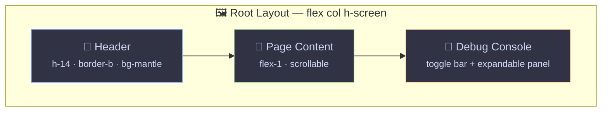

# 🔲 Widgets

> Shared layout components — Header and Debug Console.

---

## 🎯 Purpose

Widgets are **layout components** used by the root layout (`router.tsx`). They wrap all pages and provide the main navigation, global controls, and developer tooling.



---

## 📂 Structure

```
widgets/
├── header/
│   └── ui/
│       └── header.tsx          # 📌 Top bar: branding + nav tabs + actions
└── debug-console/
    └── ui/
        └── debug-console.tsx   # 🐛 Collapsible real-time log viewer
```

---

## 📌 Header — Top Bar with Navigation

The header occupies the top bar (`h-14` / `sm:h-16`, `border-b`, `bg-mantle`) and contains three sections:

### 🏷️ Branding (left)

- 🖥️ Server icon in a rounded `bg-blue/15` container
- **"WSL Nexus"** title + "WSL2 Management" subtitle (hidden on small screens)

### 🗺️ Navigation Tabs (center)

Pill-shaped tab bar (`rounded-xl bg-crust`) with 3 tabs:

| Icon | Label | Route | Description |
|---|---|---|---|
| 🖥️ `Server` | Distributions | `/` | Distro management + snapshots |
| 📊 `Activity` | Monitoring | `/monitoring` | Real-time metrics |
| ⚙️ `Settings` | Settings | `/settings` | WSL config + audit |

- Uses TanStack Router `Link` for navigation
- Detects the active route via `useMatchRoute()` with fuzzy matching
- ✅ Active style: `bg-blue text-crust shadow-md` (filled pill)
- 🔘 Inactive style: `text-subtext-1 hover:bg-surface-0 hover:text-text`
- 📱 Labels are hidden on small screens (icons only)

### 🎛️ Actions (right)

- 🐛 **Debug console toggle**: `Terminal` icon button — calls `useDebugConsoleStore.getState().toggle()`
- 🎨 **Theme toggle**: `Sun` icon (dark theme) / `Moon` icon (light theme) — uses `useThemeStore()`

---

## 🐛 Debug Console — Real-Time Log Viewer

A collapsible panel anchored to the bottom of the viewport with two parts:

### 📊 Toggle Bar (always visible)

- 🖥️ `Terminal` icon + "Debug Console" label
- 🔴 Error count badge (red) and ⚠️ warning count badge (peach) — shown when > 0
- 📋 Entry count + chevron indicator (up/down)

### 📖 Expandable Panel (`h-[40vh]`, `bg-crust`)

Opens below the toggle bar and contains:

- 🎚️ **Toolbar**: level filter buttons (All, Error, Warn, Info, Debug) + Clear + Close actions
- 📋 **Log table**: scrollable monospace table with columns for timestamp, level badge, target module, and message
- 📜 Auto-scrolls to bottom when new logs arrive

### 🗃️ State Management

Uses `useDebugConsoleStore` (Zustand) from `shared/hooks/use-debug-console.ts`:

| Property | Type | Description |
|---|---|---|
| `isOpen` | `boolean` | 👁️ Panel visibility |
| `logs` | `LogEntry[]` | 📋 Log entries (max 1000) |
| `filter` | `LogFilter` | 🔍 Active level filter (`"ALL"` or a specific level) |
| `toggle()` | `() => void` | 🔄 Toggle panel open/closed |
| `setFilter()` | `(filter) => void` | 🎚️ Change level filter |
| `clear()` | `() => void` | 🗑️ Clear all logs (also calls backend) |

⌨️ Keyboard shortcut: **Ctrl+Shift+D** toggles the console.

---

## 🖼️ Layout Integration

Widgets are used in the root component of `router.tsx`:

```
┌──────────────────────────────────────────┐
│ 📌 Header (h-14)                         │
│   [🏷️ Branding] [🗺️ Tabs: 3 pills] [🎛️ Actions] │
├──────────────────────────────────────────┤
│                                          │
│  📄 Page (Outlet)                        │
│  (flex-1, scrollable)                    │
│                                          │
├──────────────────────────────────────────┤
│ 🐛 Debug Console (toggle bar + panel)    │
└──────────────────────────────────────────┘
```

The layout is a vertical flex column (`flex-col h-screen`): Header on top, scrollable main content in the middle, and the Debug Console anchored at the bottom.

---

> 👀 See also: [🧩 Features](../features/README.md) · [📦 Shared](../shared/README.md) · [📄 Pages](../pages/README.md)
