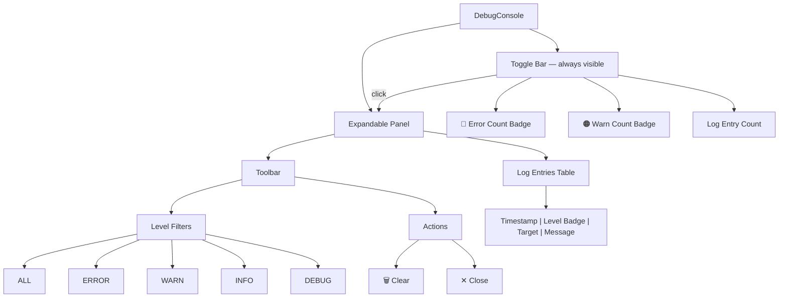

# 🔲 Debug Console

> Expandable bottom panel for viewing application logs with level filtering and color-coded entries.

---

## 🧩 Structure

The debug console is always present at the bottom of the viewport. A slim toggle bar shows log counts and expands into a full log viewer panel.

## ⚙️ Key Behaviors

| Behavior | Details |
|---|---|
| **Toggle** | Click the bottom bar or use the header terminal button to expand/collapse |
| **Panel height** | Fixed at `40vh` when open |
| **Log levels** | `ERROR`, `WARN`, `INFO`, `DEBUG`, `TRACE` — each with Catppuccin color coding |
| **Filtering** | Filter buttons: `ALL`, `ERROR`, `WARN`, `INFO`, `DEBUG` |
| **Auto-scroll** | Scrolls to bottom automatically when new log entries arrive |
| **Target coloring** | IPC targets shown in teal, others in mauve |
| **Error rows** | Rows with `ERROR` level get a subtle red background highlight |
| **State management** | All state via `useDebugConsoleStore` (Zustand) — `isOpen`, `logs`, `filter`, `toggle`, `setFilter`, `clear` |

## 📂 Files

| File | Description |
|---|---|
| `ui/debug-console.tsx` | Console widget — toggle bar, filter toolbar, scrollable log table with color-coded level badges |

## 🎨 Log Level Colors

| Level | Color |
|---|---|
| `ERROR` | 🔴 Red |
| `WARN` | 🟠 Peach |
| `INFO` | 🔵 Blue |
| `DEBUG` | 🟢 Green |
| `TRACE` | ⚪ Overlay |

---

> 👀 See also: [Widgets](../README.md) · [Header](../header/README.md)
