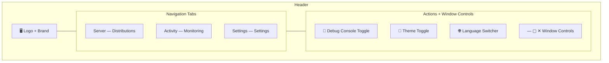

# 🔲 Header

> Top navigation bar with branding, pill-shaped route tabs, language switcher, theme toggle, and custom window controls.

---

## 🧩 Layout

The header spans the full width with three sections: branding on the left, navigation tabs centered, and action buttons plus window controls on the right.

## ⚙️ Key Behaviors

| Behavior | Details |
|---|---|
| **Navigation** | 3 routes via TanStack Router `<Link>`: `/` (Distributions), `/monitoring`, `/settings` |
| **Active tab** | Detected via `useMatchRoute` — exact match for `/`, fuzzy match for others |
| **Theme toggle** | Switches dark (Mocha) / light (Latte) via `useThemeStore` |
| **Language switcher** | Dropdown with flag icons, keyboard navigation (arrow keys, Enter, Escape) |
| **Window dragging** | Empty header area supports `startDragging()` via Tauri window API |
| **Double-click** | Toggles maximize/restore on empty header area |
| **Window controls** | Custom minimize, maximize/restore, close (hide) buttons — tracks `isMaximized` state |
| **Supported locales** | English (GB), French, Spanish, Chinese — with country flag icons |

## 📂 Files

| File | Description |
|---|---|
| `ui/header.tsx` | Main header component — branding, nav tabs, theme toggle, window controls, drag handling |
| `ui/language-switcher.tsx` | Locale dropdown with flag icons, keyboard navigation, ARIA listbox pattern |
| `ui/header.test.tsx` | Unit tests for the header component |

## 🎨 Accessibility

- Navigation uses semantic `<nav>` element
- Language switcher uses `aria-haspopup="listbox"`, `aria-expanded`, `role="option"`, `aria-selected`
- All icon buttons have `aria-label` attributes
- Window controls have localized ARIA labels

---

> 👀 See also: [Widgets](../README.md) · [Debug Console](../debug-console/README.md)
